# Background

I had my first experience with radio communications as a kid with walkie-talkies, the same as a decent number of children nowadays. I, towards high school, started learning and messing with NFC and RFID cards (maybe a post about that in the future...) and learnt about cloning them, the frequencies they operated on. Towards the end of high school, I got myself a HackRF. I probably should have started with an RTL-SDR, but I wanted that sleek, sleek Portapack badly enough, and I thought I'd learn more by using it and building it.


Currently, all I've really used the HackRF for is basic Portapack features. I listened to some ADS-B data, which was pretty cool, but that was about it. I also wanted to learn more about how the SDR worked without the Portapack interface using programs on my computer. Regarding the Baofeng, I did some listening and that was about it. I knew better than to transmit with it :p.


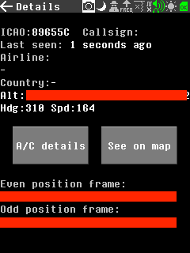


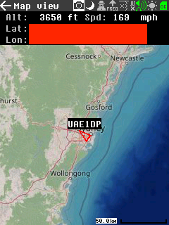

# Using a HackRF with a SDR program

I'd used the HackRF with Gqrx before, but only very minimally. To start with, I tried some very basic listening on WFM radio channels.

## Using the HackRF Portapack with Gqrx

On the Portapack, it's fairly simple to do. I did all my SDR'ing on Fedora Linux (scold me). Fairly easy, just plug in the HackRF via MicroUSB to the laptop and then select the 'HackRF' option on the Portapack menu.


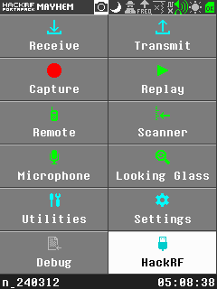


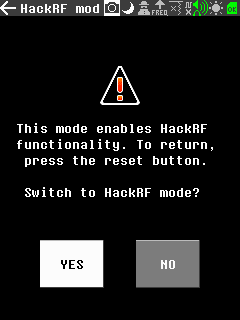

Once on this 'blue screen' we can boot Gqrx and start trying to listen to something.


## WFM

Now on Gqrx, traditional WFM transmits ~107mHz so in Gqrx using the numbers up the top we can press the correct columns to get `0 107.000.000` then press the `Play` button.

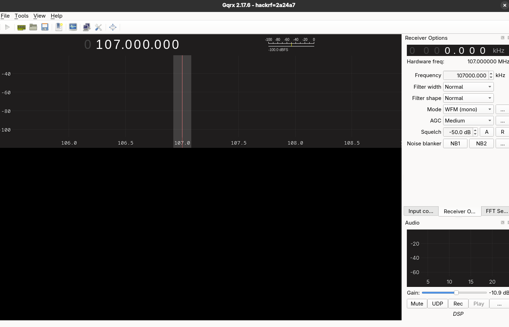

Once playing, we can see a few radio channels. I'm looking for Triple J, which is **105.7**, so we can move our listening to that frequency by dragging or using the numbers up the top.

What I noticed while doing this is if we change the numbers up the top and don't use the 'Receiver options' frequency, we just get a silence with a giant peak in our waterfall.

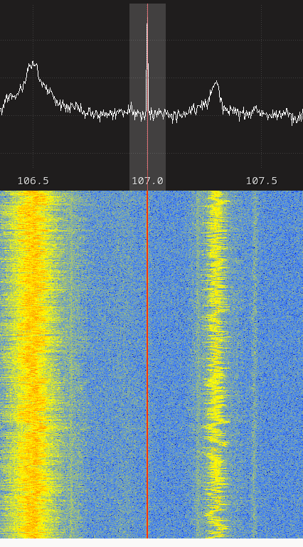

This [particular Reddit comment](https://www.reddit.com/r/RTLSDR/comments/q8eghe/comment/hgox22f/) was incredibly useful:
> It's caused by bias voltage in the AGC and is normal. All SDRs have this line, but in many cases it is automatically masked by software so you don't see it. You can minimize it if the software has a DC Block option.

Looking inside Gqrx, selecting 'Input controls' then turning 'DC remove' on removed this problem.

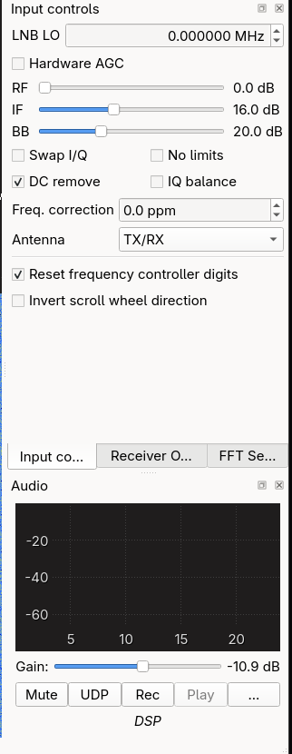

Now, let's go to **105.7** and hear sweet, sweet Triple J.

> 🚨 VOLUME WARNING

<video controls>
<source src="/public/blog-hackrf-triplej.mp4" type="video/mp4" />
</video>


Let's head over to the Baofeng, Citizen Bands and start looking at what we can do with it.

# Citizen Bands

> Important details: I'm not a lawyer or legal expert. What I'm writing here is merely my understanding of the ACMAs rules and from various sources I've read online. I could be wrong and misinformed. Take what I say with a very large grain of salt, and please come to your own conclusion about how to operate your radio(s). There are resources and other guides online that are far more informed than mine. This is merely a personal recounting of my understanding and experience of learning radio communications.

With the Baofeng, you can very easily listen to Citizen Bands and people just chatting away with themselves or others. A particularly active one around my house is `476.52500` or `CH5` (likely due to it being a repeater output, so signals from much further away are being repeated). But before that, are we doing something illegal here? What exactly are Citizen Bands?

Citizen Bands are a range of frequencies in the UHF and HF space that are legal for any Australian citizen to transmit on as long as they adhere to the ACMAs guidelines. More information is [available here](https://www.acma.gov.au/licences/citizen-band-radio-stations-class-licence), but it's fairly simple to follow. Buy a regulated radio and transmit at the frequencies you are permitted to, but what are those?

The ACMA says [[source](https://www.acma.gov.au/licences/citizen-band-radio-stations-class-licence)]:

```
You can only use CB radios on designated channels in these frequencies:
 - HF – 26.965 MHz to 27.405 MHz (inclusive)
 - UHF – 476.4125 to 477.4125 MHz (inclusive)
```

But, earlier, I said the frequency and channel. All the ACMA page provides is the frequency ranges we can operate on.

I found a handy guide [here](https://radiorescue.org.au/cb-radio/cb-channels/) that outlines the channels, frequencies, and their use. This comes in handy for knowing what we are allowed to use!

## Flashing the Baofeng

The Baofeng allows you to flash firmware onto it with channel customisation, it can be done with [Chirp](https://chirpmyradio.com/projects/chirp/wiki/Home). Installation for Linux was fairly easy with [this guide](https://chirpmyradio.com/projects/chirp/wiki/ChirpOnLinux) with Fedora.

> You don't have to do it this way, I'm an idiot and didn't try `sudo dnf install chirp`.

First install the packages:
```bash
sudo dnf install python3-wxpython4 pipx
```

Then download the latest Python3 wheel from the downloads page

After downloading the latest python3 wheel, we can install it with `pipx`:
```bash
pipx install --system-site-packages ./chirp-yyyymmdd-py3-none-any.whl
```

Once installed, using Chirp is fairly simple.

1. Attach the programmer cable from the Baofeng to your computer


2. On Chirp, we can download the currently set firmware with 'Radio' then 'Download from radio...' and configuring it as such.

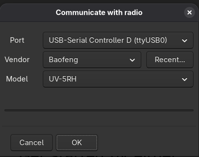

This is what you will see once it is downloaded.

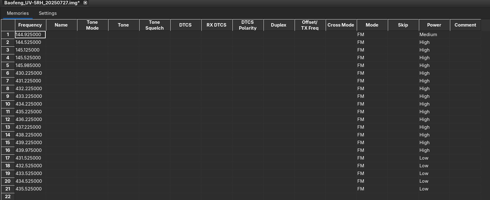

3. Inside Chirp, modify the channels (and settings) as you wish. I copied mine from the website from earlier outlining the channels.


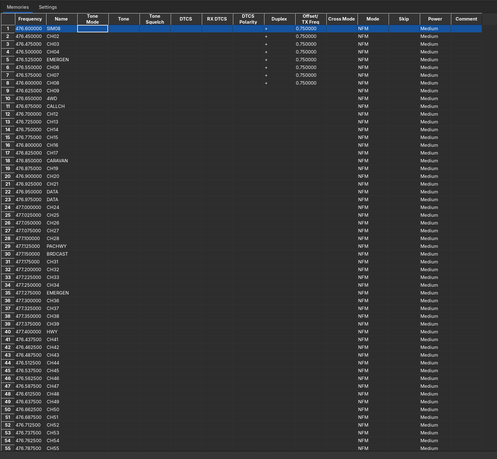


4. We can then upload the new firmware with 'Radio' then 'Upload to radio...' and selecting the correct serial device.


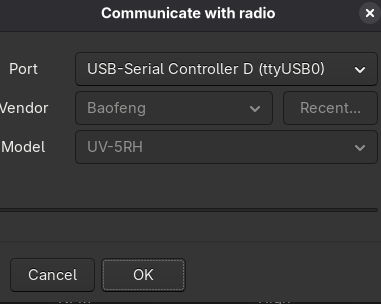

On the screen of the Baofeng we can see it being uploaded.


After that, we can press the 'VFO/MR' button to switch to channel mode, which should now align automatically with the configured channels and say the correct channel number.

With that, we can start looking at transmitting something. The aim is to transmit a working SSTV signal and decode it.

# SSTV

SSTV stands for Slow-Scan Television and is used to transfer images over radiowaves. It was originally developed in 1958 (wow!) and was a 120x120px screen.

In the modern day, we have much better ways to transfer images, but this classic still works and is a good test to work with.

For this test I made an image (which you will see at the end), and I'm going to:
1. Convert it to SSTV
2. Transmit it over a Citizen Band
3. Record the transmission on the HackRF with Gqrx
4. Decode the SSTV back into an image

## 1. Image to SSTV

Luckily, there are services online to help us do this, though someday I want to read more about how the protocol actually works and try to make an encoder on my own. I used [VR2WOA's Encoder](https://vr2woa.com/sstv) with the Robot36 format.

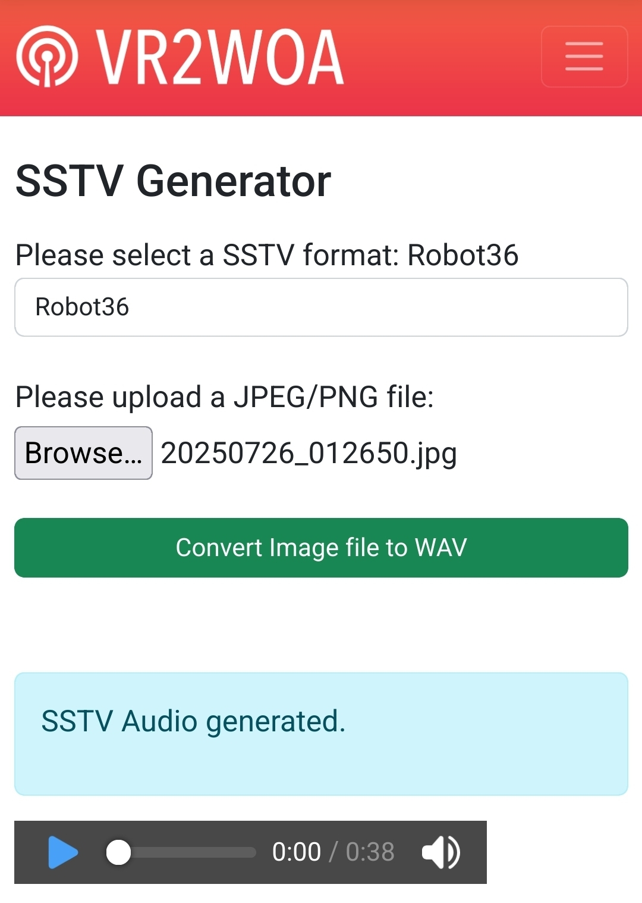

This then gave us the following `.wav` file:


<audio controls>
<source src="/public/blog-hackrf-sstv.wav" type="audio/wav" />
</audio>

## 2 & 3. Transmission and Recording

This is the scary bit: I began recording on Gqrx on `476.7750 MHz` and began the transmission on another radio I own that transmits legally (MHS050). After 38 seconds, I stopped the transmission and stopped recording.

## 4. Decode the SSTV

I record the transmission into a `.raw` on Gqrx, which is an IQ file containing raw transmission data to be filtered later.

I then set up Audacity and installed QSSTV to parse the SSTV audio.

Using Pavucontrol and Audacity, I changed my input device to the output of Gqrx and now both QSSTV and Audacity hear the Gqrx output.

Now we can 'Play' the IQ files and relisten to them at the correct frequency.

<audio controls>
<source src="/public/blog-hackrf-sstvtransmission.wav" type="audio/wav" />
</audio>

## Results!

Here is a recording I made while doing this with the raw file.
<video controls>
<source src="/public/blog-hackrf-transmissionrecording.mp4" type="video/mp4" />
</video>

And here is the final result from QSSTV.

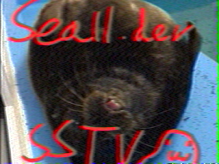

# The end, what is to come?

Maybe more things to come with radio, I'm still learning. Next, CTF challenges with radio perhaps?
