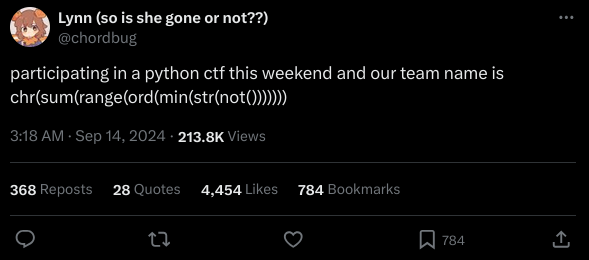
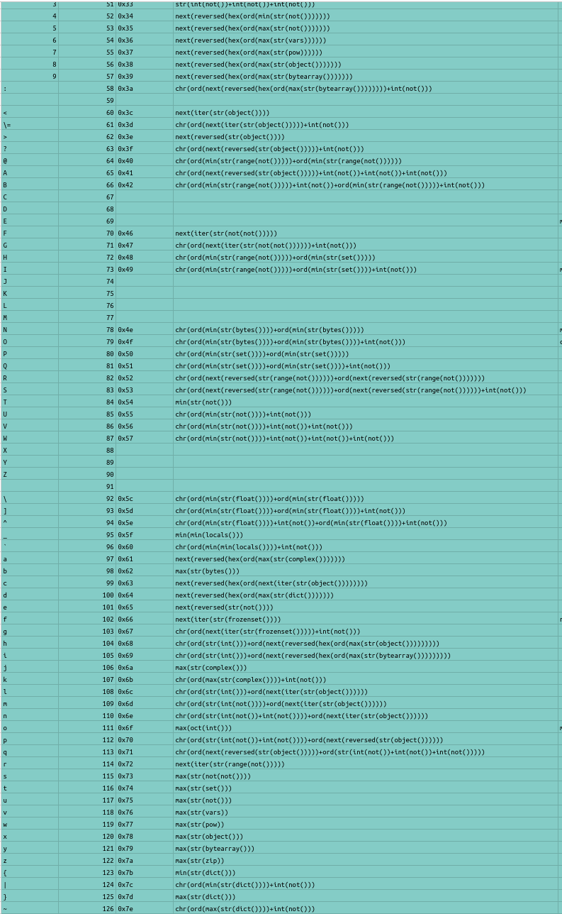
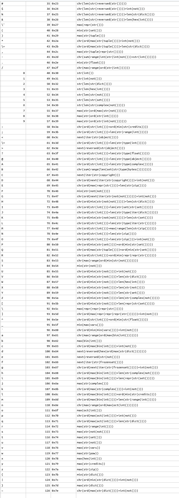
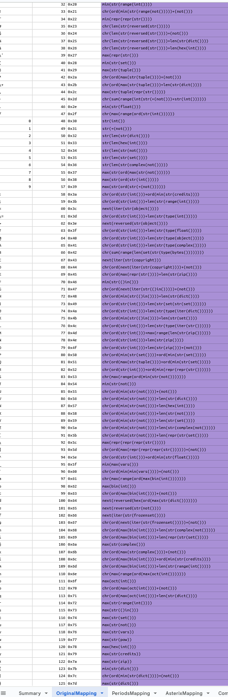

Just to begin with, this is a very silly blog post. This is about a journey into stupidity with Python, and some of the very silly things you can get away with.

## 1. The Beginning
I was browsing Twitter one morning when this tweet appeared on my feed:


I decided to see what this did:
```python
>>> chr(sum(range(ord(min(str(not()))))))
'ඞ'
```

Hehe, amogus.

I thought this was pretty interesting, that you could do this exclusively with builtins and an operator.

I decided to break it down. Originally on Twitter comments broke it down but glossed over an important detail (most did, some saw the detail).

A majority of people broke it down as follows:
```python
>>> not()
True
>>> str(not())
'True'
>>> min(str(not()))
'T'
>>> ord(min(str(not())))
84
>>> range(ord(min(str(not()))))
range(0, 84)
>>> sum(range(ord(min(str(not())))))
3486
>>> chr(sum(range(ord(min(str(not()))))))
'ඞ'
```

This works but glosses over how `not()` is functioning, as it is not a function. Due to Python's general weirdness supporting words for operators, `not` is being parsed as an operator and usually needs a space to interact with variables, as otherwise you would get statements like this that are impossible to parse:
```python
aisnotb
# vs
a is not b
```

Due to the word operators only having to be recognised, we can put symbols or anything that isn't a lowercase letter next to it without a space! In this case the `()` is an empty tuple. When you put `not` next to it, the empty tuple is parsed as a boolean, in this case if the tuple has any contents. This returns `True` as the `not` is applied, due to an empty tuple returning `False` as it has no contents. So, if we added contents to the tuple, it should return `False`.
```python
>>> ()
()
>>> not()
True
>>> not(1)
False
>>> bool(())
False
>>> bool((1))
True
>>> not ()
True
```

Interesting! So, if we were to wrap the `not()` with a `not()` it would also return `False`, the tuple just needs to have any valid contents that isn't equivalent to being empty:
```python
>>> not(not())
False
>>> not(())
True
```

So, whats next?

## 2. The Descent

Next we need to try and build numbers, if we want characters we need to build numbers to go into `chr()`.

So for example:
```python
>>> chr(int(not()))
\x01
>>> chr(int(not(not())))
\x00
```

Cool! So the booleans `True` and `False` being parsed to `1` and `0` respectively when wrapped with `int()`, then wrapping with a `chr()` converts it to a character.

We also already have some characters, for example: from the meme earlier: `min(str(not()))` gives us `T`.

We can then replicate this with `False` to get `F`: `min(str(not(not())))`.

We also have the strings for `0` and `1` with `str(int(not(not())))` and `str(int(not()))`.

We could then make characters above it with `+int(not())` and wrapping it with a `chr()` and the original statement with an `ord()` (or removing the wrap of its existing function in some cases).

So to make `2`:
- `1` can be made with: `str(int(not()))`.
- The numeric `1` is `int(not())`.
- `ord(str(int(not())))` is 49.
- `ord(str(int(not())))+int(not())` is 50.
- Wrapping that with a `chr()` returns `2`!

And the Python of that to show it:
```python
>>> str(int(not()))
'1'
>>> int(not())
1
>>> ord(str(int(not())))
49
>>> ord(str(int(not())))+int(not())
50
>>> chr(ord(str(int(not())))+int(not()))
'2'
```

I then start on a spreadsheet which tracks these combinations, and spend alot of time manually fiddling with combinations.

In the process I discover a few new tricks:
- `next(iter())` gets the first character of a string, `min()` does not it gets the character by lowest decimal value.
- `next(reversed())` gets the last character of a string.

I didn't sleep...

These are some of the more 'interesting' mappings I found manually at the time.
- `min(str(range(not())))` = a space
- `min(str(bytes()))` = `'`
- `min(str(set()))` = `(` 
- `next(reversed(str(range(not()))))` = `)`
- `min(str(float()))` = `.`
- `max(str(bytes()))` = `b`
- `next(reversed(str(not())))` = `e`
- `next(iter(str(frozenset())))` = `f`
- `max(str(complex()))` = `j`
- `next(iter(str(range(not()))))` = `r`
- `max(str(not(not())))` = `s`
- `max(str(set()))` = `t`
- `max(str(not()))` = `u`
- `max(str(pow))` = `w`
- `max(str(object()))` = `x`
- `max(str(bytearray()))` = `y`
- `max(str(zip))` = `z`
- `min(str(dict()))` = `{`
- `max(str(dict()))	` = `}`

Most of these are fairly stock standard grabbing from the function name but lot's of utilisation of `max()` for the lowercase alphabet as they have a higher decimal number range than the uppercase letters (97-122 compared to 65-90).

After filling in some remaining slots, we now have the alphabet but without much optimisation at all... just lots of `+int(not())`

## 3. The Plummet

Now you may have realised something already incredibly inoptimal about the `+int(not())` method of creating characters, and I did the next day as well. If we are trying to make `104` and the closest number we have is `98` and we also have `52`. Why would we do `98+1+1+1+1+1+1` compared to `52+52` (or some other combination)?

I manually did this to the best of my abilities, and built a good portion of the character space.



I also had in this copy, usage of certain functions that rely upon memory addresses as well as `locals`. If your confused here is an example of why this won't work or will not be usable mappings.

```python
>>> iter("test")
<str_ascii_iterator object at 0x7fcba9882ef0>
>>> iter("test")
<str_ascii_iterator object at 0x7fcba98830a0>
>>> iter("test")
<str_ascii_iterator object at 0x7fcba9883100>
>>> iter("test")
<str_ascii_iterator object at 0x7fcba9882ef0>
>>> iter("test")
<str_ascii_iterator object at 0x7fcba98830a0>
>>> iter("test")
<str_ascii_iterator object at 0x7fcba9883100>
```

While we could still use `max()` for the `x`, there are more efficient ways. There are also some cases that other characters will be picked up such as in `str(zip())` where `max()` returns `z`, but is longer than `str(zip)` so it is irrelevant.

We also can't rely on `locals`, `vars` and other functions similar to that as different Python versions & operating systems seem to affect these.

It was at this point I asked for the help of my friend [caek]() who found this concept equally absurd once shown some examples.

After some more combinations utilising the `52+52` method, we had achieved a full mapping of the characters up to `0x7f`, but our longest character was still a whopping **104** characters long...

## 4. Madness

We had now begun on making some automated scripts to create combinations, with some big breakthroughs. We had to work around a few interesting quirks of creating combinations:
- A combination cannot start with `iter()`.
- `str(str())` is inoptimal, handle redundant builtins in combination creation.
- `next()` can only be used after `iter()` and `reversed()`.
- `reversed()` can only be after `str()` and `iter()`.
- `str()`, `repr()` and `ascii()` cannot wrap `iter()`, `reversed()`, `object()` and `zip()` due to previously seen memory address issues.
- `object()` must have no args, so if `object()` is seen wrapping anything ignore the combination.

After the filtering of those issues, some amazing combinations are found:
- `chr(len(str(dict())))` for `\x04`
- `chr(len(hex(int())))` for `\x05`
- `chr(len(str(not())))` for `\x06`
- `chr(len(str(set())))	` for `\x07`
...
- `chr(len(str(type(float()))))` for `\x0f`

The automation had found wrapping `str()` around certain definintions can get longer strings, as can be seen with `\x0f`. Here is a breakdown:
```python
>>> float()
0.0
>>> type(float())
<class 'float'>
>>> str(type(float()))
"<class 'float'>"
>>> len(str(type(float())))
15
>>> chr(len(str(type(float()))))
'\x0f'
```

There was also a new mapping involving `credits` as it's consistent across versions: `max(str(credits))` for `y`.



The longest character at the end of these optimisations is still **100** characters long...

## 5. A breakthrough

On my way to lunch after discussing this with a [caek](), I had a revelation.

Remembering how `not()` works with the empty tuple, and trying to think of a shorter way to represent `not(not())` to represent `False`, which would save characters across many mappings.

Thinking of operators in Python we have the following that fit our keyspace:
- `not`
- `is`
- `in`
- `and`
- `or`

We can immediately discount `or` and `and` as they rely on either a single `True` or both `True` to return a boolean, they also require two inputs on either side which would exceed our character limit. Trying to use an empty tuple with `and` and `or` also don't return booleans, they return empty tuples:
```python
>>> ()and()
()
>>> ()or()
()
>>> (())and(())
()
>>> (())or(())
()
```

`is` is similar to `==`, but requires two inputs on either side to not match. We again need an input on either side that doesn't match to create `False`.
```python
>>> ()is()
<stdin>:1: SyntaxWarning: "is" with 'tuple' literal. Did you mean "=="?
True
>>> (())is()
<stdin>:1: SyntaxWarning: "is" with 'tuple' literal. Did you mean "=="?
True
>>> int()is()
<stdin>:1: SyntaxWarning: "is" with 'tuple' literal. Did you mean "=="?
False
```

This would again exceed the character limit of 10, so we move to the last 'word operator': `in`.

`in` is interesting as its determining if a value exists in another list, set, tuple, etc. Yes, you read that right, **tuple**. So I quickly connected the dots while describing this verbally and thought of this: `()in()`.

I pulled my phone out as fast as I could and spun up Termux to open Python, and to my delight:
```python
>>> ()in()
False
```

A 4 character save! As an empty tuple does not contain anything, an empty tuple cannot contain an empty tuple. Thank Python!

Within the same day, I had another thought when thinking about how we could decrement a number. We didn't have a way to go down number's and would create many more combinations.

What came to mind was `range()`, and this is why.
```python
>>> range(10)
range(0, 10)
>>> for i in range(10): print(i)
... 
0
1
2
3
4
5
6
7
8
9
```

The `range()` function decrements, the highest number is **one less** than the input number, but how do we get it? I think of using the `next(reversed())` trick:
```python
>>> list(range(10))
[0, 1, 2, 3, 4, 5, 6, 7, 8, 9]
>>> next(reversed(list(range(10))))
9
```

Woohoo! We can now increment and decrement, but my thought is there has to be a shorter way, I try dropping `list()`:
```python
>>> next(reversed(range(10)))
9
```

Well that's good news, because we have a list already do we really need to use `next(reversed())`? We have a numeric list would `max()` and `min()` work?
```python
>>> max(range(10))
9
```
I think that is as small as we are going to get it, we can decrement with `max(range())`!


[caek]() was the star of the show for this portion, with a new script to absolutely crush through combinations with their GPU and to utilise the new representation of `False`. In the meanwhile I contributed with manual combinations of the `52+52` trick and the new `max(range())` trick.



The longest character was now **50** characters long!

## 6. Automation

I then started drafting a script to automate the `52+52` trick recursively and to not be super slow, this can be seen in the `findnum.py` script in the repo but essentially replicates the `52+52` script but with combinations of up to `x` and to automatically find the shortest combinations.

I also learnt how to use GitHub workflows, writing my first ever one. I made a small script called `verification.py` and a workflow to automatically run it against commits and pull requests to make sure the mappings are consistent with the char code they are assigned to, this is to prevent incorrect mappings (intentionally or not).

With some more changes I also added support for the verification script across Windows, MacOS and Linux with all versions from 3.9-3.12.

This found some mappings that were 3.11+ only, so a seperate mapping was made for it.

Another mapping that was being worked on in the background that wasn't mentioned as much was the mapping with the `.` (bulletpoint, period, full stop, etc) added to the character space. But so far this has only shown promise with `.upper()` and `.lower()`.

The `findnum.py` script was added to be used with a workflow to automatically look for shorter combinations on its own for all pulls and commits, automatically creating its own pull requests to apply these changes, but also avoiding recursive execution.

A small webapp was also made to speed up the process of encoding, and a CLI version with `pywtf.py`. The website and repo template was based off of JSFuck.

## 7. What's next?

Now the tool is working towards all unicode characters, better period mapping, astrix mapping and more.

With some help from my friends ([caek]() and [KabirAcharya]()) it keeps getting shorter and stupider, if you want to contribute feel free to work on [the repo](https://github.com/sealldeveloper/pywtf)