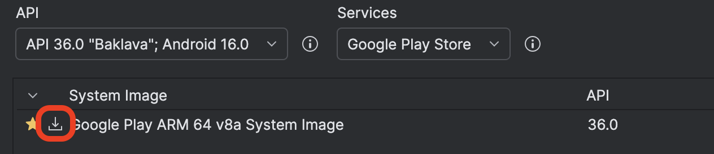
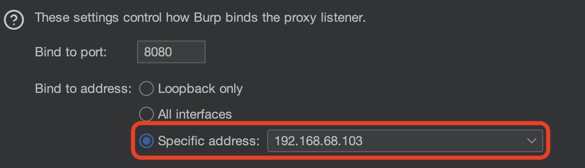

# Prerequisites

We need to start by installing the relevant tools, for Mac this is done with `brew`. `brew` can be installed from [here](https://brew.sh).

Start with:
```bash
brew install android-studio android-platform-tools openssl
```
Now start Android Studio, we can begin setting up the AVD.

# Setting up the AVD

AVD stands for Android Virtual Device and within Android Studio you can create them. They are fairly trivial to setup and are ran with `qemu`, there are also several well documented ways to root them.

When you start Android Studio you will start by downloading the Android SDK, just use the default installation location. For me this was `~/Library/Android/sdk`.

Once the components are downloaded you will get a screen like this:
 


Select 'New Project', then 'No Activity' as the project type, then 'Next' and 'Next' again. We don't care about the project as we just want to setup the Virtual Device.

On the right side of the screen are some small icons. Hovering over them defines their purpose, select 'Device Manager'.

Now look for the '+' and select it, then 'Create new Virtual Device'.

## Device Configuration Options

Look in the device options list for a Pixel 9, then press Next.

The API should have a small 'Download' icon on it. Select it, accept the license and download it. Keep in mind the API version you select as you need it later to root the VM.

> IMPORTANT NOTE: Try to select the API verison 1 older, there seems to be alot of bugs in the newest version (36 as of writing) in Frida and `objection`.



Once downloaded we should have our AVD ready to go. Once you press 'Finish' we can press the 'Play' button and it will boot the VM.

# Rooting the VM

We are going to use [rootAVD](https://gitlab.com/newbit/rootAVD). Start by cloning the project:
```bash
git clone https://gitlab.com/newbit/rootAVD
```

Once cloned, use the `rootAVD.sh` to do the process.

```bash
./rootAVD.sh system-images/android-<APIVERSION>/google_apis_playstore/arm64-v8a/ramdisk.img
```

> Sometimes this will fail because you don't have `ANDROID_HOME` set. I set mine with `export ANDROID_HOME="$HOME/Library/Android/sdk"` in my `.zshrc` file. If you want to find the path for the script just traverse through the `sdk` folder.

It will cause the VM to likely hang, for me the VM always entirely hangs and Android Studio really doesn't like it.

The way I handle this is probably not the best but seems to consistently work:
- Use `pgrep qemu` to find the currently running VM
- Use `kill -9 <PID>` to kill the AVD
- On Android Studio in the 'Device Manager', right click the AVD (once it thinks its down) and select 'Cold Boot'

This seems to work, and once its open we should be nearly done.

On the phone home page, swipe up and open Magisk. It should reboot the AVD and be rooted!

# Getting a shell

On our host we can use `adb shell` and try to get a shell, which should work. What won't work is `su` as it will hang.

All we need to do is go to the VM and answer the prompt in Magisk:


Select 'Grant' and we will have a root shell!

```bash
$ adb shell
emulator64_arm64:/ $ su
emulator64_arm64:/ #
```

# Setting up Burp Suite

Firstly, open Burp Suite and change your proxy listener from 'Loopback only' to 'Specific address'. 



The address should be selected based on the IP from this command (which retrieves your current local IP address from your WiFi or Ethernet connection, whatever is on `en0`):
```bash
ipconfig getifaddr en0
```

> Note: Doing this means the proxy will be available to everyone on your current WiFi network, if you change local IP you need to update your Burp Suite and your VM's proxy IP (which you will see later on).

Then get the certificate by pressing the 'Import / export certificate' button. Select 'Certificate in DER', then export. I save mine as `burpcert.der`


## Install the certificate

This is where `openssl` comes in, convert the DER to PEM. Make sure to swap out the names of the input and output file to what you want.
```bash
openssl x509 -inform DER -in burpcert.der -out burpcert.pem
```

Then use adb to send the certificate to the AVD:
```bash
adb push burpcert.pem /sdcard/Download
```

Open the Settings app on the phone then use the search bar to look for 'certificate'. Look for a 'Install a certificate' option:


Select the option, then select it in the relevant menu. Once inside you should see a menu like the following:


Select 'CA certificate', then 'Install anyway'. Navigate to the Downloads folder and select the `.pem` certificate.

## Install the `Cert-Fixer` module for Magisk

To make the user certificate trusted as a system CA certificate, instead of messing with mounting the system I use a module for Magisk called [Cert-Fixer](https://github.com/pwnlogs/cert-fixer).

I download the latest release and then upload it to the AVD with adb:
```bash
adb push Cert-Fixer.zip /sdcard/Download
```

On the phone, open the Magisk app then go to 'Modules'. Press 'Install from Storage' then navigate to the Downloads folder and select 'Cert-Fixer.zip'.

## Updating the WiFi to use the Proxy

Go to the settings, then WiFi, then press the 'Settings' icon on the WiFi connection. Press the small pencil icon in the top right to edit the connection. There should be a 'Proxy' option.

> Sometimes you may see a T-Mobile SIM connection, just ignore it.

Modify your proxy settings to the following, except make sure to substitute your 'Proxy hostname' for the IP you set in Burp Suite.


Press 'OK' and then try to visit a website in the VM, it should be listed in Burp Suite.


# Setting up Frida and `objection` for SSL pinning removal

Firstly, I have a `android-lab` folder I use to do my Android testing. Inside I made a Python venv to install Frida.
```
python3 -m venv .venv
. .venv/bin/activate
pip3 install frida-tools
```

Now with all the Frida utilities installed, we need to get the copies for the AVD. I have this one-liner to get the relevant binaries:
```bash
export FRIDA_VERSION=$(frida --version)
wget "https://github.com/frida/frida/releases/download/$FRIDA_VERSION/frida-server-$FRIDA_VERSION-android-arm64.xz" -qO- | xz -d > "frida-server-$FRIDA_VERSION"

adb push "frida-server-$FRIDA_VERSION" "/data/local/tmp/frida-server-$FRIDA_VERSION"

adb shell "su -c chmod +x /data/local/tmp/frida-server-$FRIDA_VERSION"

adb shell
```

This downloads the relevant Android binaries for the server, pushes them to the AVD and then drops you into a shell to start them.

All you need to do its the following:
```bash
$ adb shell
emu64a:/ $ su
emu64a:/ # /data/local/tmp/frida-server &
[1] 12037
```

This starts `frida-server` on your AVD, and the `&` is to make it a background task so you can continue using the terminal and it will continue to execute once you close the shell.

On the host you can list the available running applications with this:
```bash
frida-ps -Uai
```

`objection` can then be used to bypass SSL pinning and begin exploration!


```bash
objection -g "com.app.app" explore

com.app.app on (google :15) [usb] # android sslpinning disable
(agent) Custom TrustManager ready, overriding SSLContext.init()
(agent) Found com.android.org.conscrypt.TrustManagerImpl, overriding TrustManagerImpl.verifyChain()
(agent) Found com.android.org.conscrypt.TrustManagerImpl, overriding TrustManagerImpl.checkTrustedRecursive()
(agent) Registering job 907543. Type: android-sslpinning-disable
```

