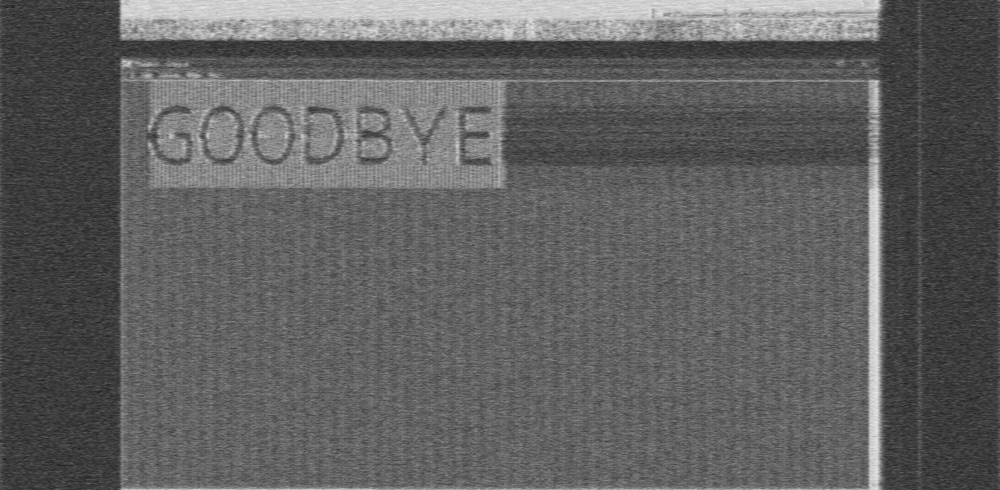

## What is TempestSDR, and how does this attack work?

TempestSDR is a piece of Java code written by [martinmarinov](https://github.com/martinmarinov) to sniff a video stream using an antenna. Based off of the paper: [Remote video eavesdropping using a software-defined radio platform](http://www.gbppr.net/mil/vaneck/acs-dissertation.pdf) which contains a PoC and where the attack was properly demonstrated and theorised.

Whats happening is, most if not all display cables connected to screens emit a radio frequency of the data travelling inside them. If we used an antenna near this cable, we can actually pickup this signal! Using TempestSDR, a software defined radio (like RTL-SDR, HackRF) and an antenna, we can listen to this faint signal emitted from the cable and construct a black and white live image of the screen.

## Setup

Firstly start with downloading [eried's self-executable version of TempestSDR for Windows](https://github.com/eried/Research/tree/master/HackRF/TempestSDR), specifically the `TempestSDR_win32_openjdk-14.0.1.zip`. If the link is down in the future I've archived a version on [The Wayback Machine](http://web.archive.org/web/20240314111651/https://raw.githubusercontent.com/eried/Research/master/HackRF/TempestSDR/TempestSDR_win32_openjdk-14.0.1.zip).

After downloading, I unzip and run `TempestSDR.exe`.

Select the `File` option in the top-left, then click `Load ExtIO source`.

If you have the HackRF plugged in, a popup should appear.

I close the menu changing no settings.

## Options

## Sniffing

I find the most easily sniffable cable to be my DVI-D for one of my monitors, the process I used to find the signal was as follows:

1. I put the gain quite high and then adjust the frequency to find the loudest range (the red underlined values).

2. I look at the blue circled peaks to select them for the settings, knowing the monitors res for your bottom graph selection is useful. You can use `AUT` to identify the monitor with some success.

3. After you find a somewhat clear signal (can see the letters or some distinguishing features), turn off the auto mode for FPS (the A next to the arrows), and then use the arrows to manually hone the signal (green square).
   - 3a. If i'm unable to find a clear signal, I use `RST` to reset my history from the antenna, particularly useful if you know that you got some garbage input.

4. Afterwards I use `Lpass` to smooth bits of the signal for a clear video stream.

## Results

Here are a few shots I got:

