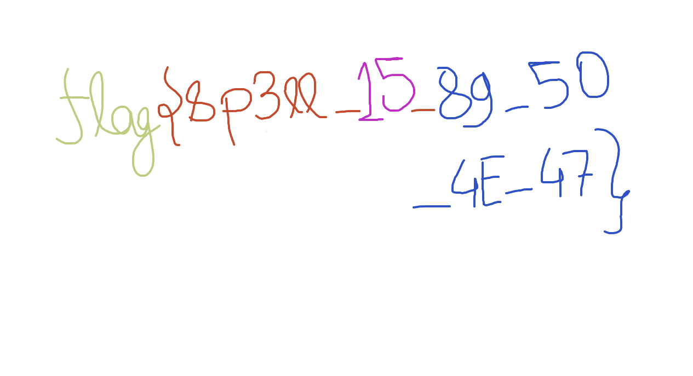

At an original look at this challenge I got stumped for a while overlooking something very minor...

We start with a seemingly 'corrupt' file, `chal.png` which doesn't open. I check EXIF first:

```
$ exiftool chal.png
ExifTool Version Number         : 12.70
File Name                       : chal.png
Directory                       : .
File Size                       : 90 kB
File Modification Date/Time     : 2023:12:18 14:43:09+11:00
File Access Date/Time           : 2023:12:18 18:10:35+11:00
File Inode Change Date/Time     : 2023:12:18 18:10:33+11:00
File Permissions                : -rw-rw-r--
File Type                       : PNG
File Type Extension             : png
MIME Type                       : image/png
Image Width                     : 1265
Image Height                    : 687
Bit Depth                       : 8
Color Type                      : RGB with Alpha
Compression                     : Deflate/Inflate
Filter                          : Adaptive
Interlace                       : Noninterlaced
Image Size                      : 1265x687
Megapixels                      : 0.869
```
Nothing... Anything trying binwalk?
```
$ binwalk -e chal.png
DECIMAL       HEXADECIMAL     DESCRIPTION
--------------------------------------------------------------------------------
41            0x29            Zlib compressed data, compressed
```
Nothing of interest in the data... So here I get stumped until I decide to check the bytes...

Files have 'signatures' (magic numbers). PNGs magic numbers are `89 50 4e 47 0d 0a 1a 0a`. This does not match our files magic numbers (`ae 71 00 ff 3d 62 24 6d`)

So... I change the files magic bytes to be the correct bytes, and we get the following image (that opens!).



Flag: `flag{sp3ll_15_89_50_4E_47}`

**Files:** [public.zip](https://web.archive.org/web/20231218155709/https://backdoor.infoseciitr.in/uploads?key=8823502df1ed5ebf77a70f66f2cb4d3551cc167477a7cc7d5525a04ef7559255%2Fpublic.zip)