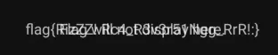
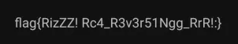

The app (on startup) displays this.


I opened the apk with jadx and had a look through the functions on `MainActivity` and noticed this particular portion.

```java
public void onCreate(Bundle savedInstanceState) {
	super.onCreate(savedInstanceState);
	setContentView(C0567R.layout.activity_main);
	TextView textView = (TextView) findViewById(C0567R.C0570id.displayTextView);
	this.displayTextView = textView;
	textView.setVisibility(8);
	TextView textView2 = (TextView) findViewById(C0567R.C0570id.textView);
	this.textView = textView2;
	textView2.setText(getResources().getString(C0567R.string.message));
	kim(getResources().getString(C0567R.string.f116k1));
	nim(getResources().getString(C0567R.string.f117n1));
	damn(getResources().getString(C0567R.string.f115d1));
	m105k2(getResources().getString(C0567R.string.k21));
}
```

The app shows some text normally, and we can see some texts visibility being edited and some text being shown.

I connect my phone and prepare an ADB bridge with jadx. Looking through the Smali I put a breakpoint at:

 - line 225 (`invoke-virtual      {v0, v1}, Landroid/widget/TextView;->setVisibility(I)V`)
 - line 238 (`invoke-virtual      {v0, v1}, Landroid/widget/TextView;->setText(Ljava/lang/CharSequence;)V`)

On the first breakpoint shows setting the visibility. We change this (`v1`) to `0` to make it visible.



On the second breakpoint we change this (`v1`) from `Flag will not display here.` to ` ` (a space), to make it invisible.



Continuing past the breakpoints were shown our flag: <mark>flag{RizZZ! Rc4_R3v3r51Ngg_RrR!:}</mark>.

**Files:** [slaydroid.zip](https://web.archive.org/web/20231218160004/https://staticbckdr.infoseciitr.in/slaydroid.zip)