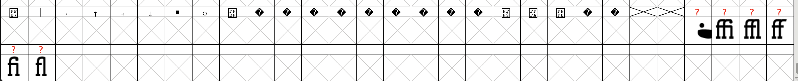
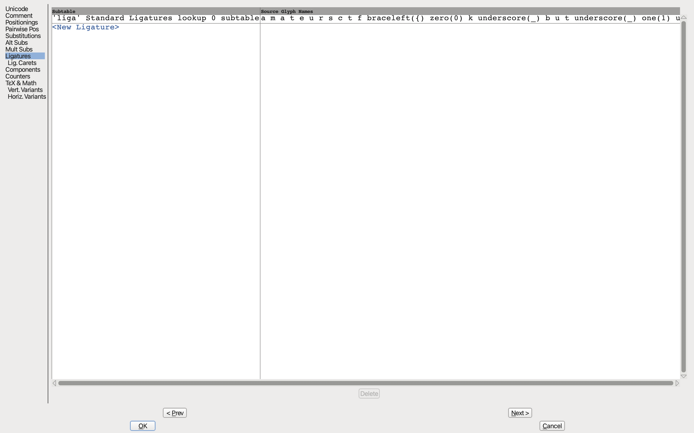

Visiting the website in Burp Suite I see a request to `/`, `/agile-rut.otf`, and `/favicon.ico`

Now the one of interest is `agile-rut.otf`, which I visit and download.

I look online for how to view whats inside a font and I find FontForge is a very good tool for fonts.

After opening the font in FontForge there are some suspicious glyphs at the bottom, particularly the half of a smiley face.



I right click the glyph and press `Glyph Info...`, I browser through the sidebar tabs and I see something of interest in `Ligatures`.



```
a m a t e u r s c t f braceleft({) zero(0) k underscore(_) b u t underscore(_) one(1) underscore(_) d o n t underscore(_) l i k e underscore(_) t h e underscore(_) j b m o n zero(0) underscore(_) equal(=) equal(=) equal(=) braceright(})
```

Flag: `amateursctf{0k_but_1_dont_like_the_jbmon0_===}`