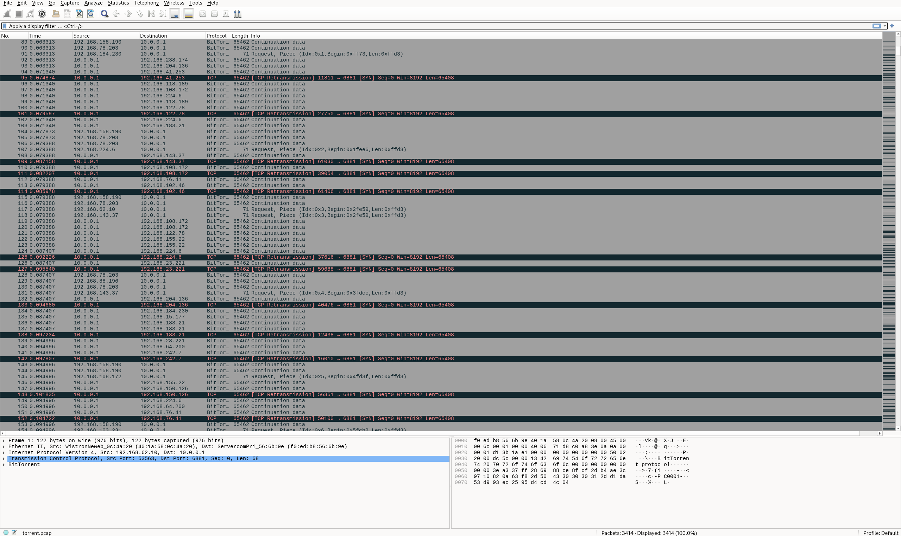
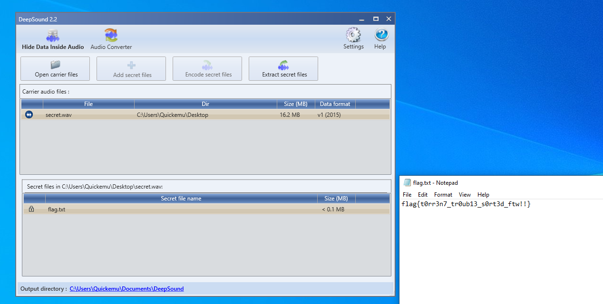

Starting with a `torrent.pcap`, I investigate with Wireshark.



This is Bittorrent traffic, I start by analysing with bittorrent-traffic-analyzer.

The only part of interest is the `-download`:
```bash
$ ./bt-monitor -pcap ../torrent.pcap -download
Length of file is: 25410508, number of parts: 5020, info_hash is: f904efebe656514c26fd5d9f66b810113c85fdd4, contributors: {('10.0.0.1', '6881')}
```

To extract this file I use a Python script:
```python
from scapy.all import rdpcap
from tqdm import tqdm
import struct

def reconstruct_bittorrent_file(pcap_file, output_file):
    packets = rdpcap(pcap_file)
    total_packets = len(packets)
    pieces = {}
    print(f"Processing {total_packets} packets from {pcap_file}...")
    for pkt in tqdm(packets, desc="Reconstructing file", unit="pkt"):
        if pkt.haslayer('TCP') and pkt.haslayer('Raw'):
            try:
                payload = pkt['Raw'].load
                # BitTorrent message format:
                # <length prefix><message ID><payload>
                # First byte is message type, followed by piece index, offset, and data
                if len(payload) < 13:
                    continue
                msg_length = struct.unpack(">I", payload[0:4])[0]
                
                # Check if this is a PIECE message (ID = 7)
                if len(payload) > 4 and payload[4] == 7:  # 7 is the message ID for PIECE
                    piece_index = struct.unpack(">I", payload[5:9])[0]
                    piece_offset = struct.unpack(">I", payload[9:13])[0]
                    piece_data = payload[13:]
                    key = (piece_index, piece_offset)
                    if key not in pieces:
                        pieces[key] = piece_data
                    else:
                        if len(piece_data) > len(pieces[key]):
                            pieces[key] = piece_data
                            
            except Exception as e:
                print(f"Error processing packet: {e}")
                continue
    
    print("Sorting and combining pieces...")
    sorted_pieces = sorted(pieces.items())
    reconstructed_data = b''.join(data for (_, _), data in sorted_pieces)
    
    with open(output_file, 'wb') as f:
        f.write(reconstructed_data)
    
    print(f"Reconstructed file saved as: {output_file}")
    print(f"Total pieces reconstructed: {len(pieces)}")
    print(f"Total data size: {len(reconstructed_data)} bytes")

if __name__ == "__main__":
    reconstruct_bittorrent_file('torrent.pcap', 'reconstructed.bin')
```

Using the script we get a `reconstructed.bin` that is a `zip`:
```bash
$ file reconstructed.bin
reconstructed.bin: Zip archive data, at least v2.0 to extract, compression method=deflate
```

Extracting we get a `secret.wav` and a `key.txt`.

`key.txt` is a Base64 string:
```
NjcgNzUgNzIgNWYgNjMgNDAgNjYgNjYgNmEgMzAgNjUgNzEgNWYgNzYgNjYgNWYgMzQgNjYgNWYgNzIgNmUgNmQgNmMgNWYgNmUgNjYgNWYgNGUgNGYgNTA=
```

Decoded is a hex string:
```
67 75 72 5f 63 40 66 66 6a 30 65 71 5f 76 66 5f 34 66 5f 72 6e 6d 6c 5f 6e 66 5f 4e 4f 50
```

Decoded from hex is this string:
```
gur_c@ffj0eq_vf_4f_rnml_nf_NOP
```

You can then ROT13 (DCode.fr's Cipher Identifier spots this) decode it:
```
the_p@ssw0rd_is_4s_eazy_as_ABC
```

Looking at the file with stegseek using the `--seed` switch, there is definitely some kind of steganography.
```bash
$ stegseek --seed secret.wav
StegSeek 0.6 - https://github.com/RickdeJager/StegSeek

[i] Found (possible) seed: "bbd0b344"             
	Plain size: 256.2 MB (compressed)
	Encryption Algorithm: loki97
	Encryption Mode:      ctr
```

Eventually I try DeepSound which is a Windows program for steganographically disguising files in .wav's but is not decodable with stegseek/steghide/etc

This grants us the flag!



Flag: `flag{t0rr3n7_tr0ub13_s0rt3d_ftw!!}`