This is a writeup for the challenge 'Verboten' from bi0sCTF 2024, I played this CTF with [thehackerscrew](http://www.thehackerscrew.team/).

You can join the Discord community for this CTF (with more writeups!) [here](https://discord.gg/qUKNQwznZd).

## The Challenge

### Challenge Metadata

The challenge was written by `jl_24`, `sp3p3x`, `gh0stkn1ght` and `hrippi.x_` and got 29 solves.

Here is the challenge description:

> Randon, an IT employee finds a USB on his desk after recess. Unable to contain his curiosity he decides to plug it in. Suddenly the computer goes haywire and before he knows it, some windows pops open and closes on its own. With no clue of what just happened, he tries seeking help from a colleague. Even after Richard's effort to remove the malware, Randon noticed that the malware persisted after his system restarted.

> Note:
> - For Q7: 12HR time format
> - All epoch times should be converted to IST (UTC + 5:30).
> - All other timestamps are to be taken as it is from artifacts.


### What are we working with?

The files we are given are a `.ad1` file, let's do some basic research into this file format.

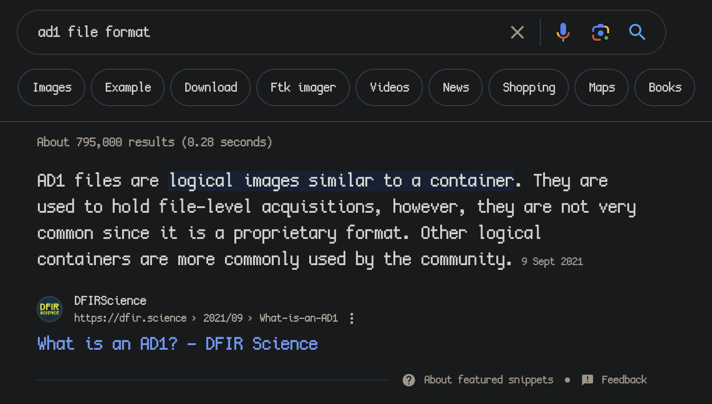

Seems to be a logical drive backup and can be parsed with a program called FTK Imager.

I download FTK Imager and mount the `.ad1` as evidence, and we can now see a file system which is unmistakably a Windows installation.

I export the files to a folder on my Desktop to parse through.

Afterwards before looking I join the deployment (through ncat) that we are given to see the first question.

## Question 1

> Q1) What is the serial number of the sandisk usb that he plugged into the system? And when did he plug it into the system?

> Format: verboten{serial_number:YYYY-MM-DD-HH-MM-SS}

So, looking for information on the timestamp I find a tool called USB Detective and download the community edition.

After downloading and running, as well as selecting the appropriate registry hives inside the `Windows/System32/config` folder, we are shown a result containing a 'Serial Number', the last time it was plugged in/unplugged, and some other information.

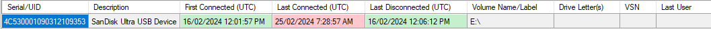

We can see both the Serial and the Timestamp there! But our serial is incorrect once we check on the server.

Looking more into where this information is typically stored, we are pointed to look into the `SYSTEM` registry, so I mount it using RegCool.

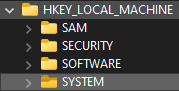

Now looking in the Registry, looking online they say to check:
- [SYSTEM\CurrentControlSet\Control\usbflags](https://learn.microsoft.com/en-us/windows-hardware/drivers/usbcon/usb-device-specific-registry-settings)
- [SYSTEM\CurrentControlSet\Enum\USBSTOR](https://www.sciencedirect.com/topics/computer-science/window-registry)
- [SYSTEM\CurrentControlSet\Enum\USB](https://www.sciencedirect.com/topics/computer-science/window-registry)
-  SYSTEM\CurrentControlSet\Enum\STORAGE (from just exploring, no source)

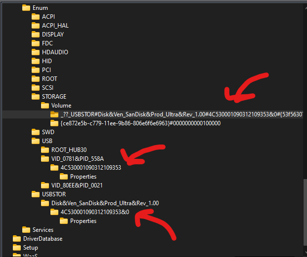

Checking them out we can see some more information, the `STORAGE` entry containing this string:

`##?#SWD#WPDBUSENUM#_??_USBSTOR#Disk&Ven_SanDisk&Prod_Ultra&Rev_1.00#4C530001090312109353&0#{53f56307-b6bf-11d0-94f2-00a0c91efb8b}#{f33fdc04-d1ac-4e8e-9a30-19bbd4b108ae}`

The key part they want you to include is the `&0` at the end of the Serial Number we are given, for whatever reason. This is also seen in the serial for `USBSTOR` but not `USB`.

Extracting that and using the timestamp from USB Detective, we have the correct flag for part 1.

Flag: `verboten{4C530001090312109353&0:2024-02-16-12-01-57}`

## Question 2

> Q2) What is the hash of the url from which the executable in the usb downloaded the malware from?

> Format: verboten{md5(url)}

Looking inside the `Users\randon\AppData\Local\Chome\User Data\Default` folder is some browser artifacts!

Downloading and using a tool called Hindsight we can view the left over data on the browser, specifically the timeline.

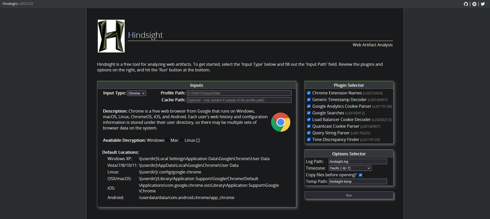

Selecting the `Default` folder as the input we get this parsing:

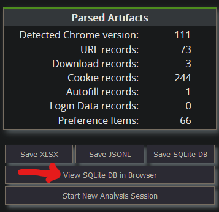

Viewing the timeline we can see a certain URL being fetched: `https://filebin.net/qde72esvln1cor0t/mal`

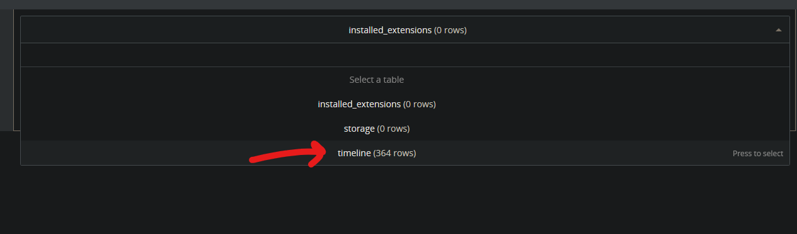

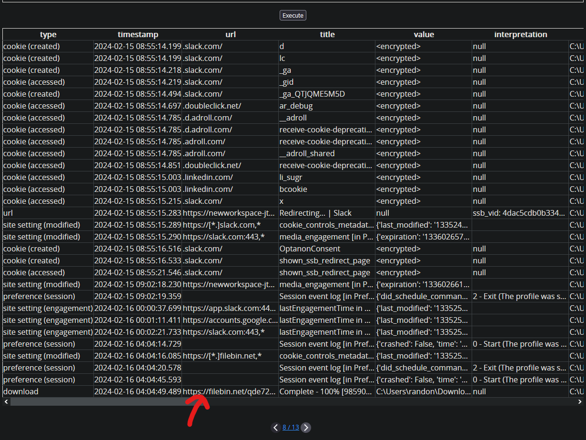

The MD5 of that URL (`https://filebin.net/qde72esvln1cor0t/mal`) gives us the flag!

Flag: `verboten{11ecc1766b893aa2835f5e185147d1d2}`

## Question 3

> Q3) What is the hash of the malware that the executable in the usb downloaded which persisted even after the efforts to remove the malware?

> Format: verboten{md5{malware_executable)}

A bit more poking around we stumble upon the Startup folder (`\ProgramData\Microsoft\Windows\Start Menu\Programs\Start Up`), which has a `mal.exe` (which seems to be from the FileBin link above).

Getting the MD5 of that file gives us the flag.

Flag: `verboten{169cbd05b7095f4dc9530f35a6980a79}`

## Question 4

> Q4) What is the hash of the zip file and the invite address of the remote desktop that was sent through slack?

> Format: verboten{md5(zip_file):invite_address}

Looking inside some more of the `AppData` folders, we can see a `Slack` folder. Looking at the files we can see the Cache is still intact. As the underlying browser is based on Chromium, we can use a tool to view the cache intended for Chromium. I utilise NirSoft's ChromeCacheView (love you Nir Sofer).

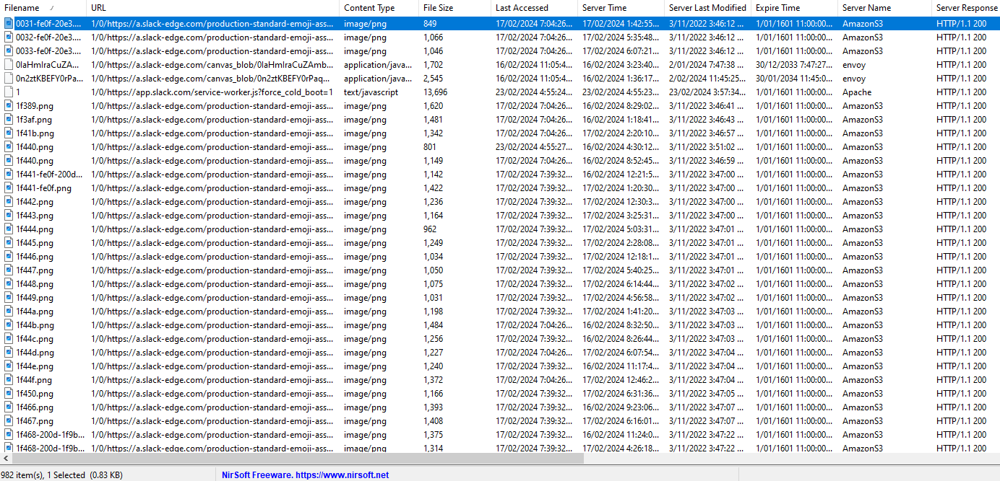

Viewing the Cache we can see alot of entries but we know that we are looking for a ZIP file, so I search for `.zip` and get one entry.

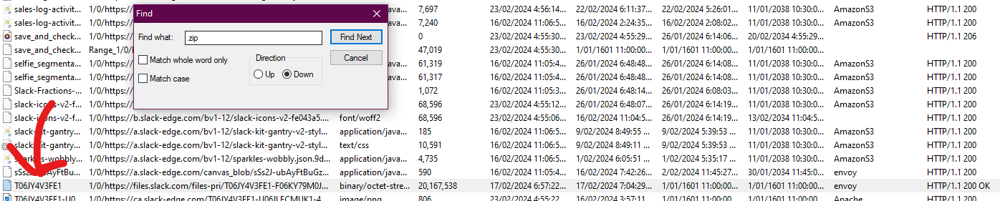

Looking at the entry, we can see an MD5 in the `ETag`.

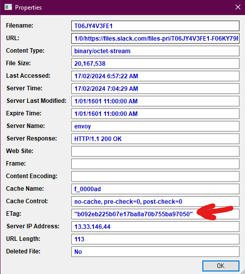

Now for the invite address, looking for the phrase 'address' inside the IndexedDB blob file, we can find the ID. I looked here because of [this article](https://medium.com/@jeroenverhaeghe/forensics-finding-slack-chat-artifacts-d5eeffd31b9c).

The message in question: `here is the address for anydesk: 1541069606`

Note: A tool as mentioned by a Discord user `dysnome` was Slack-Parser.

Flag: `verboten{b092eb225b07e17ba8a70b755ba97050:1541069606}`

## Question 5

> Q5) What is the hash of all the files that were synced to Google Drive before it was shredded?

> Format: verboten{md5 of each file separated by ':'}


From looking into the `AppData` folders I remember a folder called `DriveFS` (`\Users\randon\AppData\Local\Google\DriveFS`) and look for any tools designed to parse it.

Online I find DriveFS-Sleuth which seems perfect.

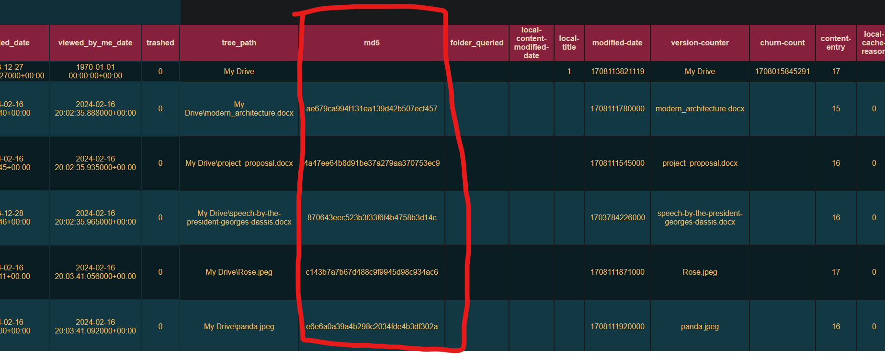

Downloading it and running it with our system and selecting the appropriate files, we get the MD5's of the files in the output.

Flag: `verboten{ae679ca994f131ea139d42b507ecf457:4a47ee64b8d91be37a279aa370753ec9:870643eec523b3f33f6f4b4758b3d14c:c143b7a7b67d488c9f9945d98c934ac6:e6e6a0a39a4b298c2034fde4b3df302a}`

## Question 6

> Q6) What is time of the incoming connection on AnyDesk? And what is the ID of user from which the connection is requested?

> Format: verboten{YYYY-MM-DD-HH-MM-SS:user_id}


Remembering from the `AppData` again, I visit the `AnyDesk` folder.

Looking at `/Users/randon/AppData/Roaming/AnyDesk/ad.trace` we can search for 'incoming' and get some hits, going through we can see an incoming request with an ID and timestamp.

`info 2024-02-16 20:29:04.298       back   4668   6440                   app.backend_session - Incoming session request: Richard Beard (221436813)`

Flag: `verboten{2024-02-16-20-29-04:221436813}`

## Question 7

> Q7) When was the shredder executed?

> Format: verboten{YYYY-MM-DD-HH-MM-SS}

We can find this timestamp from investigating the prefetches. 

I utilise a tool called PECmd to view the Prefetches and extract all of them to a JSONL to parse.

Searching in the JSONL export I look for 'shredder' and see some references to the prefetch `BLANKANDSECURE_X64.EXE-DF0E2BF6.pf`.

The question specifically asks for the last time the shredder was executed

```json
{
    "SourceFilename": "C:\\Windows\\prefetch\\BLANKANDSECURE_X64.EXE-DF0E2BF6.pf",
    "SourceCreated": "2024-02-22 18:03:26",
    "SourceModified": "2024-02-16 20:31:06",
    "SourceAccessed": "2024-02-24 13:27:08",
    "ExecutableName": "BLANKANDSECURE_X64.EXE",
    "Hash": "DF0E2BF6",
    "Size": "29910",
    "Version": "Windows 10 or Windows 11",
    "RunCount": "1",
    "LastRun": "2024-02-16 20:30:51",
    "Volume0Name": "\\VOLUME{01da5bf6b466bdde-e8b4e083}",
    "Volume0Serial": "E8B4E083",
    "Volume0Created": "2024-02-10 07:56:50",
    "Directories": "...\\VOLUME{01da5bf6b466bdde-e8b4e083}\\USERS\\RANDON\\DOWNLOADS\\FILE_SHREDDERS, \\VOLUME{01da5bf6b466bdde-e8b4e083}\\USERS\\RANDON\\DOWNLOADS\\FILE_SHREDDERS\\SHREDDERS, \\VOLUME{01da5bf6b466bdde-e8b4e083}\\USERS\\RANDON\\DOWNLOADS\\FILE_SHREDDERS\\SHREDDERS\\SHREDDERS, \\VOLUME{01da5bf6b466bdde-e8b4e083}\\USERS\\RANDON\\DOWNLOADS\\FILE_SHREDDERS\\SHREDDERS\\SHREDDERS\\BLANKANDSECURE_X64...",
    "FilesLoaded": "...",
    "ParsingError": false
}
```

Using the `SourceModified` date gives us the flag (and adjusting to 12H time as mentioned in the challenge description).

Now, why do we use `SourceModified` and not the given `LastRun` entry?

As explained by the discord user `dysnome`:
> Last run: When you double click on the .exe file, Last modified: When all DLLs have been loaded in memory

Flag: `verboten{2024-02-16-08-31-06}`

## Question 8

> Q8) What are the answers of the backup questions for resetting the windows password?

> Format: verboten{answer_1:answer_2:answer_3}

Again, the NirSoft legend gives us a tool to do this for us: SecurityQuestionsView.

Running this and selecting the appropriate files allows us to pull the answers out.

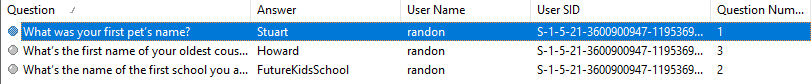

Flag: `verboten{Stuart:FutureKidsSchool:Howard}`

## Question 9


> Q9) What is the single use code that he copied into the clipboard and when did he copy it?

> Format: verboten{single_use_code:YYYY-MM-DD-HH-MM-SS}


Looking inside some more files given we can find `\Users\randon\AppData\Local\ConnectedDevicesPlatform\dd683d380e7fa229\ActivitiesCache.db`. This database contains the contents we need, looking through with a hex editor we can find a deleted entry (which we found searching for `content` in the file):

```json
[
  {
    "content":"WW91ciBzaW5nbGUtdXNlIGNvZGUgaXM6IDgzMDAzMA0K",
    "formatName":"Text"
  }
]
```

Decoding the base64 we are given the code: `Your single-use code is: 830030`

The timestamp was found from looking at the 4 bytes before the `[` and parsing to Decimal.

`65CFA163` -> `1708106083`

Once adjusted for to IST as per the rules, we are given the final flag.

Note: It turns out removing the `ActivitiesCache.db-wal` and `Activities.db-shm` allows viewing of the entries in the DB without having to view it with a hex editor.

Flag: `verboten{830030:2024-02-16-23-24-43}`


## Special Thanks
Special thanks to `dysnome` and `warlocksmurf` on the bi0sCTF Discord for the writeup feedback and critique!

