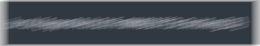
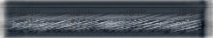
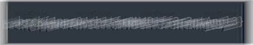

This is a writeup for the challenge 'eye doctor' from Braeker 2024, I played this CTF with [thehackerscrew](http://www.thehackerscrew.team/).

You can join the Discord community for this CTF (with more writeups!) [here](https://discord.gg/txANaaygJe).

## The Challenge

### Challenge Metadata

The challenge was written by `spipm` and got 119 solves.

### What are we working with?

We are given a PNG file which shows some distorted imagery for what looks like text:

Assuming that we need to 'deblur' the text to read it, I start looking online.

### Solution

Looking online for CTF image blurred I found [this resource](https://fareedfauzi.gitbook.io/ctf-playbook/steganography).

Scrolling through I found this entry: `13. Use SmartDeblur software to fix blurry on image.`

Downloading [SmartDeblur](http://smartdeblur.net/) I put the image in and try to automatically deblur it...

Well, that didn't work... Lets try some different settings.

I select a portion of the image and drop the size to 10x10.

Flag: `brck{4ppr04ch1tfr0M4D1ff3r3ntAngl3}`

