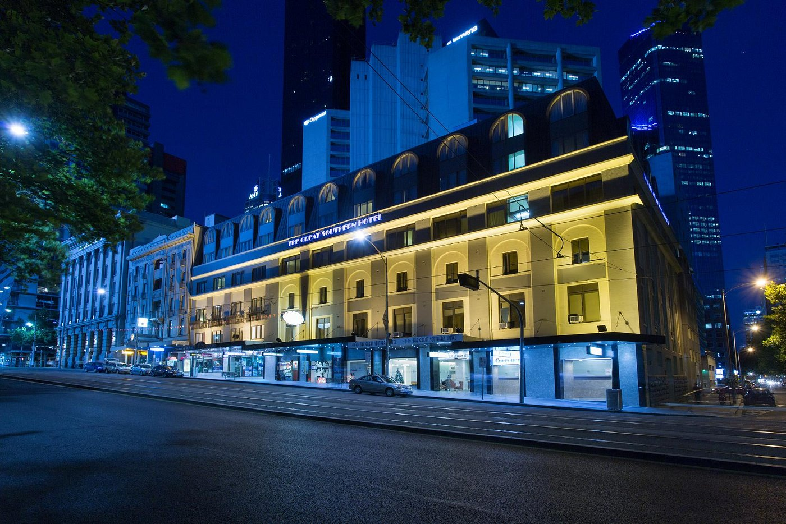

We are supplied a `cityviews.jpeg`.

I spot its in Melbourne from the `3AW Melbourne` sign in the background.

My friend ends up finding the logo at the bottom of the screen is the Great Southern Melbourne Hotel.

Looking at [Google Maps](https://www.google.com.au/maps/place/The+Great+Southern+Hotel+Melbourne/@-37.8196792,144.9549522,19z/data=!4m9!3m8!1s0x6ad65d51ec7a3043:0xc24c13994bad2d84!5m2!4m1!1i2!8m2!3d-37.8197222!4d144.955!16s%2Fg%2F11yx7qgrh?entry=ttu) I find the corner of the building where the windows line up mean it has to be taken from **Hotel Indigo Melbourne on Flingers an IHG**.

Flag: `DUCTF{hotel_indigo_melbourne_on_flinders}`