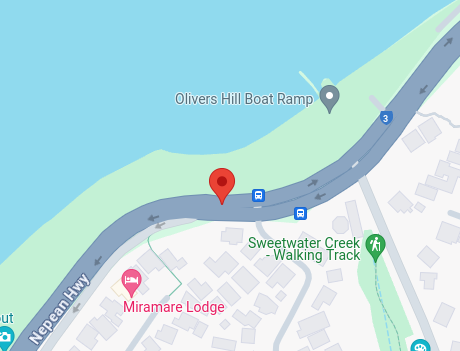

We are given a `offtheramp.jpeg`.


When we use exiftool with this image, we are given some coordinate headers:
```yml
GPS Altitude                    : 35 m Above Sea Level
GPS Latitude                    : 38 deg 9' 15.95" S
GPS Longitude                   : 145 deg 6' 29.69" E
GPS Position                    : 38 deg 9' 15.95" S, 145 deg 6' 29.69" E
```

When we put this into [Google Maps](https://www.google.com.au/maps/place/38%C2%B009'16.0%22S+145%C2%B006'29.7%22E). The ramp ahead is called `Olivers Hill Boat Ramp`.



Flag: `DUCTF{olivers_hill_boat_ramp}`