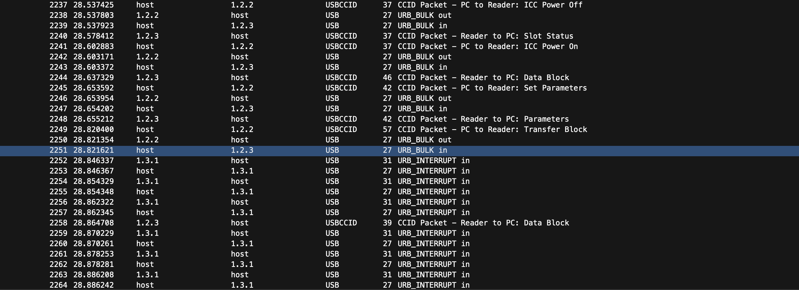

**🩸 This was my first ever blood on a challenge! I am super proud of myself :D 🩸**

Starting with the file `usb.pcapng`, I open it in Wireshark to inspect the communications.

We can see a mix of USB and USBCCID communications in Wireshark.

We can see all of the 'data block' packets contain a block of data (shocker). Some browsing online led me to the following [article](https://stackoverflow.com/questions/15059580/reading-emv-card-using-ppse-and-not-pse) from looking at the data blocks and the replies gave me [this site](https://emvlab.org/tlvutils) for TLV data decoding.

I used it to decode the data blocks until I saw some familiar data from fiddling with cards, specifically found in packet 3278, we can see the [decoded version here](https://emvlab.org/tlvutils/?data=7081a857135132630040615951d23022016950876900000f5a0851326300406159515f24032302285f25032002015f280202505f3401018c279f02069f03069f1a0295055f2a029a039c019f37049f35019f45029f4c089f34039f21039f7c148d12910a8a0295059f37049f4c089f02069f03068e0a00000000000000001f039f0702ff009f080200039f0d05b4606080009f0e0500100000009f0f05b4606098009f420209).

We can see in `Primary Account Number` is the card number, and in `Application Expiration Date` we can see the [YYMMDD format](https://emvlab.org/emvtags/show/t5F24/) of expiration, giving us our flag.

Flag: `GCC{5132630040615951|02/23}`