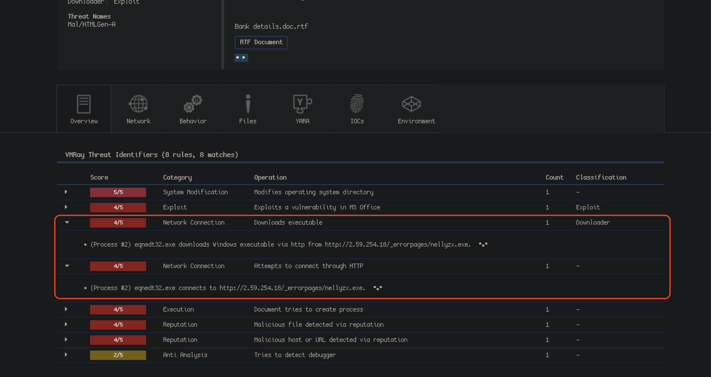
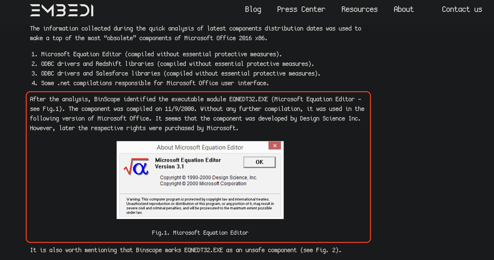

We start this challenge with a file: `evidence.zip` which contains a single file: `Return book loan.eml`.

The contents of this email contains a Base64 encoded attachment called `Bank details.doc`, I decode this from Base64 and save it as a file on my computer.

I see Windows AV flag it and delete it, so we know this file signature is known as malicious, I [upload it to VirusTotal](https://www.virustotal.com/gui/file/8badd7a5fe0794d035783f9afcb7fc3af9a354f3cfb96acb080d3fb53658bb03/community) and get alot of hits as well as previous analysis.

We can see it has some tags, CVE-2017-11882, CVE-2018-0802, and CVE-2018-0798. Those are the three CVEs!

An analysis by [VMRay](https://www.vmray.com/analyses/_vt/8badd7a5fe07/report/overview.html) shows that it drops an exe, `nellyzx.exe` from the process `eqnedt32.exe`.



Information about `eqnedt32.exe` from Microsoft shows association with CVE-2017-11882, so lets do some research on this CVE.

Reading through the [NVD](https://nvd.nist.gov/vuln/detail/CVE-2017-11882), and in its sources is the following [blog post](https://web.archive.org/web/20181104111128/https://embedi.com/blog/skeleton-closet-ms-office-vulnerability-you-didnt-know-about/) that seems to showcase this vulnerability from the Equation Editor.



My teammate, Kabir, did the following during the CTF:
>After dumping out the raw OLE object with rtfobj (in oletools), I opened it in hexeditor and saw the object name Equation.3

The answer for the object is `EQuAtIon.3` but, why?

Let's do this on our own to find out:

Firstly, we use oletools, specifically `rtfobj` to extract the raw object.

```
$ rtfobj -s all Bank\ details.doc
...
===============================================================================
File: 'Bank details.doc' - size: 91817 bytes
---+----------+---------------------------------------------------------------
id |index     |OLE Object
---+----------+---------------------------------------------------------------
0  |00003183h |Not a well-formed OLE object
---+----------+---------------------------------------------------------------
Saving raw data in object #0:
  saving object to file Bank details.doc_object_00003183.raw
  md5 e3bf3ff46a17433d3b874e369899aa34
```

Looking inside this raw object with a hex editor, we can distinctly see `EQuAtIon.3` up the top.

```
†‘'"ˆ06CFS#GI†uöX)EQuAtIon.3U~¹ëG]"0­ìÎ...
```

For the final part, looking up `nellyzx.exe` there is an analysis from [JoeSandbox](https://www.joesandbox.com/analysis/890608/0/html) which delcares it as `Formbook`, formulating our flag!


Note: As [expansively researched](https://hackmd.io/@A3jD_2-KSHGKXuvq1LDRuA/BysMWt4pT) by Crazyman, it seems this is **AsyncRAT** and not Formbook, as the author had thought. In future we cannot base the analysis off of the name alone but the hash also.

Flag: `GCC{CVE-2017-11882_CVE-2018-0802_CVE-2018-0798:EQuAtIon.3:Formbook}`