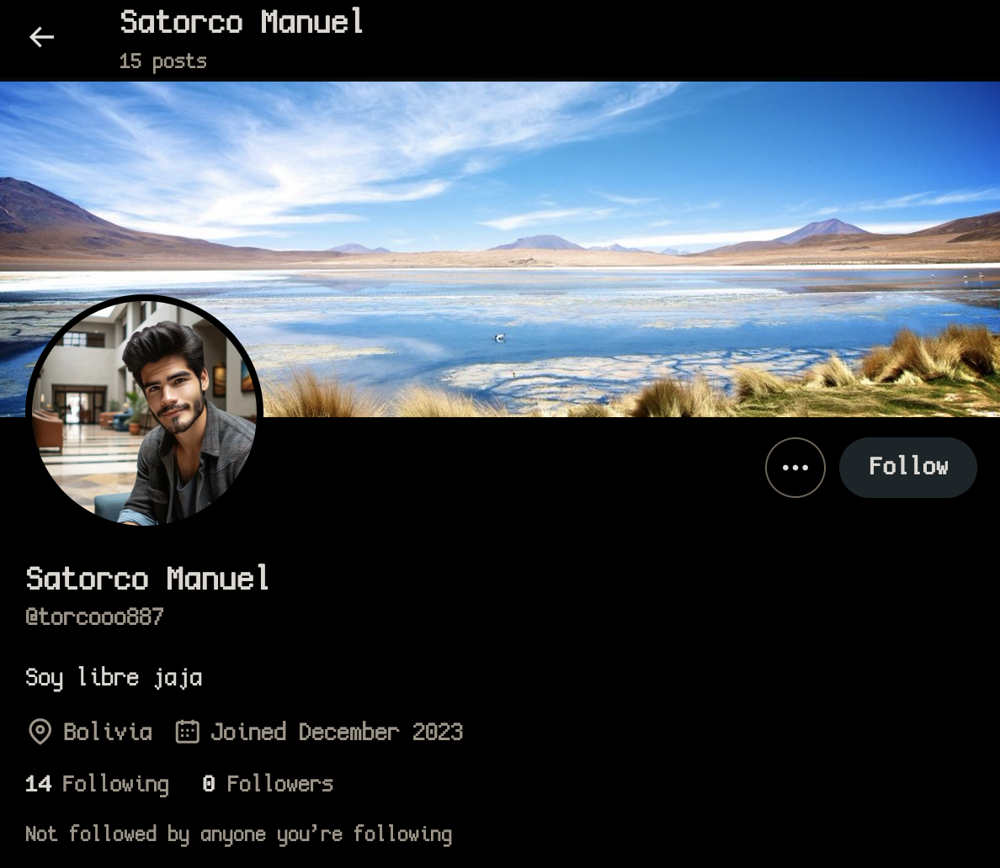
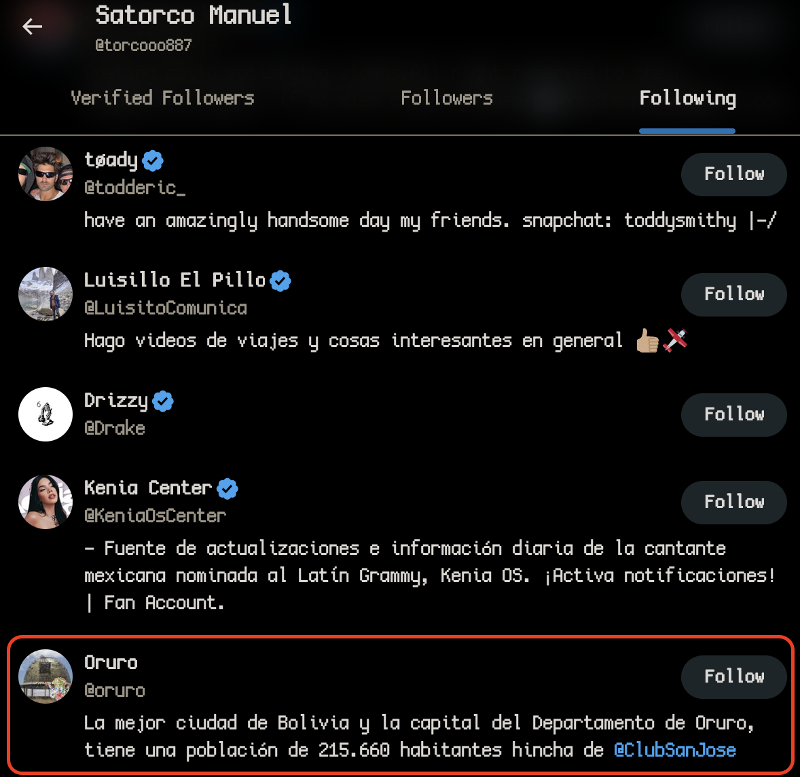
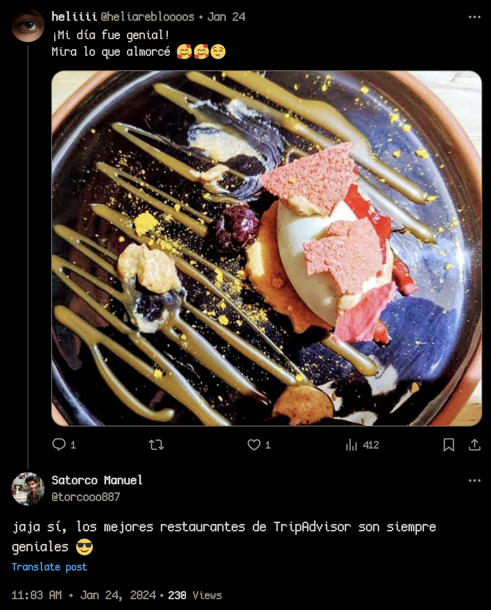
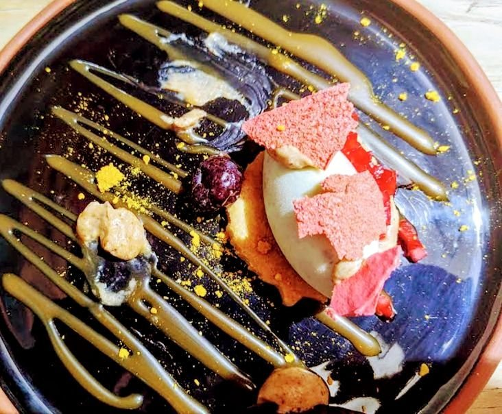
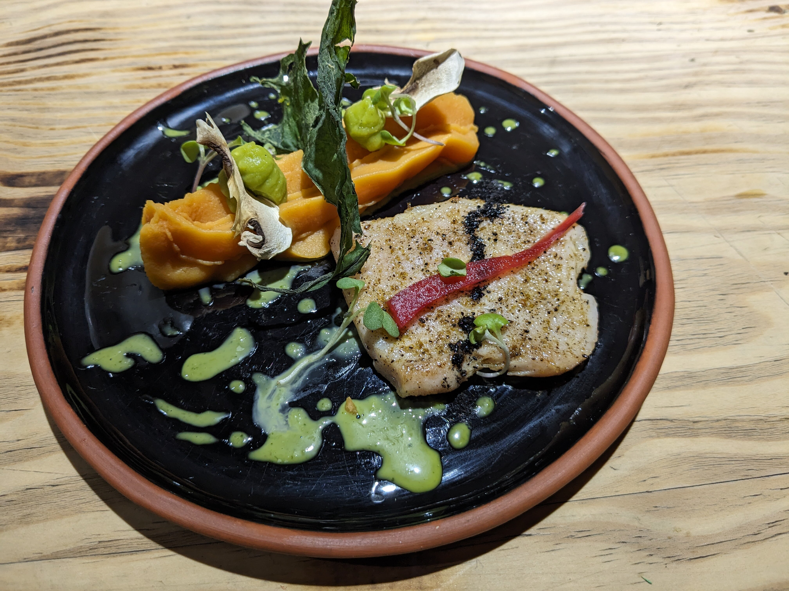
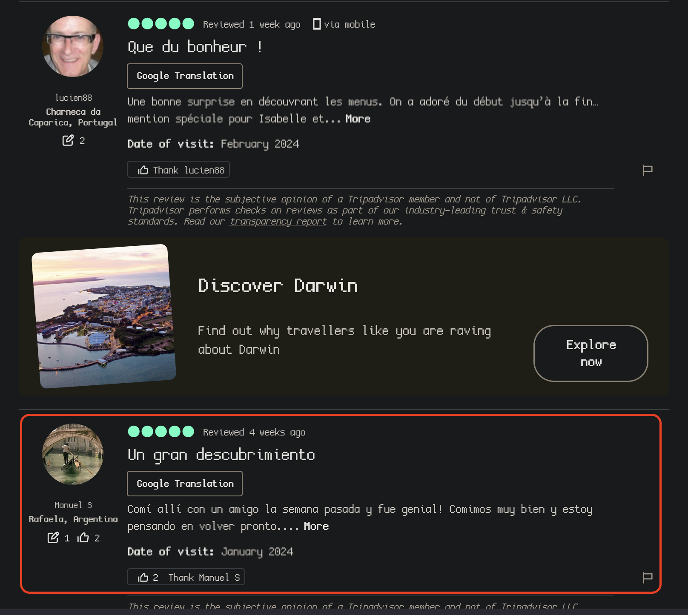
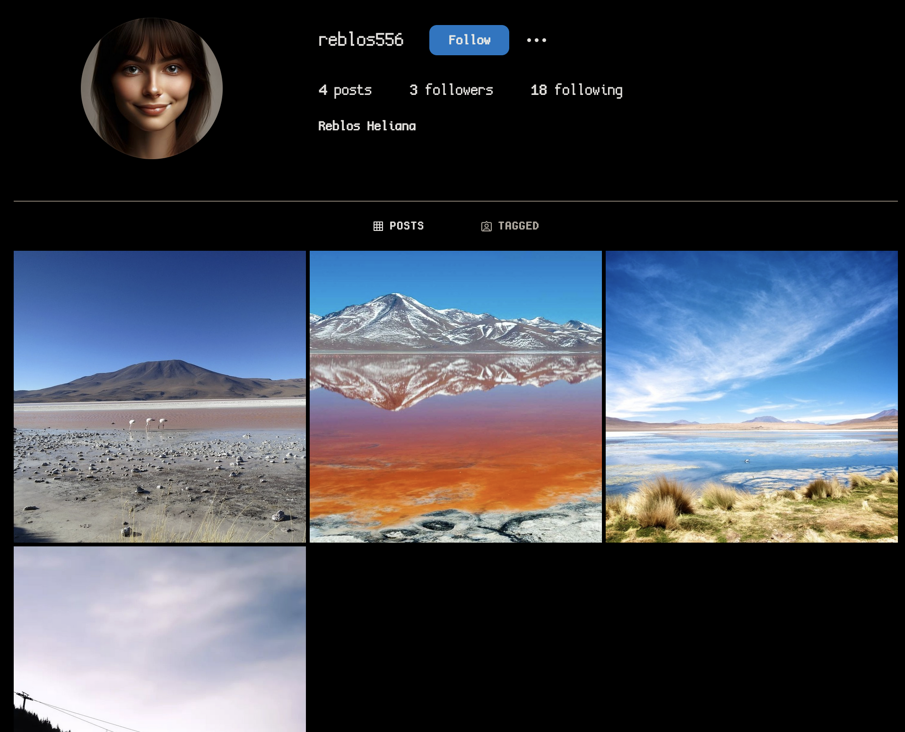
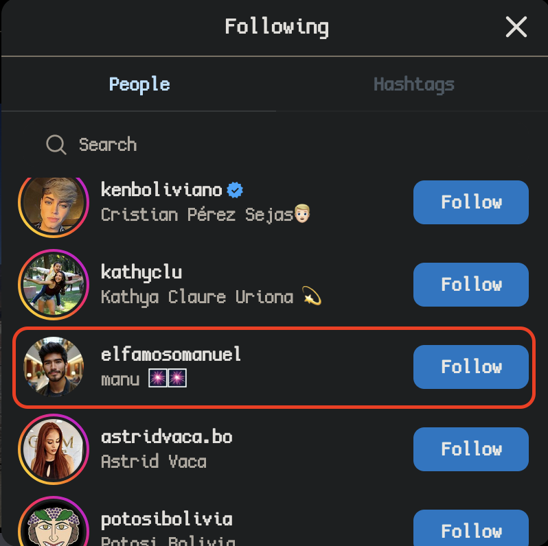
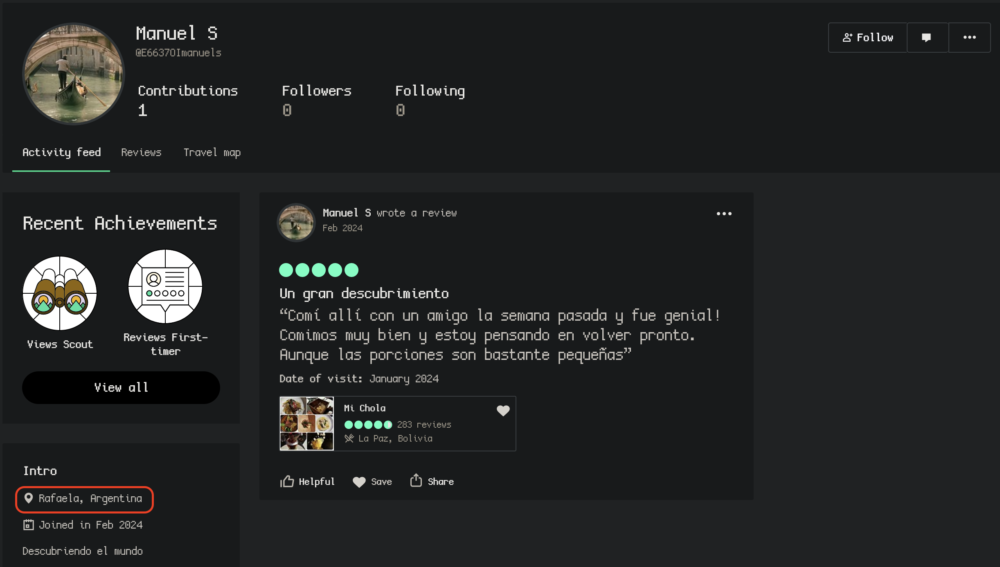

# Part 1

## Challenge Metadata
> In the course of investigating an ongoing trafficking operation, our informants seem to have managed to recover a name: Satorco M. We don't have more information, we need you. Can you find his username on Instagram?

> Flag format: `GCC{username}`

## Solve

So starting with just the name `Satorco M.` we can look on some common social media and locate a [Twitter account](https://twitter.com/torcooo887). 

From an initial look at Manuel's tweets, replies, and the accounts he follows, we can gather the following:
- Likely from Oruro (An account he follows), Bolivia (The location he listed on his profile)

- Seems to [have been to a restraunt in Oruro](https://twitter.com/heliarebloooos/status/1749942346261704855) with [another user they replied to](https://twitter.com/heliarebloooos)

- Manuel's reply to that post shows its a top restraunt on TripAdvisor, so maybe we look there?

There is also a [Facebook Account](https://www.facebook.com/profile.php?id=61554088779848), that doesn't seem to have any information of value, likely its an attached account to the Instagram.

We dig through TripAdvisor restraunts in Oruro and finally find something with similar looking dishes and dish design, **Mi Chola**.

Here is the dish from the post:

And here is the review's dish:

Same exact plate, and looking at the review (in All Languages), [we find our 'Manuel S' from Rafela, Argentina](https://www.tripadvisor.co.uk/ShowUserReviews-g294072-d14780020-r936717831-Mi_Chola-La_Paz_La_Paz_Department.html).

His profile is very empty, we even dig into his obscure username thinking it was a license plate, where is this Instagram account?

After alot of trouble, our teammate finds an Instagram account. It turns out the friends user name `heliarebloooos`, is their actual name: `Helia Reblos`, which has a [result on Instagram](https://www.instagram.com/reblos556).

Looking at this user's following we see our main man, [Manuel](https://www.instagram.com/elfamosomanuel/).

That answers our first part: 

Flag: `GCC{elfamosomanuel}`

Now, whats the second part?

# Part 2

## Challenge Metadata

> Congratulations, you've found his social media account! But we need more information to catch him. Can you find the city where he lives now?

> Flag format: `GCC{city}`

## Solve

**Oh.** It seems we solved the challenges out of order. Looking at [the TripAdvisor](https://www.tripadvisor.co.uk/Profile/E6637OImanuels) we can see his location, Rafela.

Flag: `GCC{rafela}`