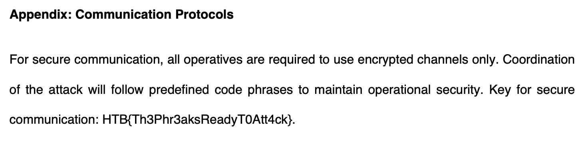

We start this challenge with `phreaky.pcap`, and I open it with Wireshark.

Skimming the traffic, there is some HTTP traffic, and some SMTP traffic.

Reading the HTTP traffic, it seems to only be typical requests for ubuntu packages and updates.

The SMTP traffic on the other hand, there are some emails which we can see viewing the reassembled SMTP packets containing attachments

```
...
--=-=DBZhoU35m_YtHyGmIsZszrXoWQVlI-1y1rd3=-=
Content-Type: text/plain; charset=us-ascii
Content-Disposition: inline
Content-ID: <20240306145912.g2I1r%caleb@thephreaks.com>

Attached is a part of the file. Password: S3W8yzixNoL8

--=-=DBZhoU35m_YtHyGmIsZszrXoWQVlI-1y1rd3=-=
Content-Type: application/zip
Content-Transfer-Encoding: base64
Content-Disposition: attachment; 
 filename*0="caf33472c6e0b2de339c1de893f78e67088cd6b1586a581c6f8e87b5596";
 filename*1="efcfd.zip"
Content-ID: <20240306145912.Emuab%caleb@thephreaks.com>

UEsDBBQACQAIAGZ3ZlhwRyBT2gAAAN0AAAAWABwAcGhyZWFrc19wbGFuLnBkZi5wYXJ0MVVUCQAD
wIToZcCE6GV1eAsAAQToAwAABOgDAAA9mPwEVmy1t/sLJ62NzXeCBFSSSZppyIzvPXL++cJbuCeL
nP4XXiAK9/HZL9xRw4LjlDf5eDd6BgBOKZqSn6qpM6g1WKXriS7k3lx5VkNnqlqQIfYnUdOCnkD/
1vzCyhuGdHPia5lmy0HoG+qdXABlLyNDgxvB9FTOcXK7oDHBOf3kmLSQFdxXsjfooLtBtC+y4gdB
xB4V3bImQ8TB5sPY55dvEKWCJ34CzRJbgIIirkD2GDIoQEHznvJA7zNnOvce1hXGA2+P/XmHe+4K
tL/fmrWMVpQEd+/GQlBLBwhwRyBT2gAAAN0AAABQSwECHgMUAAkACABmd2ZYcEcgU9oAAADdAAAA
FgAYAAAAAAAAAAAAtIEAAAAAcGhyZWFrc19wbGFuLnBkZi5wYXJ0MVVUBQADwIToZXV4CwABBOgD
AAAE6AMAAFBLBQYAAAAAAQABAFwAAAA6AQAAAAA=

--=-=DBZhoU35m_YtHyGmIsZszrXoWQVlI-1y1rd3=-=--
```

Looking at the contents of the first zip, we can see the following file: `phreaks_plan.pdf.part1`.

Looking through the remaining SMTP packets, we can see multiple files following the same names: `phreaks_plan.pdf.part2`, `phreaks_plan.pdf.part3`, etc...

After getting all of the file parts, we can use a hex editor to string all of the bytes todather and make a working PDF.

Inside the PDF, is the flag.



Flag: `HTB{Th3Phr3aksReadyT0Att4ck}`