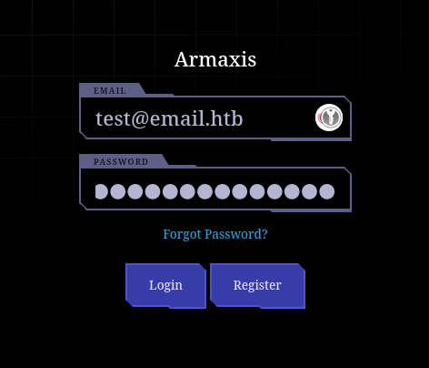
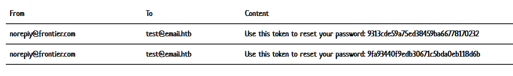
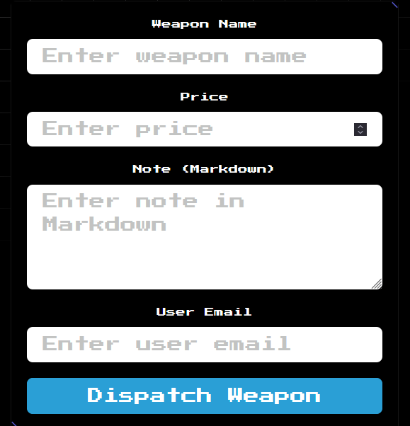
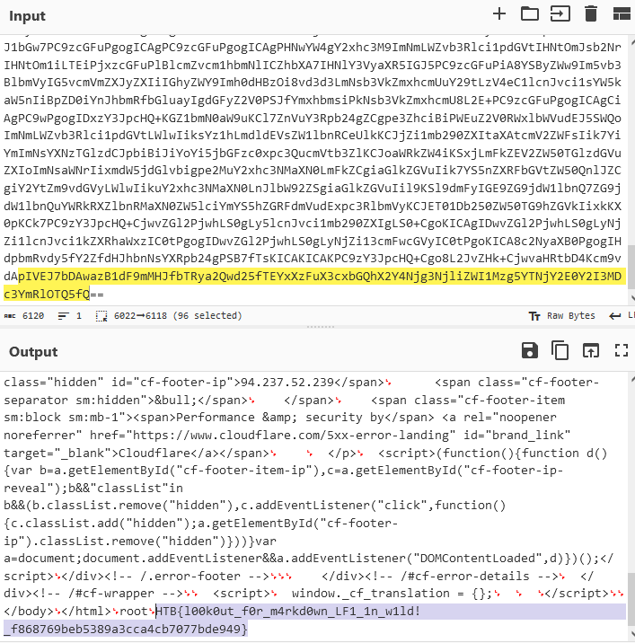

Downloading the source code, there are two applications:
- an Email app on port 8080
- the challenge application on port 1337

We control the `test@email.htb` email, so I register an account.



Logging in, we have no permissions to do anything. We can't 'dispatch' and weapons we can just log out.

Looking through the source code I spot an issue with the password reset workflow.

```js
router.post("/reset-password/request", async (req, res) => {
  const { email } = req.body;
  if (!email) return res.status(400).send("Email is required.");

  try {
    const user = await getUserByEmail(email);
    if (!user) return res.status(404).send("User not found.");

    const resetToken = crypto.randomBytes(16).toString("hex");
    const expiresAt = Date.now() + 3600000;

    await createPasswordReset(user.id, resetToken, expiresAt);

    await transporter.sendMail({
      from: "noreply@frontier.com",
      to: email,
      subject: "Password Reset",
      text: `Use this token to reset your password: ${resetToken}`,
    });

    res.send("Password reset token sent to your email.");
  } catch (err) {
    console.error("Error processing reset request:", err);
    res.status(500).send("Error processing reset request.");
  }
});
router.post("/reset-password", async (req, res) => {
  const { token, newPassword, email } = req.body; // Added 'email' parameter
  if (!token || !newPassword || !email)
    return res.status(400).send("Token, email, and new password are required.");

  try {
    const reset = await getPasswordReset(token);
    if (!reset) return res.status(400).send("Invalid or expired token.");

    const user = await getUserByEmail(email);
    if (!user) return res.status(404).send("User not found.");

    await updateUserPassword(user.id, newPassword);
    await deletePasswordReset(token);

    res.send("Password reset successful.");
  } catch (err) {
    console.error("Error resetting password:", err);
    res.status(500).send("Error resetting password.");
  }
});
```

The reset password function will send you a `resetToken` to your email, but the `/reset-password` doesn't check it's your token, so you can reset the password to any email as you can control the `email` parameter and it isn't derived from the token.

I request a password reset token.



Then use the token on `admin@armaxis.htb`, and log in as them!

We now have the capabilities to 'dispatch weapon's.



The 'Markdown' note catches my eye, so I look into the source for anything of interest.

```js
function parseMarkdown(content) {
    if (!content) return '';
    return md.render(
        content.replace(/\!\[.*?\]\((.*?)\)/g, (match, url) => {
            try {
                const fileContent = execSync(`curl -s ${url}`);
                const base64Content = Buffer.from(fileContent).toString('base64');
                return ``;
            } catch (err) {
                console.error(`Error fetching image from URL ${url}:`, err.message);
                return `<p>Error loading image: ${url}</p>`;
            }
        })
    );
}
```

This is used on that markdown portion of the weapon, and we can see the markdown image format (``) is being passed to `curl`, allowing for Command Injection!

So, this payload should work to read the flag: ``



Flag: `HTB{l00k0ut_f0r_m4rkd0wn_LF1_1n_w1ld!_f868769beb5389a3cca4cb7077bde949}`