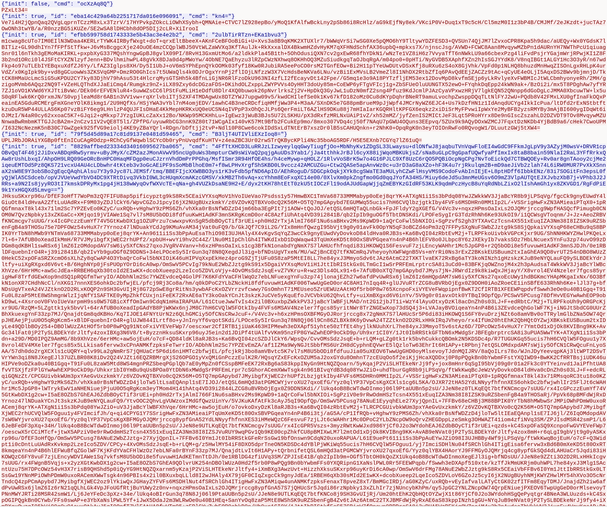

We are given a `server.py`, `client.py`, `params.py` and a PCAP.

We are given some initial parameters:
```python
a = 0xa1d41ebef9c575ac113fcfd5ac8dbda9
b = 0x8dcf3cf766e0b6c30e753416a70e2367
m = 0x100000000000000000000000000000000
```

It's an LCG encryption system:
```python
class LCG:
    def __init__(self):
        self.state = SEED
        self.a = a
        self.b = b
        self.m = m
    
    def _next(self):
        self.state = (self.a * self.state + self.b) % self.m
        return self.state
    
    def generate_key(self, l):
        return bytes([self._next() & 0xff for _ in range(l)])

    def generate_packet_uuid(self):
        return hex(self._next())

    def encrypt(self, msg):
        key = self.generate_key(len(msg))
        return xor(msg, key)

    def decrypt(self, msg):
        return self.encrypt(msg)
```

The issue is with every `_next` it sets the `state` again, so we can predict it with information with the PCAP and decrypt the message.



The blue is the server, so the `id` we are seeing is the first `self._next()` for the string as its sent before the output is encrypted, and we can calculate all future ones for the encrypted string from that, meaning we can decrypt outputs.

The state encryption is made with 3 known params (a, b, and m) and the state from the previous execution.

We can start by making a state calculation function:
```python
def calculate_next_state(S_n,a,b,m):
    return (a * S_n + b) % m
```

The function for key generation is using a new state with a `& 0xff` for each character in the length of the message, so the key covers the full message. The message is then XOR'ed with this key.

```python
def decode_and_xor(encoded_message, key):
    decoded_message = base64.b64decode(encoded_message)
    
    state = int(key,16)
    key_bytes = []
    for i in range(len(decoded_message)):
        state = calculate_next_state(state, a, b, m)
        val = state & 0xff
        key_bytes.append(val)
        
    
    key_bytes = bytes(key_bytes)
    return xor(decoded_message, key_bytes)
```

The `message` is first base64 decoded, then we convert the hexadecimal `state` to an integer. For each character in the `message` the `state` is calculated and then the key is created in `key_bytes`. The key is then used with the `xor` function from the `pwn` library.

Now that the script works, we can use the `id` from the 2nd server message and the response from the client's 2nd message to decode the output:
```python
import base64
from itertools import product
from pwn import xor

from params import *

def calculate_next_state(S_n,a,b,m):
    return (a * S_n + b) % m

def decode_and_xor(encoded_message, key):
    decoded_message = base64.b64decode(encoded_message)
    
    state = int(key,16)
    key_bytes = []
    for i in range(len(decoded_message)):
        state = calculate_next_state(state, a, b, m)
        val = state & 0xff
        key_bytes.append(val)
        
    
    key_bytes = bytes(key_bytes)
    return xor(decoded_message, key_bytes)

key = 'eba14c429a64b2251717da016e096091'
encoded_message = 'Ve7i4H2jQpnQaq2QVgLqprnTCzzM8xLx3TzrV/17HYPvkpZOkcLiOWhXSybh+QMNAie+CTVC7lZ928epBo/yMoQ1KfAlfwBckLny2pSb86i8RcHlz/aG9kEjfNy8ek/VKciP0V+Duq1xT9c5cH/Cl5mzM0I1z3bP4B/CMJMf/2eJKzdt+jucTAz7OwONh3twYB/a/R0nzzBG5iKUZe/SE2wSA8lDHCbh8dOP5DIj2cLR+XiIrooI'

result = decode_and_xor(encoded_message, key)
print(f'Key: {key} -> Decoded XOR Result: \n{result.decode(errors='ignore')}')
```

```bash
$ python3 solve.py
Key: eba14c429a64b2251717da016e096091 -> Decoded XOR Result: 
uid=1000(user) gid=1000(user) groups=1000(user),20(dialout),24(cdrom),25(floppy),27(sudo),29(audio),30(dip),44(video),46(plugdev),106(netdev),110(lpadmin),114(bluetooth),116(scanner)
```
Yay!

Now decoding the huge output we get the flag.

```
$ python3 solve.py
Key: 8829affbed23334d34016095627ba065 -> Decoded XOR Result: 
0█████000█████0███████████0███████████000000███0000000000█████00000███00████00████000000000000000000000000000000000█████00000000000000000000000000000000000000000000000000000000███00000000000000000000000000000000000█████0000000000
░░███000░░███0░█░░░███░░░█░░███░░░░░███0000██░0000000000░░███00000░░░00░░███0░░███00000000000000000000000000000000░░███00000000000000000000000000000000000000000000000000000000░░░00000000000000000000000000000000000░░███00000000000
0░███0000░███0░000░███00░00░███0000░███000██00000█████00███████000████00░███00░███000000000000████████0000██████00███████00000000000000██████000██████00████████000█████0█████0████00████████0000██████000██████000███████00000000000
0░███████████00000░███00000░██████████00███00000███░░00░░░███░000░░███00░███00░███00000000000░░███░░███00███░░███░░░███░00000000000000███░░███0███░░███░░███░░███0░░███0░░███0░░███0░░███░░███00███░░███0███░░███0███░░███00000000000
0░███░░░░░███00000░███00000░███░░░░░███░░░██000░░█████000░███00000░███00░███00░███000000000000░███0░███0░███0░███00░███00000000000000░███0░░░0░███0░███0░███0░███00░███00░███00░███00░███0░███0░███0░░░0░███████0░███0░███00000000000
0░███0000░███00000░███00000░███0000░███00░░██000░░░░███00░███0███0░███00░███00░███000000000000░███0░███0░███0░███00░███0███0000000000░███00███░███0░███0░███0░███00░░███0███000░███00░███0░███0░███00███░███░░░00░███0░███00000000000
0█████000█████0000█████0000███████████0000░░███0██████000░░█████00█████0█████0█████0█████████0████0█████░░██████000░░█████00█████████░░██████0░░██████00████0█████00░░█████0000█████0████0█████░░██████0░░██████0░░████████0█████████
░░░░░000░░░░░0000░░░░░0000░░░░░░░░░░░000000░░░0░░░░░░00000░░░░░00░░░░░0░░░░░0░░░░░0░░░░░░░░░0░░░░0░░░░░00░░░░░░00000░░░░░00░░░░░░░░░00░░░░░░000░░░░░░00░░░░0░░░░░0000░░░░░0000░░░░░0░░░░0░░░░░00░░░░░░000░░░░░░000░░░░░░░░0░░░░░░░░░0
0000000000000000000000000000000000000000000000000000000000000000000000000000000000000000000000000000000000000000000000000000000000000000000000000000000000000000000000000000000000000000000000000000000000000000000000000000000000000
0000000000000000000000000000000000000000000000000000000000000000000000000000000000000000000000000000000000000000000000000000000000000000000000000000000000000000000000000000000000000000000000000000000000000000000000000000000000000
0000000000000000000000000000000000000000000000000000000000000000000000000000000000000000000000000000000000000000000000000000000000000000000000000000000000000000000000000000000000000000000000000000000000000000000000000000000000000
00000000000█████00000000000000000000000000█████00000000000000█████000000000█████████0000█████████000000000000000000000000000000000000000000000000000000000000███000█████0000000000000000███████00███000000000000000000000000000000000
0000000000░░███00000000000000000000000000░░███00000000000000░░███000000000███░░░░░███00███░░░░░███0000000000000000000000000000000000000000000000000000000000░░░000░░███0000000000000000███░░░███░░░██00000000000000000000000000000000
00██████000░███████000██████00█████0████0███████0000000000000░███00000000███00000░░░00███00000░░░0000000000000█████000██████000██████00█████0████0████████00████00███████000█████0████░░░000░███00░░██0000000000000000000000000000000
0░░░░░███00░███░░███0███░░███░░███0░███0░░░███░00000000000000░███0000000░███000000000░███00000000000000000000███░░000███░░███0███░░███░░███0░███0░░███░░███░░███0░░░███░000░░███0░███000███████0000░░███00000000000000000000000000000
00███████00░███0░███░███0░███0░███0░███000░███000000000000000░███0000000░███000000000░███0000█████0000000000░░█████0░███████0░███0░░░00░███0░███00░███0░░░00░███000░███00000░███0░███00░███░░░000000██░000000000000000000000000000000
0███░░███00░███0░███░███0░███0░███0░███000░███0███00000000000░███000000█░░███00000███░░███00░░███000000000000░░░░███░███░░░00░███00███0░███0░███00░███000000░███000░███0███0░███0░███00░░░000000000██00000000000000000000000000000000
░░████████0████████0░░██████00░░████████00░░█████00█████████0███████████0░░█████████00░░█████████00█████████0██████0░░██████0░░██████00░░████████0█████00000█████00░░█████00░░███████000███000000███000000000000000000000000000000000
0░░░░░░░░0░░░░░░░░000░░░░░░0000░░░░░░░░0000░░░░░00░░░░░░░░░0░░░░░░░░░░░000░░░░░░░░░0000░░░░░░░░░00░░░░░░░░░0░░░░░░000░░░░░░000░░░░░░0000░░░░░░░░0░░░░░00000░░░░░0000░░░░░0000░░░░░███00░░░000000░░░0000000000000000000000000000000000
00000000000000000000000000000000000000000000000000000000000000000000000000000000000000000000000000000000000000000000000000000000000000000000000000000000000000000000000000000███0░███000000000000000000000000000000000000000000000000
0000000000000000000000000000000000000000000000000000000000000000000000000000000000000000000000000000000000000000000000000000000000000000000000000000000000000000000000000000░░██████0000000000000000000000000000000000000000000000000
00000000000000000000000000000000000000000000000000000000000000000000000000000000000000000000000000000000000000000000000000000000000000000000000000000000000000000000000000000░░░░░░00000000000000000000000000000000000000000000000000
```

Flag: `HTB{still_not_convinced_about_LCG_security?}`