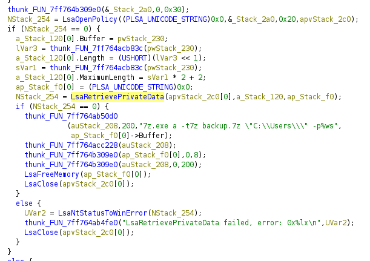

Given a memory dump and a password locked `backup.7z`, I dived into the memory dump.

It was a Windows memory dump, I started by using vol3, eventually found that the desktop app for the SMS app Signal was installed and a suspicious `backuper.exe` was running.

Using MemProcFS we grab the executable file and open it in Ghidra.



This snippet was the part of interest, we can see its pulling from LSA so I use vol3's LSA dumper and find `OfflineBackupKey` (which was referenced in the exe).

We get a hex response:
```
28 00 00 00 00 00 00 00 00 00 00 00 00 00 00 00 79 00 59 00 6a 00 38 00 67 00 35 00 50 00 6b 00 36 00 68 00 21 00 2d 00 4b 00 33 00 70 00 42 00 4d 00 53 00 78 00 46 00 00 00 00 00 00 00 00 00
```

This decodes to `(yYj8g5Pk6h!-K3pBMSxF`, but we need to drop the `(`, this gives the password for the `backup.7z`: `yYj8g5Pk6h!-K3pBMSxF`.

Looking into Signal's encryption system they changed to a new one using the `Local State` DPAPI encryption to encrypt the `config.json` key which is used to decrypt the DB.

> From here on was information from other writeups after the CTF concluded!

Dumping the memory of Signal.exe's parent process, you can then search for "SQLite 3 database" header, and find encryption key in hex!

> You can also still do it with MemProcFS but it removes the `lsass.exe`, so you need to patch it out in `vmm.dll` so it dumps it. then you can utilise mimikatz and do the rest.

Note: You could also do this properly by extracting DPAPI keys from memory and using to decrypt masterkey in `%APPDATA%\Microsoft\Protect` and using that decrypt the key from `config.json`.

Open the database using SQLCipher with that key and view the messages table for the username and password of the Docker instance (connect according to instructions in readme.txt)

After visiting the Credentials tab, you will be given the `flag.txt`.