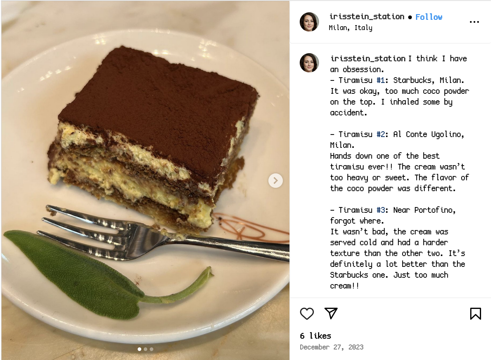
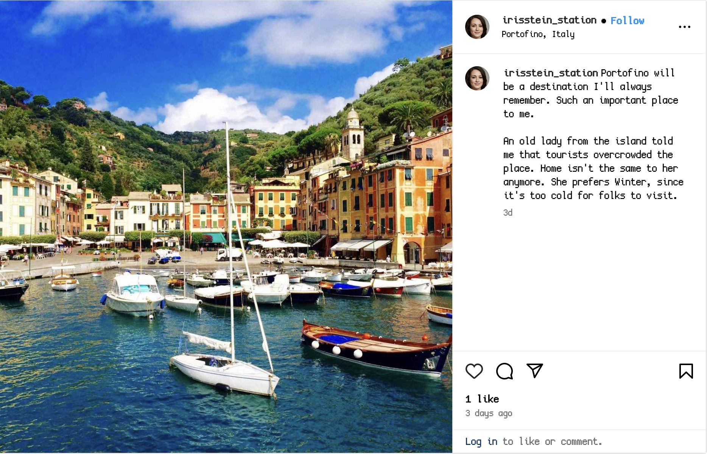

We start with a hash (`$2b$04$DkQOnBXHNLw2cnsmSEdM0uyN3NHLUb9I5IIUF3akpLwoy7dlhgyEC`) that is a `bcrypt $2*$, Blowfish (Unix)` hash.

We know we need to use 3 words with proper capitalization, and some numbers (likely a birthday, as the 'specific date' part of the hint suggests using that as the numbers) following it. A few posts are of interest for our password.

Firstly, the one about her Mum.


We can see that she calls her Mothers birthday a 'very important date', I think those are our numbers, just depending on the format.



Here, she expresses her 'obsession' with Tiramisu, that's going on the wordlist.



In this post she talks about a specific place in Italy, Portofino.

She expresses in a few other posts some places she's been, things she likes, etc. In the end I construct the following list of words from posts and who they follow.

```
netherland
italy
berlin
tiramisu
czechia
mimosa
portofino
swan
swarovski
crystal
starbuck
milan
conte
ugolino
sunrise
sunset
karadenizli
maceraci
iris
stein
station
elaina
lenox
hill
hospital
food
traveling
sunny
sanfrancisco
```

I then write a Python script to generate all our combinations and appropriate 'variants' (eg. portofino = Portofino,Portofinos). There is no lowercase variants due to the clue including **proper capitalization**. The date at the end is following a mmddyyyy format (due to the organisers being mainly from the US). 

We have to consider that when people use dates in passwords they are not always going to use a perfect format with 0's, so there are some possibilities to consider.

```python
numbers=['481965','0481965','04081965','4081965']
import os

c=0
with open('wordlist.txt','w') as ff:
	with open('words.txt','r') as f:
		data=f.readlines()
		newdata=[]
		for x in data:
			newdata.append(x.title())
			newdata.append(x.title()+'s')
		data=newdata
		for x in data:
			for y in data:
				for z in data:
					for n in numbers:
						if not x==y and not x==z and not y==z:
							pw=x.replace('\n','')+y.replace('\n','')+z.replace('\n','')+n
							ff.write(pw+'\n')
							c+=1
print(f'Found {c} new passwords.')
```

```
$ python3 wordgen.py
Found 740544 new passwords.
```

Now we wait, and crack with hashcat, until we get a hit!

```
$ hashcat -m 3200 hash wordlist.txt
...
$2b$04$DkQOnBXHNLw2cnsmSEdM0uyN3NHLUb9I5IIUF3akpLwoy7dlhgyEC:PortofinoItalyTiramisu0481965
```

There's our password, and therefore our flag! 

Flag: `irisctf{PortofinoItalyTiramisu0481965}`