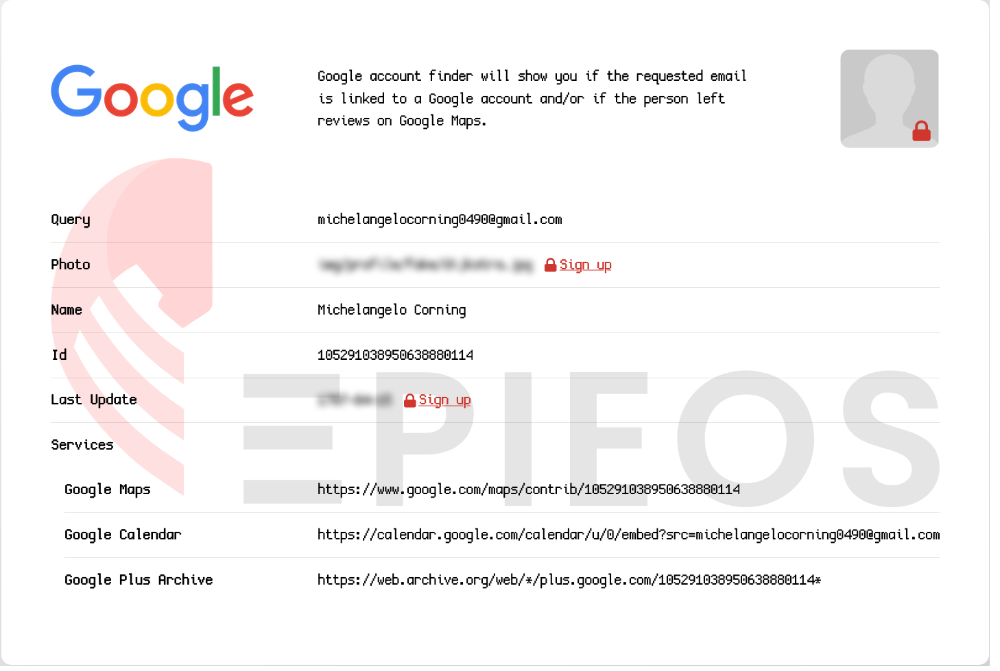
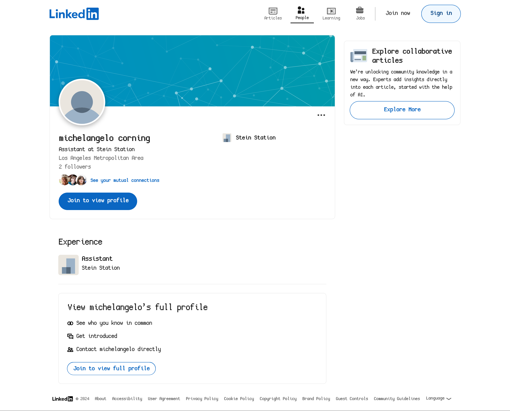
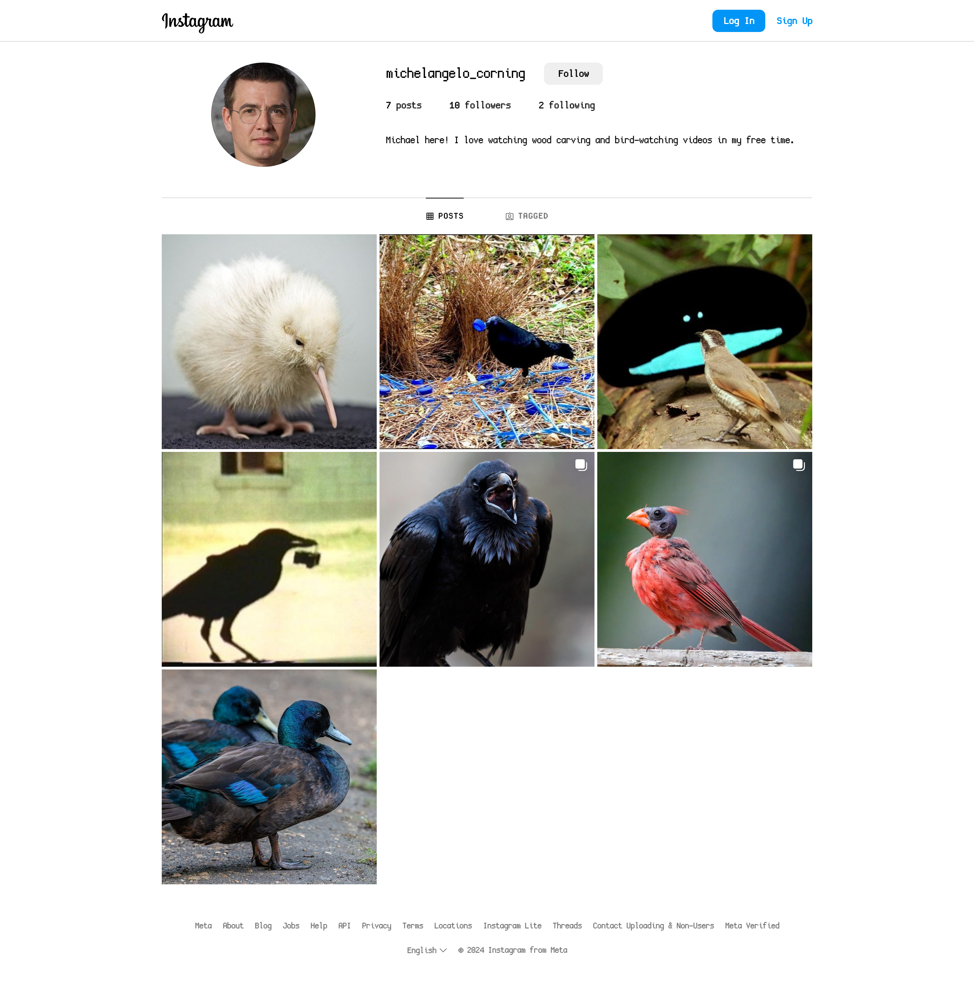

We are given a voicemail of a person named 'Iris'. For convinience, we are given a transcript of the audio file.

```
Hello, you’ve reached Iris Stein, head of the HR department! I’m currently away on vacation, please contact my assistant Michel. You can reach out to him at michelangelocorning0490@gmail.com. Have a good day and take care.
```

Doing a lookup of the email [michelangelocorning0490@gmail.com](mailto:michelangelocorning0490@gmail.com) on Epieos  we are given the full name of the Google account which is `Michelangelo Corning`.



When we lookup his name on some search engines, we come across a [LinkedIn](https://www.linkedin.com/in/michelangelo-corning-6b1b7a2a4/) and an [Instagram](https://www.instagram.com/michelangelo_corning/)!





Browsing his Instagram posts, one post catches my eye and the description contains our flag!


Flag: `irisctf{pub1ic_4cc0unt5_4r3_51tt1ng_duck5}`

**Files:** [away-on-vacation.tar.gz](https://web.archive.org/web/20240107215543/https://cdn.2024.irisc.tf/away-on-vacation.tar.gz)