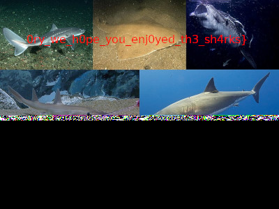

We start with a PCAP file that contains 802.11 (WiFi) traffic that we cannot read, due to us not having the password.

I extract the hash of the PCAP with [hashcat's online tool](https://hashcat.net/cap2hashcat/) (but this can also be done locally). I then ran the hash against the `rockyou.txt` wordlist from SecLists.

```
$ hashcat -a 0 -m 22000 hash rockyou.txt
...
humus12345
```

We get our password: `humus12345`

I then go to my Wireshark preferences, then Protocols > IEEE 802.11 and Edit the Decryption keys to add `humus12345` as a `wpa-pwd`.

The traffic is now decrypted and readable, we can see some FTP communications.

```
220 (vsFTPd 3.0.3)
USER joeschmoe
331 Please specify the password.
PASS irisctf{welc0me_t0_th3_n3twork_c4teg
230 Login successful.
SYST
215 UNIX Type: L8
FEAT
211-Features:
EPSV
[65 bytes missing in capture file].229 Extended Passive Mode Entered (|||5715|).
150 Here comes the directory listing.
226 Directory send OK.
[6 bytes missing in capture file].TYPE I
200 Switching to Binary mode.
SIZE beautiful_fish.png
213 206908
229 Extended Passive Mode Entered (|||5803|).
[6 bytes missing in capture file].RETR beautiful_fish.png
150 Opening BINARY mode data connection for beautiful_fish.png (206908 bytes).
226 Transfer complete.
MDTM beautiful_fish.png
213 20231231045714
213 206908
[25 bytes missing in capture file].EPSV
229 Extended Passive Mode Entered (|||8782|).
RETR beautiful_fish.png
150 Opening BINARY mode data connection for beautiful_fish.png (206908 bytes).
226 Transfer complete.
MDTM beautiful_fish.png
213 20231231045714
SIZE beautiful_fish.png
213 206908
EPSV
229 Extended Passive Mode Entered (|||6640|).
RETR beautiful_fish.png
150 Opening BINARY mode data connection for beautiful_fish.png (206908 bytes).
[25 bytes missing in capture file].SIZE beautiful_fish.png
[44 bytes missing in capture file].213 206908
EPSV
RETR beautiful_fish.png
[47 bytes missing in capture file].150 Opening BINARY mode data connection for beautiful_fish.png (206908 bytes).
226 Transfer complete.
MDTM beautiful_fish.png
213 20231231045714
QUIT
221 Goodbye.
```

Looking at the FTP commands and responses, we can see a portion of the flag already.

The first half of the flag is `irisctf{welc0me_t0_th3_n3twork_c4teg`, now we can see they are calling an image to download 4 times called `beautiful_fish.png`. Lets see if we can view that image and download the data for it.

When we right click on the FTP traffic and click `Follow... > TCP Stream`, we can see on TCP streams 2, 3, 5 and 6 that there is PNG data (noticable from the magic bytes). We set `Show data as...` to `Raw` then Save each one to a file (I named mine 1-4.png from ascending order based on the data stream index).

When we look through these PNGs we can see all of them are corrupted and missing portions, the reason for this is part of the struggle with sniffing over WiFi, the medium of air has other traffic and obstacles to a clear signal from a cable so sniffing is challenging.

Each PNG is missing different portions, so using a hex editor we can find the missing portions of each PNG and compile the missing bytes into one PNG. 

I do this with the 3rd image (from TCP stream 5) and search for the text 'missing' in my hex editor (010 Editor) and find a few hits. We can then find those portions from the other files by searching for a portion of bytes just before the missing data. 

**When replacing the message with bytes its important to replace the single `.` missing byte string (just after the `]`) as otherwise the bytes will be incorrect..**

After some manual fiddling with bytes, we are given a readable file!



Then compiling both parts gives us the final flag.

Flag: `irisctf{welc0me_t0_th3_n3twork_c4teg0ry_we_h0pe_you_enj0yed_th3_sh4rks}`

**Files:** [copper-selachimorpha.tar.gz](https://web.archive.org/web/20240107225134/https://cdn.2024.irisc.tf/copper-selachimorpha.tar.gz)