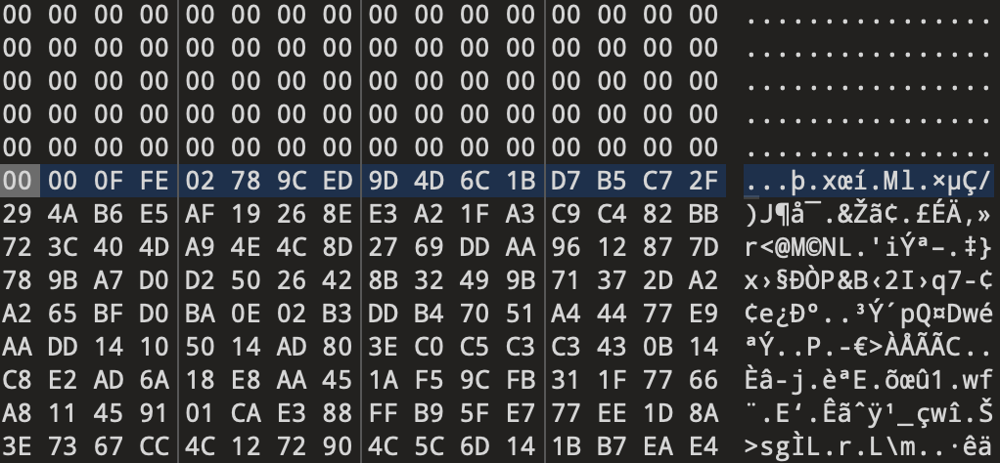
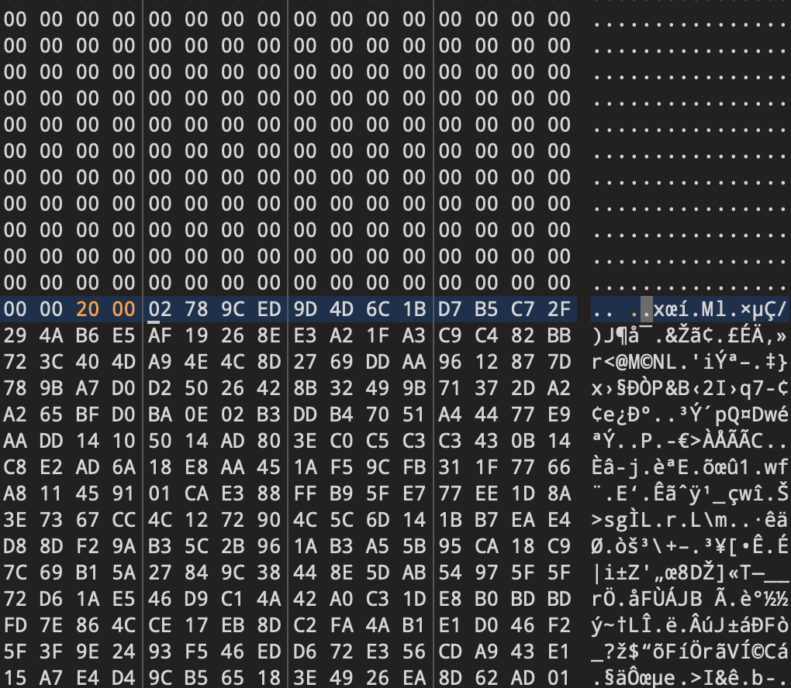
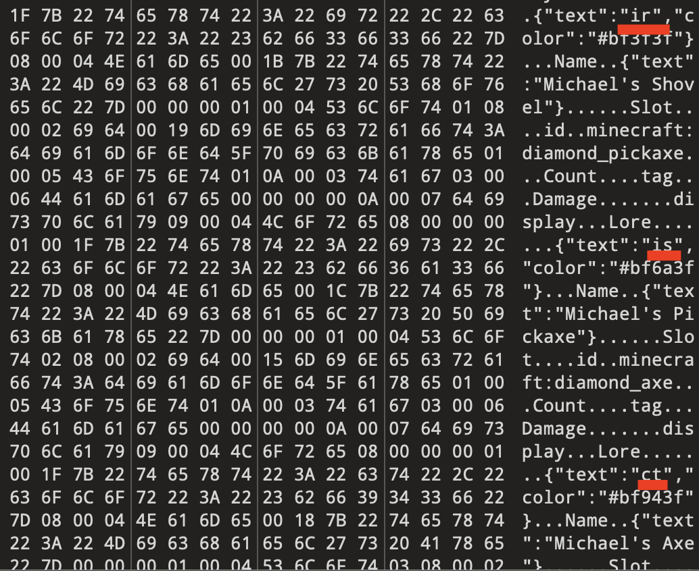

Notes:
- Game version: 1.20.2
- You don't need to own the game to solve this challenge

Hint:
> X: 104, Y: 63, Z: 248

The file we start with is a Minecraft Anvil file, specifically for the region 0,0. Regions contain chunks, and chunks contain blocks.

To get started I find what chunk my coordinates are actually in using [this tool](https://minecraft.tools/en/coordinate-calculator.php).

Upon inputting the block coordinates we are provided into the tool, I find my chunk is `X: 6, Z: -15`.

Then reading the [region file format](https://minecraft.wiki/w/Region_file_format) I find we can extract the chunk data, and then decompress it from zlib, and then read the NBT data.

The region file format:
- According to the region file format the first 4KiB of data is chunk locations
- The following 4KiB are timestamps for those chunks
- The remainder of the file is the chunk data itself

Now, the chunk data:
- The first 4 bytes are the length of the upcoming chunk in bytes
- The next byte indicates what compression method it uses, by default it uses zlib (`02`).
- The length is not exact and the chunk data takes up storage in multiples of `4096` bytes.
- One decompressed we are given plain NBT data which contains the data for that chunk

Using the script we can do the following:
- Retrieve the chunk data itself, ignoring the headers
- Parse the chunk data according to length, and decompressing with zlib
- Reading the NBT data to get out the chunks coordinates (`xPos, yPos and zPos`)
- Name the extracted data file that, with the current chunk count and save and repeat for all chunks.

I write a python script to automatically parse and output the chunks in NBT data (parsing once the header data has been manually removed). This script will be inputted the data, and then 

```python
import io, sys, math, zlib, nbtlib, os

print('Loading file...')
file=open("r.0.0.mca","rb")
data=file.read()
file.close()

count=0
print('Parsing...')
while len(data) > 0:
    length=(math.ceil(int.from_bytes(io.BytesIO(data).read(4), 'big')/4096)*4096)-5
    file_format=int.from_bytes(io.BytesIO(data[:5][4:]).read(1),'big')
    data=data[5:]
    writedata=data[:length]
    data=data[length:]
    with open(f'out/{count}.zlib', 'wb') as f:
            f.write(writedata)
            f.close()
    try:
        writedata=zlib.decompress(writedata)
        with open(f'out/{count}.nbt', 'wb') as f:
            f.write(writedata)
            f.close()
        nbt_file = nbtlib.load(f'out/{count}.nbt')
        print(int(nbt_file['']['xPos']),int(nbt_file['']['yPos']),int(nbt_file['']['zPos']))
        os.rename(f'out/{count}.nbt',f"out/{int(nbt_file['']['xPos'])},{int(nbt_file['']['yPos'])},{int(nbt_file['']['zPos'])},{count}.nbt")
    except:
        print(f'Error on chunk! {io.BytesIO(data[:4]).read(4)}, {length}, {file_format}')
    count+=1
```

First run we get some errors:
```
Error on chunk! b'\x86\x8b\xfb\xf8', 4091, 2
Error on chunk! b'', 2257321979, 140
```

Going to the first chunk that messed up in a hex editor (010 Editor), we can see that this chunk is actually 8KiB not 4KiB like the length says, so we edit the length bytes from '4094' (`b'\x00\x00\x0f\xfe'`) to be '8192' (`b'\x00\x00\x20\x00'`) which allows the script to finish with no errors.





Now let's look for our chunk files, we have two `-6,4,15` files. 
```
6,-4,15,246.nbt
6,-4,15,270.nbt
```

Searching through both in a hex editor, we see the `My Important Items` chest in both but only `246` has the item data.

Parsing the items in a hex editor we can see a small 2 character string of text on each item. 



Once constructed together we get the flag. 

Flag: `irisctf{block_game_as_a_file_system}`

**Files:** [corrupted-world.tar.gz](https://web.archive.org/web/20240107232417/https://cdn.2024.irisc.tf/corrupted-world.tar.gz)