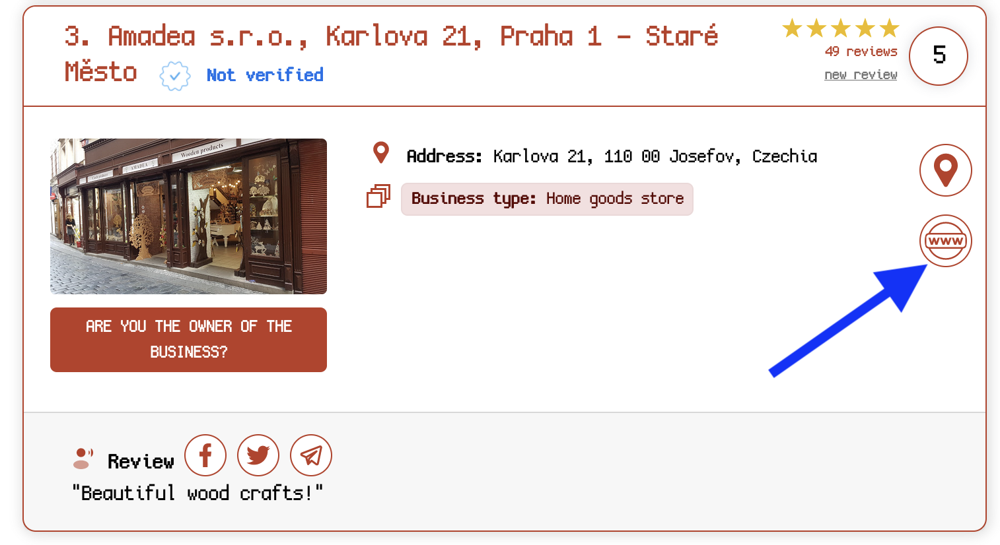

We start with a photo and the challenge to find what street it was on, we are given the following photo:

Using some searching on Google Maps, we can find a similar logo but not the same storefront.

Searching "Czech wooden products" online yields [this result](https://www.forpraguelovers.com/en/best/wood-shops-in-prague) (among others).

On this page I spot the logo again, and this time we have a website: [amadea.cz](https://www.amadea.cz/)

I find the [list of stores](https://www.amadea.cz/en/wooden_shops/) by searching for the domains stores list.

Inside here we see the same storefront from the photo, located at `Prague Castle in Zlatá ulička (Golden Lane), No. 20.`

Looking up the address on Google Maps we are given the full street name: `Zlatá ulička u Daliborky`

There's our flag! 

Flag: `irisctf{zlata_ulicka_u_daliborky}`

**Files:** [czech-where.tar.gz](https://web.archive.org/web/20240107214111/https://cdn.2024.irisc.tf/czech-where.tar.gz)