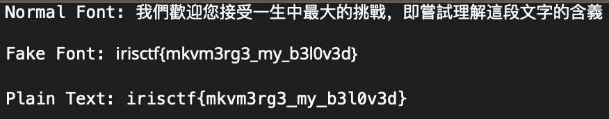

Looking at the video we can see some subtitles, using [`mkvextract`](https://manpages.ubuntu.com/manpages/trusty/man1/mkvextract.1.html) we can pull out some files.

We can extract the everything using a [script on Gist](https://gist.github.com/konfou/05db32e11ee84efde0adba2ac34331f4) and inside the MKV are some TTFs and the subtitles.

```
$ ./mkvextract-helper.sh -f chal.mkv -tavsc             (base)
The attachment #1, ID 13897746459734659379, MIME type font/ttf, size 7110560, is written to 'chal/NotoSansTC-Regular_0.ttf'.
The attachment #2, ID 13557627962983747543, MIME type font/ttf, size 64304, is written to 'chal/FakeFont_0.ttf'.
The attachment #3, ID 7918181187782517176, MIME type font/ttf, size 582748, is written to 'chal/NotoSans-Regular_0.ttf'.
Extracting track 1 with the CodecID 'A_AAC' to the file 'chal/track_1.'. Container format: raw AAC file with ADTS headers
Progress: 100%
Extracting track 2 with the CodecID 'S_TEXT/ASS' to the file 'chal/track_2.ass'. Container format: SSA/ASS text subtitles
Progress: 100%
```

FakeFont catches my eye, and when we install it.

We can then get the subtitle text from the exported `track_2.ass` file.

```
...
[Events]
Format: Layer, Start, End, Style, Name, MarginL, MarginR, MarginV, Effect, Text
Dialogue: 0,0:00:00.00,0:02:10.00,CJK,,0,0,0,,我們歡迎您接受一生中最大的挑戰，即嘗試理解這段文字的含義

```



Rendering the subtitle text with the FakeFont, we get our flag. 

Flag: `irisctf{mkvm3rg3_my_b3l0v3d}`

**Files:** [not-just-media.tar.gz](https://web.archive.org/web/20240107231823/https://cdn.2024.irisc.tf/not-just-media.tar.gz)