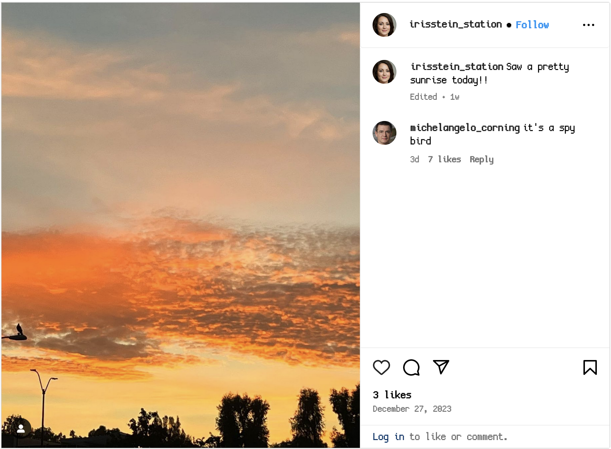
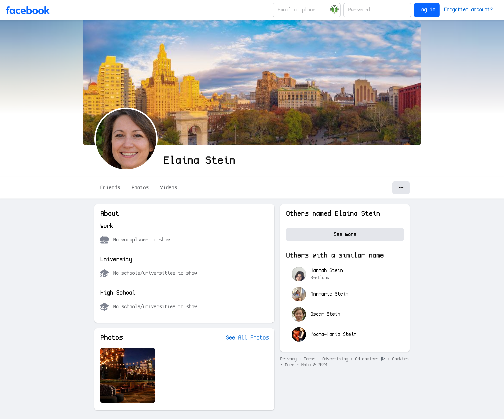
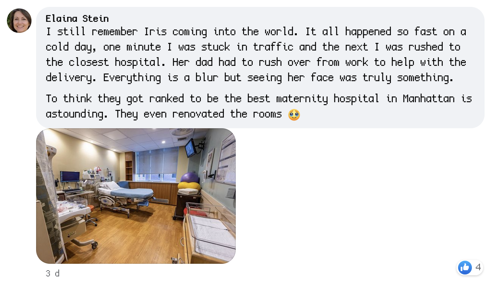
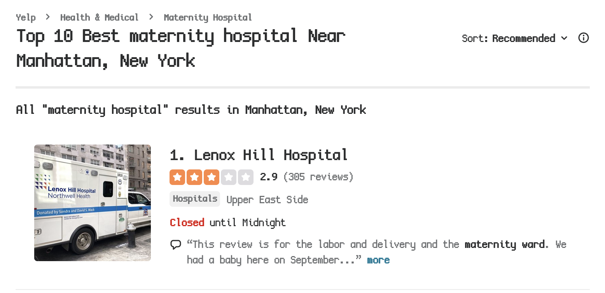
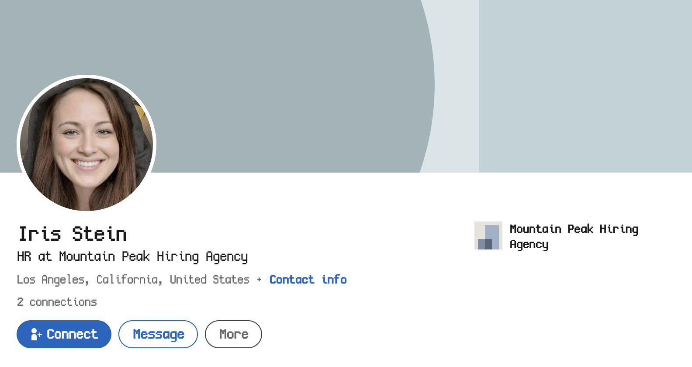
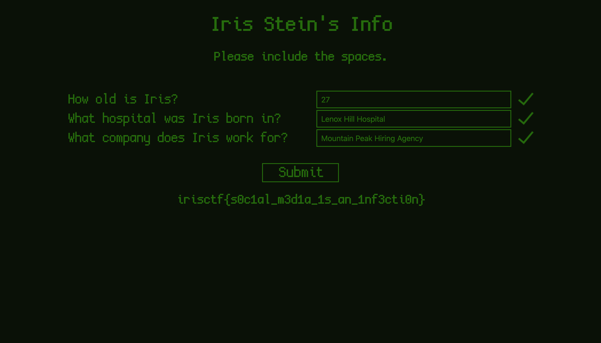

We are looking for the following information points about Iris:
- How old is Iris?
- What hospital was Iris born in?
- What company does Iris work for?

Looking through what we have, in the tagged posts section of Michelangelo's Instagram is a post!

It's from Iris, we can now look through her Instagram.

Looking through her posts, a particular one catches my attention from the description:

We can see she mentions an `Elaina Stein` and trying to visit an Instagram with that tag fails, so I check Facebook and get a hit!

Looking through her posts, we find two birthdays. One for herself (8th of April 1965) and for Iris (27th of April 1996). I originally messed these up due to my timezone displaying them incorrectly so double check!

We now know Iris's age to be `27`.

In the comments of the birthday post is Elaina with some extra information.

By searching for the exact phrase "best maternity hospital in Manhattan" we get a hit on [Yelp](https://www.yelp.com/search?find_desc=maternity+hospital&find_loc=Manhattan%2C+NY).

Our top result is `Lenox Hill Hospital`, so there's our hospital.

Looking up Iris's name online we also get a [LinkedIn](https://www.linkedin.com/in/iris-stein-57894b2a7).

And there's her job! `Mountain Peak Hiring Agency`

There we go!

Flag: `irisctf{s0c1al_m3d1a_1s_an_1nf3cti0n}`