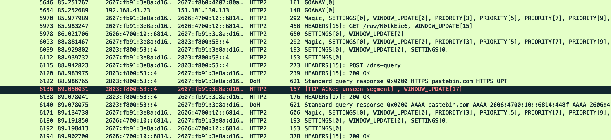

Note: this challenge is a continuation to [skat's SD Card](/writeups/24-irisctf-skats-sd-card). You are dealing with the same scenario. skats-sd-card.tar.gz is the same file from that challenge (SHA-1: 4cd743d125b5d27c1b284f89e299422af1c37ffc).

Looking at what were given, we have some 802.11 packets and we don't know the password, hash cracking was no good here so I went looking for a password.

Poking around the `/home/skat` directory, the `Bookshelf` folder has a PDF for setting up a Raspberry Pi, making me think this linux img potentially *is* a Raspberry Pi.

The Firefox data shows nothing of interest, so checking on the `/etc/NetworkManager` folder I see `system-connections` and then `skatnet.nmconnection`, which contains a WiFi password.

```
[connection]
id=skatnet
uuid=470a7376-d569-444c-a135-39f5e57ea095
type=wifi
interface-name=wlan0

[wifi]
mode=infrastructure
ssid=skatnet

[wifi-security]
auth-alg=open
key-mgmt=wpa-psk
psk=

[ipv4]
method=auto

[ipv6]
addr-gen-mode=default
method=auto

[proxy]
```

We get our password: `agdifbe7dv1iruf7ei2v5op`

I then go to my Wireshark preferences, then Protocols > IEEE 802.11 and Edit the Decryption keys to add `agdifbe7dv1iruf7ei2v5op` as a `wpa-pwd`.

The other file we are given with the `.cap` is some sslkeys, so I think its probably best we utilise those immediately.

I then go to Protocols > TLS and setting the (Pre)-Master-Secret log file to the other file we are given (`sslkeyfile`) allows us to read the HTTPS traffic.

Looking through the traffic, specifically HTTP/2, a URL catches my eye.



A pastebin entry! I scroll from that request downwards till I see a data response.

Packet 6197 holds the key, inside is our flag. 

Flag: `irisctf{i_sp3nd_m0st_of_my_t1me_0n_th3_1nt3rnet_w4tch1ng_c4t_v1d30s}`

**Files:** [skats-sd-card.tar.gz](https://web.archive.org/web/20240107230452/https://cdn.2024.irisc.tf/skats-sd-card.tar.gz) [skats-network-history.tar.gz](https://web.archive.org/web/20240107231621/https://cdn.2024.irisc.tf/skats-network-history.tar.gz)