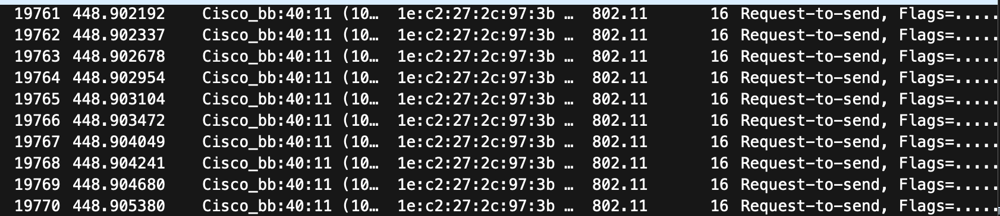
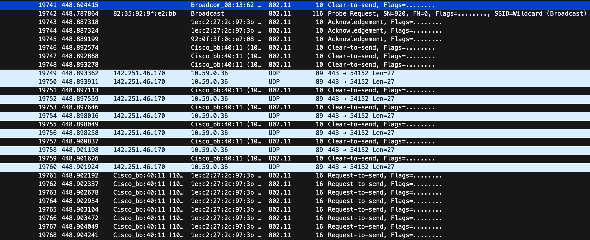
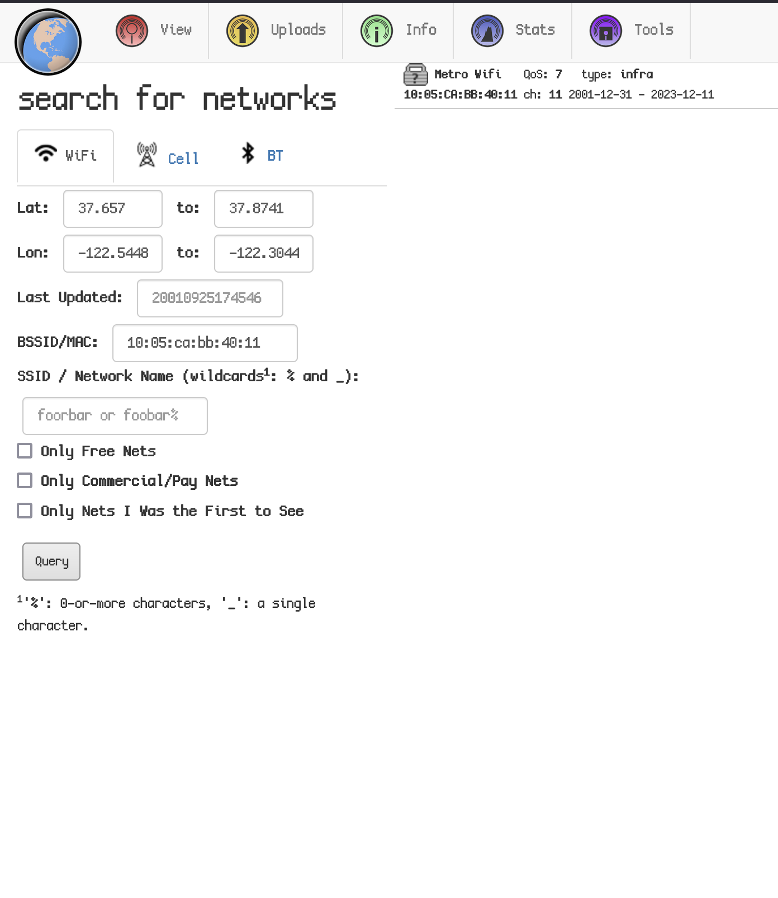
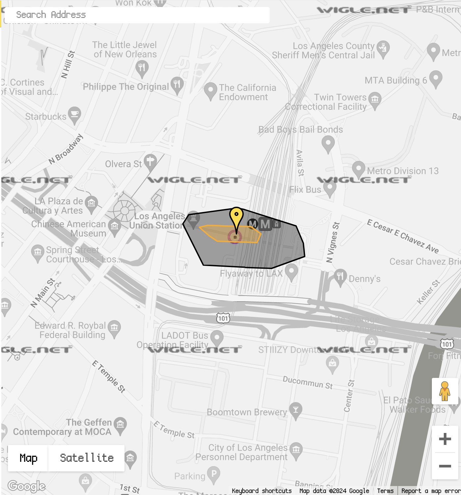

We are given a PCAP file, and since we are asked where they went, (the destination specifically) we can go to the end of the PCAP and look around. As they are wardriving they will be communicating with nearby routers.

We can see they are communicating with a CISCO router at the end, we can get the BSSID of this router and look it up on Wigle for a location. Wigle is an online index of scanned WiFi routers with GPS data attached, so if our BSSID is there we should get a rough location.

BSSID: `10:05:ca:bb:40:11`

We get a hit, now where is it?

Looking at the structure marker nearby we seem to be at `Los Angeles Union Station`.

Which gives us the flag!

Flag: `irisctf{los_angeles_union_station}`

**Files:** [wheres-skat.tar.gz](https://web.archive.org/web/20240107222928/https://cdn.2024.irisc.tf/wheres-skat.tar.gz)