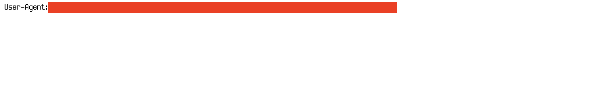
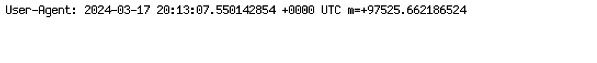
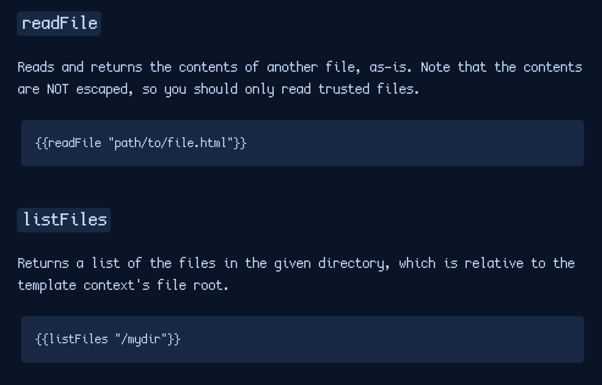
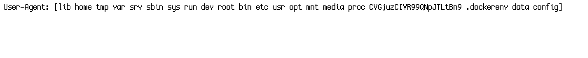
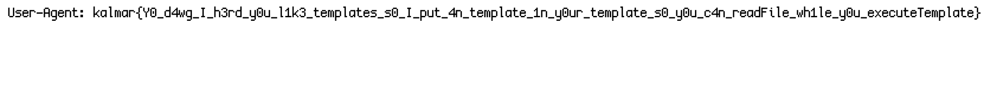

**The challenge got 89 solves, and I personally got the blood on this challenge! 🩸**

### What are we working with?

We are given a ZIP file with multiple files consisting of webserver sourcecode.
```
Caddyfile
docker-compose.yml
flag
README.txt
```

### Solution

Reading through each of the files we can gather the following information initially:
- The `Caddyfile` contains multiple entrys for various webservers, reading the bottom of the file there's some HTML of interest:
```html
Hello! Wanna know you if your browser supports <a href="https://http1.caddy.chal-kalmarc.tf/">http/1.1</a>? <a href="https://http2.caddy.chal-kalmarc.tf/">http/2</a>? Or fancy for some <a href="https://http3.caddy.chal-kalmarc.tf/">http/3</a>?! Check your preference <a href="https://http.caddy.chal-kalmarc.tf/">here</a>.<br/>We also allow you to check <a href="https://tls12.caddy.chal-kalmarc.tf/">TLS/1.2</a>, <a href="https://tls13.caddy.chal-kalmarc.tf/">TLS/1.3</a>, <a href="https://tls.caddy.chal-kalmarc.tf/">TLS preference</a>, supports <a href="https://mtls.caddy.chal-kalmarc.tf/">mTLS</a>? Checkout your <a href="https://ua.caddy.chal-kalmarc.tf/">User-Agent</a>!<!-- At some point we might even implement a <a href="https://flag.caddy.chal-kalmarc.tf/">flag</a> endpoint! -->
```

Giving us some new endpoints to check out:
  - https://http1.caddy.chal-kalmarc.tf/
  - https://http2.caddy.chal-kalmarc.tf/
  - https://http.caddy.chal-kalmarc.tf/
  - https://tls12.caddy.chal-kalmarc.tf/
  - https://tls.caddy.chal-kalmarc.tf/
  - https://mtls.caddy.chal-kalmarc.tf/
  - https://ua.caddy.chal-kalmarc.tf/
  - https://flag.caddy.chal-kalmarc.tf/

Ofcourse, the `flag` subdomain is down, but it was worth a shot!

- Reading the `docker-compose.yml` we can see the file will be stored in the root directory, though we already know this from the challenge description.

- The `flag` file and `README.txt` file are not of major importance.

So, out of the endpoints we are given in that HTML, whats likely to have our exploit? I have a strong feeling its the User-Agent one (https://ua.caddy.chal-kalmarc.tf/) because we can modify our User-Agent value to insert something to the page, such as SSTI!

Visiting the page, all it does is display our User-Agent on the screen.



Now, looking into what a `Caddyfile` is for, I find this [documentation](https://caddyserver.com/docs/caddyfile). Looking on the documentation page I search for any instances of 'template' and find a page about [templates](https://caddyserver.com/docs/modules/http.handlers.templates#docs), bingo!

I find a good testing value for the SSTI exploit is `{{now}}`, which should display the time.



Yay! There's our exploit, now how do we read the file? Let's check that documentation again:



Well, let's give it a shot! I set my User-Agent to `{{listFiles "/"}}` and look for an output.



There's the file: `CVGjuzCIVR99QNpJTLtBn9`, lets read it by using `{{readFile "/CVGjuzCIVR99QNpJTLtBn9"}}` as the User-Agent.



Bam! And a blood too! 🩸

Flag: `kalmar{Y0_d4wg_I_h3rd_y0u_l1k3_templates_s0_I_put_4n_template_1n_y0ur_template_s0_y0u_c4n_readFile_wh1le_y0u_executeTemplate}`