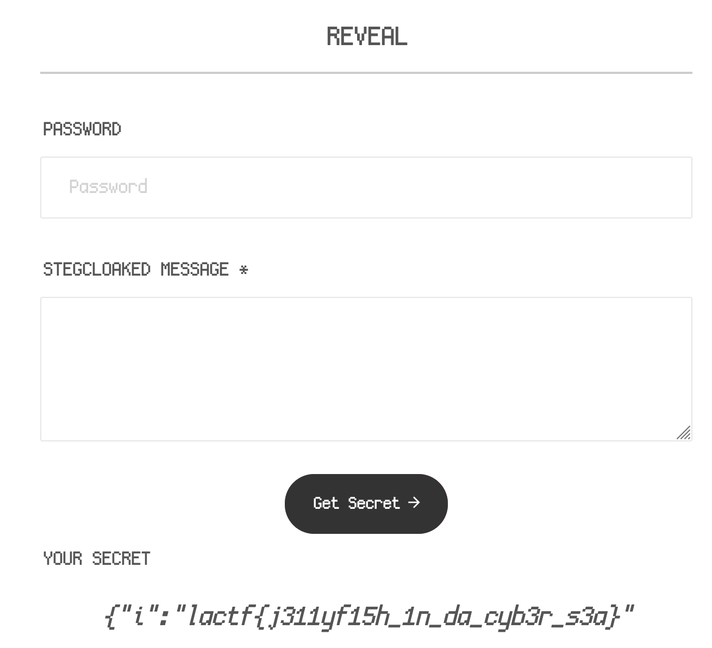

When viewing the event on Discord without using any proxy, we see its just a normal event text.

But viewing the event in a proxy we can see some extra content that was invisible.

```
\u200d\u2064\u200c\u200d\u200c\u2062\u200d\u2062\u200d\u2061\u200d\u200d\u2061\u2062\u200d\u2062\u200d\u2062\u200c\u200d\u200d\u2062\u200d\u2062\u200d\u2061\u200d\u200c\u2062\u2061\u200d\u2062\u2064\u200d\u2062\u200c\u2061\u200c\u2061\u2062\u2061\u200d\u2061\u200d\u2061\u200c\u200d\u200c\u2061\u200d\u200d\u200d\u2062\u200c\u2062\u200c\u2062\u200c\u2062\u2061\u2062\u200c\u2062\u2064\u200c\u200d\u2064\u200d\u2061\u200d\u2062\u200c\u2062\u2061\u2062\u200c\u2064\u2061\u200d\u200d\u2062\u2064\u2063\u2062\u200c\u2062\u2064\u200d\u200c\u200d\u2064\u2063\u2061\u200d\u2061\u2062\u2061\u200d\u2062\u2064\u2061\u2063\u2061\u200d\u2062\u200c\u2061\u200c\u200d\u2064\u200d\u2062\u200d\u2062\u200c\u2062\u200c\u2061\u200c\u2062\u200d\u2064\u2063\u2061\u200c\u2062\u200c\u2062\u200c\u2062\u200c\u2061\u200d\u2062\u2064\u2063\u2061\u2062\u200d\u2062\u200d\u2061\u2063\u2061
```

Looking online for ciphers that involve exclusively hidden characters I found StegCloak with an [online demo](https://stegcloak.surge.sh/), which seemed to be a match.

I firstly used CyberChef to unescape the string, then copied the raw output to paste into StegCloak.



Flag: `lactf{j311yf15h_1n_da_cyb3r_s3a}`