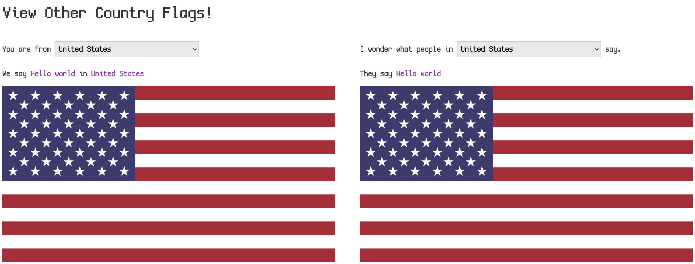
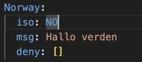
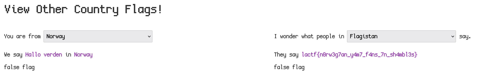

Looking at Flaglang it is a plain website where we can select countries and see 'Hello world' in various languages, at the very top is an interesting option, Flagistan.

Looking at the source code provided we can see that the countries are stored in YAML and the country 'Flagistan' seems to deny all country codes.

Scrolling through the YAML I notice that 'NO' for Norway is highlighted blue.

YAML seems to parse YES/NO as objects like true/false rather than strings, so we can cause the server to load an invalid object (which isn't on Flagistans deny list), allowing us to render the flag!

Bam! We can see the flag!

Flag: `lactf{n0rw3g7an_y4m7_f4ns_7n_sh4mbl3s}`