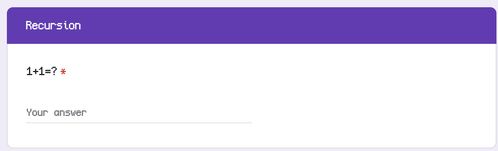
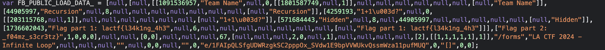

Working through the form we can see, it is indeed an infinite loop, we get stuck on this question:

Looking inside the source code, at the bottom, I spot something of interest in the `script` tag.

It seems our flag is right there in 2 parts!

Flag: `lactf{l34k1ng_4h3_f04mz_s3cr3tz}`

**Files:** [Form (Potentially Down in future)](https://docs.google.com/forms/d/e/1FAIpQLSfgUDWRzgkSC2pppOx_SVdw1E9bpVVWUkvQssmWza11pufMUQ/viewform?usp=sf_link)