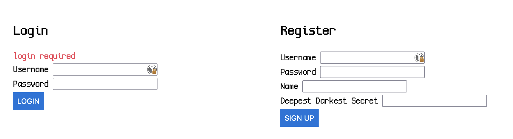
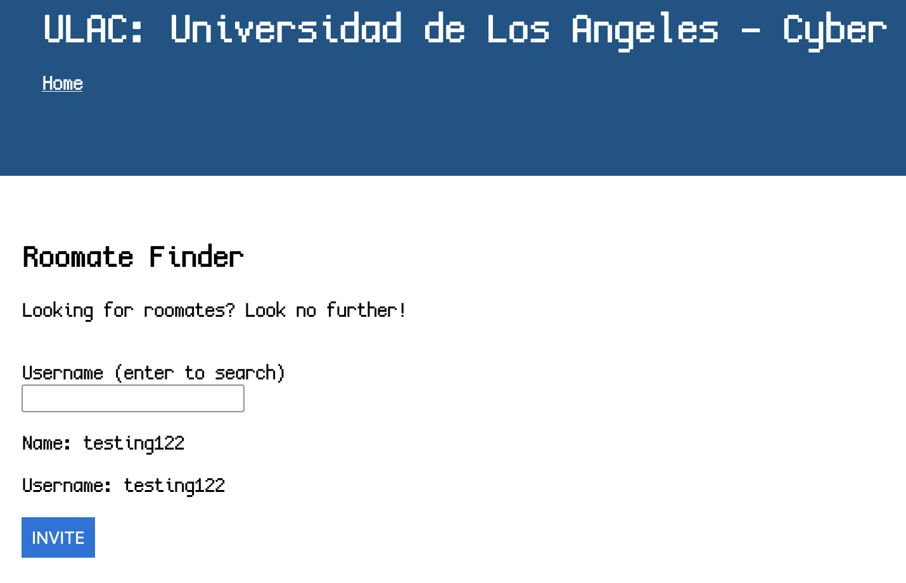
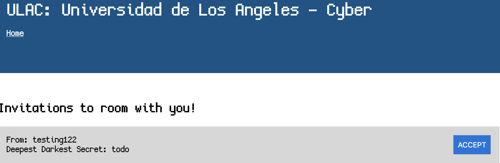

We are given an admin bot, a web interface and the source code.

Looking at the capabilities of the app, we seem to be able to register a user with a few parameters (username, password, name and deepest darkest secret).



Looking at the source code, we can see a user 'samy' (the GOAT) is registered and the flag is stored in his deepest darkest secret.

```js
users.set('samy', {
  username: 'samy',
  name: 'Samy Kamkar',
  deepestDarkestSecret: process.env.FLAG || 'lactf{test_flag}',
  password: process.env.ADMINPW || 'owo',
  invitations: [],
  registration: Infinity
});
```

Once registered we seem to have a few capabilities:
- Sending invites to a user based on their username, it displays their username, name and an invite button (`/finder/?q=USERNAME`)



- Recieveing invites from a user, displays their name and deepest darkest secret (`/request`)



It seems we have to force samy to send an invite to us to see the flag, I make a new user with a potential payload idea involving XSS.

I make a new form using HTML with my username to submit an invite, and an XSS to trigger the form, as follows:

```html
<form name="invitefix" action="/finder" method="POST">
  <input type="hidden" name="username" value="USERNAME">
  <input type="submit" value="Invite">
</form>

```

The form being redefined above allows it to access the form, and using the `` allows some slight delay before triggering, which seemed more consistent.

I send the following URL to the admin bot to trigger the search for my user and set the payload off.

`https://new-housing-portal.chall.lac.tf/finder/?q=USERNAME`

Once visited, we can see samy has visited and sent us an invite, how kind!

Flag: `lactf{b4t_m0s7_0f_a77_y0u_4r3_my_h3r0}`