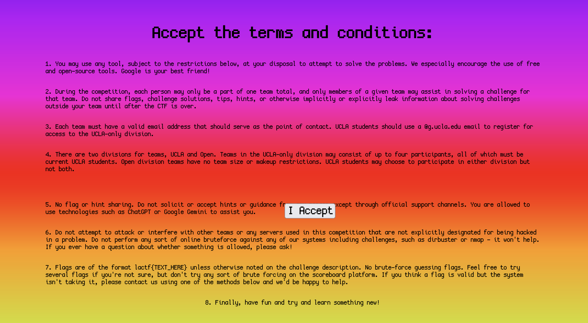

When visiting the site linked, we are shown a plain webpage with some rules and an accept button, but when we get close it moves away from our cursor.



The way I approach this is by using Burp Suite to remove the client side movement code so the button cannot move away. I do this by intercepting responses in Burp Suite and then editing the response before the browser loads it.

I specifically remove this portion of the JS:

```js
window.addEventListener("mousemove", function (e) {
    mx = e.clientX;
    my = e.clientY;
});
```

Flag: `lactf{that_button_was_definitely_not_one_of_the_terms}`