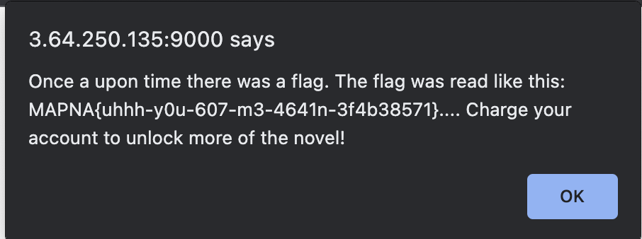

This is part 2 to the challenge [Novel reader](/writeups/24-mapnactf-novel-reader).

The same website also has another file we have to read inside `private/A-Secret-Tale.txt`

Looking at the word balance, we can seem to set negative values by purchasing `-100` words, for example.

The source code for reading the file is as follows:

```python
buf = readFile(name).split(' ')
buf = ' '.join(buf[0:session['words_balance']])+'... Charge your account to unlock more of the novel!'
```

If we make `session['words_balance']` equal to `-1` we can read the whole file!

I set my word balance to -1 and then use the path traversal vulnerability to read the file.



Flag: `MAPNA{uhhh-y0u-607-m3-4641n-3f4b38571}`

**Files:** [novel-reader_d78366cb079727a6bd3809219df9bc7835d17fd1.txz](https://web.archive.org/web/20240121175613/https://mapnactf.com/tasks/novel-reader_d78366cb079727a6bd3809219df9bc7835d17fd1.txz)