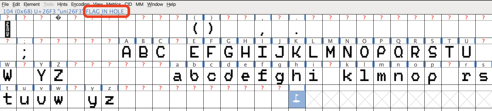
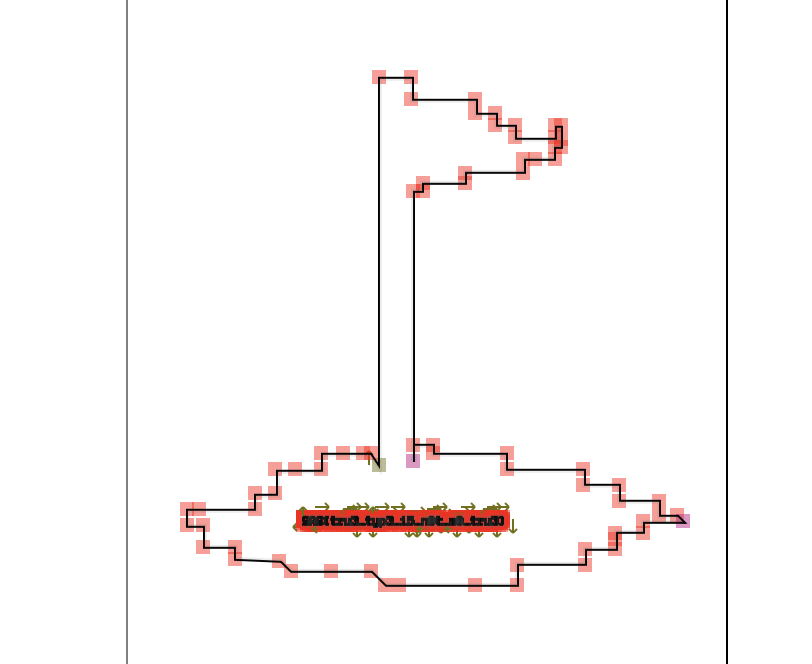
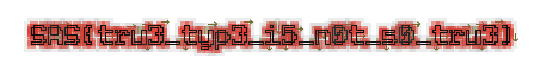

We are given a PDF `vobla_tales.pdf`, and I notice something when downloading the PDF.

The PDF title says `Custom Font Example`, so I go to investigate the font using FontForge.

I go to FontForge and use the 'Extact from PDF' option to import the font.

I see one of interest, and looking at the name `FLAG IN HOLE` I investigate.

I zoom in, and...

Flag: `SAS{tru3_typ3_i5_n0t_s0_tru3}`