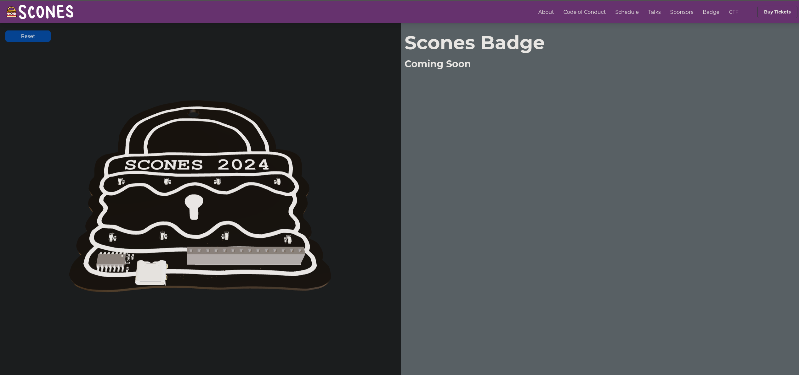
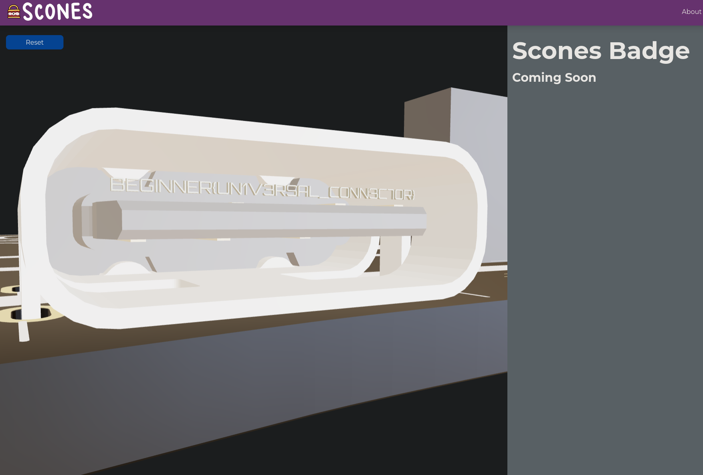

This one was fairly simple, we were provided with a url to a page: [badge](https://scones.secso.cc/badge) which had a model of the badge that was purchasable onsite.

Looking inside the USB-C port of the badge is the flag!

Flag: `BEGINNER{UN1V3RSAL_CONNEC7OR}`