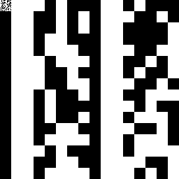
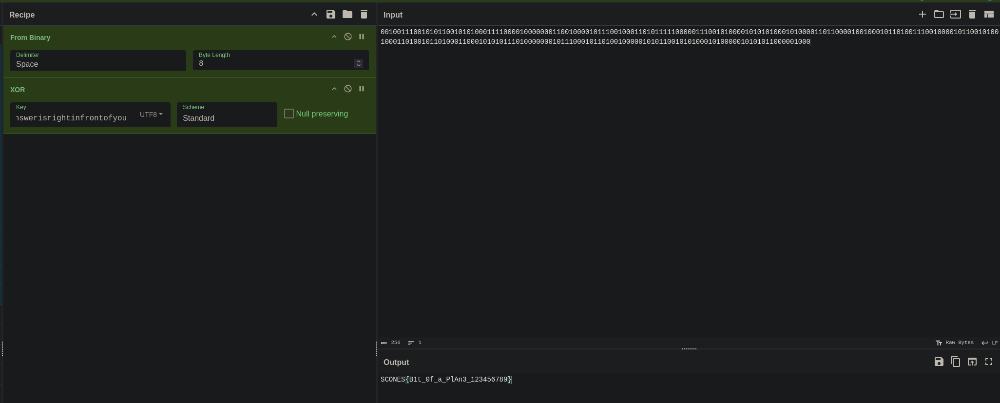

This challenge absolutely stumped me and boggle aswell for the longest time...

All we are given is this image.


This looks like a data matrix so I transcribe it (assuming the weird transparent pixel is a `0`), black being `0` and white being `1`.

```
0111010001101000
0110010101110010
0110010101100001
0110110001100001
0110111001110011
0111011101100101
0111001001101001
0111001101110010
0110100101100111
0110100001110100
0110100101101110
0110011001110010
0110111101101110
0111010001101111
0110011001111001
0110111101110101
```

This is decoded from binary as `therealanswerisrightinfrontofyou`, how very taunting...

boggle points out something very interesting, is it something with the transparency?

I use Python to print out all the `RGBA` combinations in the image.

```python
import numpy as np
from PIL import Image

img = Image.open("blocks.png")
img = img.convert("RGBA")
img_array = np.array(img)
size = img.size

found = []

print("Finding unique...")
for x in range(size[0]):
    for y in range(size[1]):
        r, g, b, a = img_array[y, x]
        r,g,b,a = (int(r),int(g),int(b),int(a))
        if (r,g,b,a) not in found:
            found.append((r,g,b,a)) 

print('Found:')
for x in found:
    print(f'{x}')
```

The output was the following:
```
Finding unique...
Found:
(0, 0, 0, 0)
(0, 0, 0, 255)
(0, 0, 0, 1)
(255, 255, 255, 255)
```
Aha! So opacity of `0` and `1` is being used, I bet its another binary. I make a script to change the opacity of all the opacity `1` pixels to `255` so that its completely visible.



If you look in the top-left, its another data matrix inside the data matrix!

I make another Python script to decode it:
```python
import numpy as np
from PIL import Image


img = Image.open("blocks.png")
img = img.convert("RGBA")
img_array = np.array(img)
alpha_channel = img_array[:, :, 3]
mask = np.logical_or(alpha_channel == 0, alpha_channel == 1)
y_coords, x_coords = np.where(mask)

for y, x in zip(y_coords, x_coords):
    r, g, b, a = img_array[y, x]
    print(f"{a}",end="")
```

Output was: `0010011100101011001010100011110000100000001100100001011100100011010111110000011100101000010101010001010000110110000100100010110100111001000010110010100100011010010110100011000101010111010000000101110001011010010000010101100101010001010000010101011000001000`

This decodes to, gibberish... is it my code??

Then I have a thought.

What if the first data matrix was a KEY like with Vigenere or XOR?

Turns out I was correct, it was an XOR key.



Flag: `SCONES{B1t_0f_a_PlAn3_123456789}`