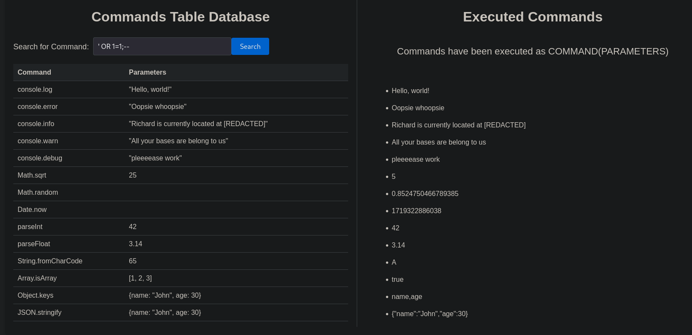
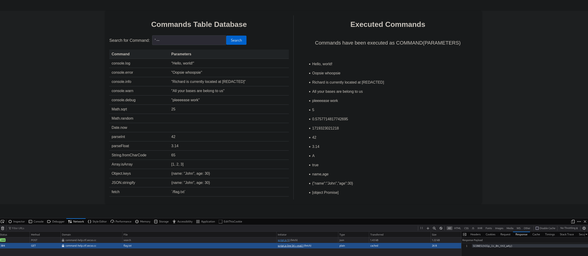

This challenge was very... weird.

We are provided with a [Commands Table Database website](https://web.archive.org/web/20240625134022/https://command-help.ctf.secso.cc/).

I find it immediately vulnerable to SQLi and think thats the end of the challenge, I'm caught offguard and no flag to be found.



The commands are 'executed' on the right side but it *seems* to be all client side so I'm very confused as to why its there.

I use `sqlmap` to look for any more tables or columns but there are none.

I start looking elsewhere on the subdomain and hit a `robots.txt`, it says `Damn, people still be storing flags in text files??`.

I check `/flag.txt` and get a `Not Found`, I check `/example.txt` and get `Cannot GET /example.txt`, so `/flag.txt` exists and its a fake error... sneaky!!

An interesting exploit chain forms:
- Use the SQLi to inject values to the `commands` table
- Inject a `fetch` to `/flag.txt`
- Open network tab on page
- Run SQLi to display all items on page, flag in network tab

I use the `Copy to cURL command` on my browser and edit the data payload:
```
$ curl 'https://command-help.ctf.secso.cc/search' -X POST ... --data-raw $'{"q":"\';INSERT INTO commands VALUES (NULL, \'fetch\', \'\`/flag.txt\`\', NULL);"}'
```

I then do the classic `' --` injection to display all results, and it works!



Flag: `SCONES{h3lp_1s_0n_th3_w4y}`