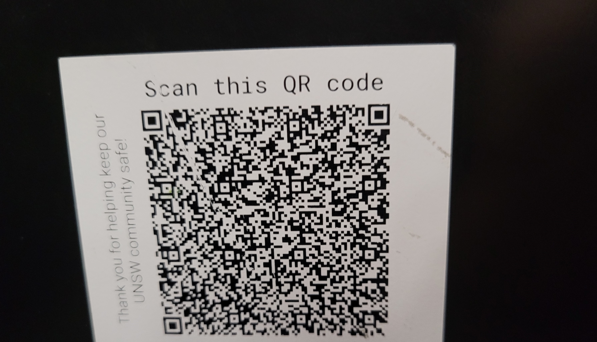

We are given an image of a QR code:


Scanning the QR Code has a URL.
```
https://www.service.nsw.gov.au/campaign/service-nsw-mobile-app?data=eyJ0IjoiY292aWQxOV9idXNpbmVzcyIsImJpZCI6IjIwODY3MSIsImJuYW1lIjoiVU5TVyBBaW5zd29ydGggRzAzIiwiYmFkZHJlc3MiOiJLLUoxNy1HMDMgLSBBaW5zd3RoRzAzIEtlbnNpbmd0b24gTlNXIDIwNTIifQ==
```

The `data` param can be decoded from b64 to some JSON:
```json
{
  "t": "covid19_business",
  "bid": "208671",
  "bname": "UNSW Ainsworth G03",
  "baddress": "K-J17-G03 - AinswthG03 Kensington NSW 2052"
}
```

The flag was the `baddress`.

Flag: `K-J17-G03 - AinswthG03 Kensington NSW 2052`